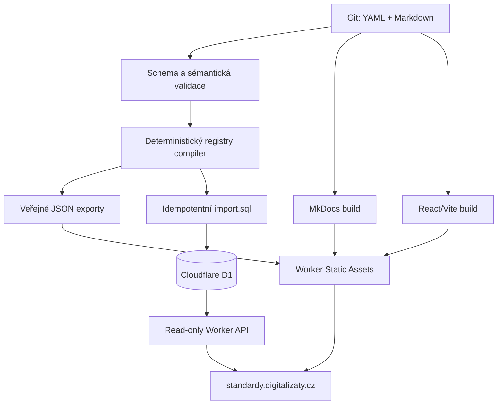

# Architektura registru

## Výchozí stav repozitáře

Před rozšířením obsahoval repozitář pouze MkDocs dokumentaci (`docs/`, `mkdocs.yml`, `requirements.txt`) a workflow `.github/workflows/pages.yml`. Ten při změně větve `main` sestaví MkDocs a publikuje adresář `site/` přes GitHub Pages. Odborné texty zůstávají beze změny a registry je samostatná vrstva.

V repozitáři nebyla Node aplikace, databáze ani serverová část. Přechod na Cloudflare je proto přidán jako samostatný deployment; stávající Pages workflow zůstává funkční, dokud nebude nakonfigurována a přepnuta cílová doména.

## Rozhodnutí

- Git/YAML je jediný source of truth. D1 je odvozená query vrstva.
- `Rule` má stabilní identitu; normativní změny jsou uvnitř `RuleVersion` a vážou se k `NationalStandard`.
- Normativní požadavek, interpretace, chování implementace a známé rozpory jsou oddělená pole.
- Stabilní URL používají string ID, nikdy databázový klíč.
- Worker neposkytuje žádné veřejné zápisové endpointy.
- Build metadata jsou odvozena z Git commitu (ne z aktuálního času), proto je build téhož commitu reprodukovatelný.

## Adresáře

| Cesta | Úloha |
|---|---|
| `docs/` | existující odborná dokumentace a vývojová dokumentace |
| `registry/` | autoritativní YAML entity |
| `schemas/` | JSON Schema 2020-12 |
| `packages/registry-core/` | loader, validace, compiler, diff a SQL export |
| `scripts/` | CLI vstupní body |
| `migrations/` | D1 schéma |
| `worker/` | REST API a routing statických assetů |
| `web/registry/` | React Registry Explorer |
| `dist/registry/` | generované normalizované soubory a import SQL |
| `site/` | složený deployment artefakt: MkDocs + `/registry` + `/data` |

## Routing na jedné doméně

Worker Static Assets publikuje složený adresář `site/`:

- `/` a existující cesty obsluhují vygenerované soubory MkDocs,
- `/registry/*` nejprve zkusí statický asset a při neexistující cestě vrátí `/registry/index.html`,
- `/api/v1/*` vždy obslouží Worker a D1.

Selektivní `assets.run_worker_first` omezuje Worker jen na API a SPA routing. Dokumentační assety jsou servírovány přímo.

## Deployment

Workflow `deploy-cloudflare.yml` po merge do `main` validuje data, spustí testy, sestaví dokumentaci i SPA, aplikuje D1 migrace, kompletně nahradí odvozená data a nasadí Worker + Static Assets. Spustí se pouze po nastavení GitHub variable `CLOUDFLARE_D1_DATABASE_ID` a secrets `CLOUDFLARE_API_TOKEN`, `CLOUDFLARE_ACCOUNT_ID`. Importní SQL nepoužívá ruční `BEGIN`/`COMMIT`, protože vzdálený D1 bulk import řídí atomicitu sám.

D1 ID není tajemství, ale konfigurace používá zástupnou hodnotu, aby repozitář nebyl svázán s databází před jejím vytvořením. CI vytvoří ignorovaný `wrangler.deploy.jsonc` s reálným ID.

## Hranice první fáze

První vertical slice ověřuje celý tok MIX → `iccProfileVersion` → DMF Monografie 2.3 → ICC hlavička → D1 → API → detail pravidla. Jde o jeden odborně ověřený případ, nikoli o úplný katalog ani hotový validační engine. Neověřené zůstává konkrétní chování ProArcu, Komplexního validátoru a převod výstupu externích nástrojů do MIX.
