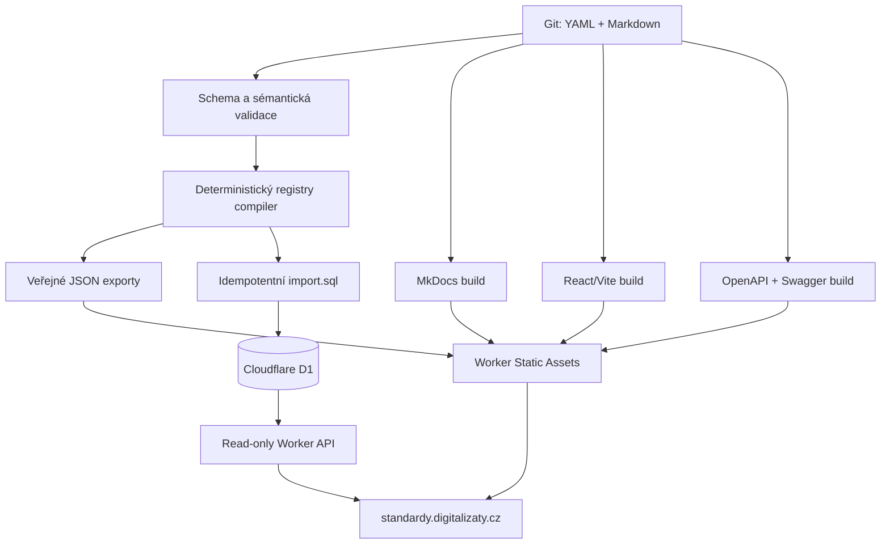

# Architektura registru

## Současné uspořádání

Produkční doménu `standardy.digitalizaty.cz` obsluhuje Cloudflare Worker + Static Assets s databází D1. Jeden deployment zahrnuje odbornou a vývojovou dokumentaci MkDocs, registr React/Vite, veřejné exporty JSON a Swagger UI. Autoritativní data zůstávají v Git/YAML; D1 je obnovitelný index, nikoli redakční databáze.

Workflow `.github/workflows/pages.yml` nadále samostatně sestavuje a publikuje pouze MkDocs na GitHub Pages. Není to nasazení celé aplikace a samo neaktualizuje produkční Cloudflare Worker ani D1. Přehled aktuálního obsahu je na [úvodní stránce vývoje](index.md).

## Rozhodnutí

```mermaid
flowchart TD
    Git[Git: YAML + Markdown] --> Validate[Schema a sémantická validace]
    Validate --> Compiler[Deterministický registry compiler]
    Compiler --> JSON[Veřejné JSON exporty]
    Compiler --> SQL[Idempotentní import.sql]
    SQL --> D1[(Cloudflare D1)]
    Git --> MkDocs[MkDocs build]
    Git --> Vite[React/Vite build]
    Git --> Swagger[OpenAPI + Swagger build]
    JSON --> Assets[Worker Static Assets]
    MkDocs --> Assets
    Vite --> Assets
    Swagger --> Assets
    D1 --> Worker[Read-only Worker API]
    Assets --> Domain[standardy.digitalizaty.cz]
    Worker --> Domain
```

- Git/YAML je jediný source of truth. D1 je odvozená query vrstva.
- `Rule` má stabilní identitu; normativní změny jsou uvnitř `RuleVersion` a vážou se k `NationalStandard`.
- Normativní požadavek, interpretace, chování implementace a známé rozpory jsou oddělená pole.
- Stabilní URL používají string ID, nikdy databázový klíč.
- Worker neposkytuje žádné veřejné zápisové endpointy.
- Build metadata jsou odvozena z Git commitu (ne z aktuálního času), proto je build téhož commitu reprodukovatelný.

## Adresáře

| Cesta | Úloha |
|---|---|
| `docs/` | existující odborná dokumentace a vývojová dokumentace |
| `registry/` | autoritativní YAML entity |
| `schemas/` | JSON Schema 2020-12 |
| `packages/registry-core/` | loader, validace, compiler, diff a SQL export |
| `scripts/` | CLI vstupní body |
| `migrations/` | D1 schéma |
| `worker/` | REST API a routing statických assetů |
| `web/registry/` | React Registry Explorer |
| `dist/registry/` | generované normalizované soubory a import SQL |
| `web/api-docs/` | lokálně hostované Swagger UI |
| `site/` | složený deployment artefakt: MkDocs + `/registry` + `/data` + `/api-docs` + OpenAPI |

## Routing na jedné doméně

Worker Static Assets publikuje složený adresář `site/`:

- `/` a existující cesty obsluhují vygenerované soubory MkDocs,
- `/registry/*` nejprve zkusí statický asset a při neexistující cestě vrátí `/registry/index.html`,
- `/api/v1/*` vždy obslouží Worker a D1.
- `/data/*.json` poskytuje statické exporty datasetu,
- `/api-docs/` poskytuje Swagger UI a `/openapi.json` čtecí kontrakt API z Workeru (také na `/api/v1/openapi.json`).

Selektivní `assets.run_worker_first` zahrnuje `/api/*`, `/registry/*` a `/openapi.json`. Dokumentace, exporty a Swagger assety jsou servírovány přímo. Proto musí existovat `docs/development/index.md`, aby MkDocs vytvořil i samotnou cestu `/development/`.

## Deployment

Workflow `deploy-cloudflare.yml` po merge do `main` validuje data, spustí testy, sestaví dokumentaci i SPA, aplikuje D1 migrace, kompletně nahradí odvozená data a nasadí Worker + Static Assets. Spustí se pouze po nastavení GitHub variable `CLOUDFLARE_D1_DATABASE_ID` a secrets `CLOUDFLARE_API_TOKEN`, `CLOUDFLARE_ACCOUNT_ID`. Importní SQL nepoužívá ruční `BEGIN`/`COMMIT`, protože vzdálený D1 bulk import řídí atomicitu sám.

`wrangler.jsonc` již obsahuje ID produkční D1 a vlastní doménu. ID databáze není tajemství; tokeny do repozitáře nepatří. CI vytvoří ignorovaný `wrangler.deploy.jsonc` a přepíše binding hodnotou z GitHub variable. Pro jiné prostředí je nutné upravit také cílovou doménu a jméno Workeru. Ruční postup popisuje [návod k nasazení](local-development.md#nasazeni).

## Pokrytí a hranice ověření

Registr k 5. 10. 2026 obsahuje 45 pravidel DMF Monografie 2.3: 13 pro MIX, 18 pro [info.xml](info-xml.md) a 14 pro [soubory a vazby hlavního METS](mets-files.md). Není úplným katalogem ani validačním enginem. [Rozbor ICC](icc-profile-version.md) dokumentuje konkrétní verze a mapování JHOVE, jpylyzeru, ProArcu a konfiguraci Komplexního validátoru; nejde o tvrzení o všech jejich cestách zpracování. [Obrazová skupina](mix-image-characteristics.md), info.xml a skupina METS mají ověřený přepis DMF/XSD, nikoli implementace nástrojů.
