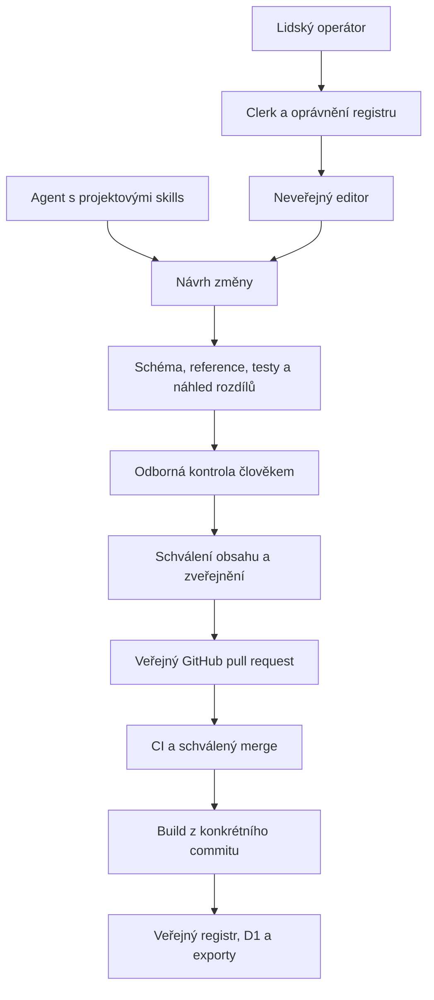

# Redakční postup, neveřejný editor a agenti

**Stav k 7. 10. 2026:** tento dokument popisuje cílový redakční postup. Implementované jsou projektové skills a [MVP editoru](editor-mvp.md): integrace Clerk, explicitní členství, oddělené koncepty, historie revizí, formulář, validace a diff. Pro vývoj i produkci je připravená samostatná Clerk aplikace a oddělené databáze konceptů. Schvalování, PR a publikace nejsou implementované. Veřejné API zůstává pouze pro čtení.

## Společný princip

Lidský editor a agent mají vytvářet stejný typ návrhu změny. Sdílejí schémata, sémantickou validaci, porovnání a zpracování důkazů v `packages/registry-core`; nemají mít dva odlišné významy stejného pravidla. Autoritativní publikovaný obsah zůstane v Git/YAML. D1 registru je obnovitelný index, nikoli redakční zdroj pravdy.

Diagram představuje cílový postup, ne dnešní automatizaci. Lokální agent připravuje diff a kontrolní zprávu; MVP API přijímá lidskou session a zatím nemá strojovou identitu pro agenty. Vytvoření PR nebo publikace vyžaduje odpovídající zadání/oprávnění, které samotná skill neuděluje.

## Cílový rozsah editoru

Následující rozsah přesahuje lokální MVP. To nyní obsahuje základní formulář a úplný dokument v pokročilém JSON, ruční ukládání, validaci a diff; nemá automatické ukládání ani všechny specializované formuláře.

První iterace bude zaměřená na opravu existujícího pravidla a přidání jedné související sady. Formulář vychází ze schématu `RuleVersion`, ale vysvětluje pole lidsky:

- národní standard, verze, identita a cílový prvek;
- požadavek, původní kód povinnosti, kardinalita a podmínky;
- zdroj s verzí a lokátorem, stav a rozsah ověření;
- oddělený výklad, nesoulady a implementace nástrojů;
- příklady XML s původem, hash a XPath;
- katalogizační rozsah a odborně zdůvodněné párování.

Vedle formuláře bude náhled detailu, strukturovaný diff proti výchozímu commitu, seznam ovlivněných relací a výsledek validací. Zobrazení YAML může být pokročilou volbou, nikoli podmínkou práce operátora. Automatické ukládání vytváří jen koncept, nikdy publikaci.

## Identita není oprávnění

Clerk je navrhovaný poskytovatel identity. Inspirací je [oddělení přihlášení a propojeného účtu v DigiWorkflow](https://github.com/bezverec/digiworkflow/blob/main/middleware.ts), nikoli kopie jeho Next.js middleware do Cloudflare Workeru. Pro Worker je nutné použít a ověřit vhodnou integraci; [Clerk dokumentuje serverové ověřování požadavků](https://clerk.com/docs/reference/backend/authenticate-request).

Přístup do jiné aplikace ani pouhá registrace v Clerk nedává oprávnění k tomuto registru. Oprávnění se při každé chráněné operaci vyhodnotí na backendu podle stabilní identity a explicitního členství. Chybějící konfigurace nebo selhání ověření musí přístup zamítnout, ne otevřít anonymně.

| Navržená role | Rozsah |
| --- | --- |
| Editor | Vytváření a úpravy dostupných konceptů, odeslání ke kontrole; bez vlastního odborného schválení |
| Recenzent | Kontrola pramenů a diffu, vrácení nebo schválení konkrétní revize; nemůže schválit vlastní změnu |
| Správce | Správa členství a technické konfigurace; role sama nenahrazuje odborné schválení |
| Publikující osoba/služba | Převod schváleného návrhu do PR a následná publikace podle samostatných oprávnění |

Role publikace může být přidělena konkrétnímu recenzentovi, ale schválení musí pocházet od jiné osoby než autora dané revize. Přísný režim tedy potřebuje alespoň dva lidské účty; do jejich zajištění editor nemá automaticky slučovat a publikovat. Případný jednodušší režim musí být samostatným vědomým rozhodnutím, nikoli skrytým obejitím kontroly.

Zvolená varianta je samostatná Clerk aplikace pro Standardy. [Hobby plán](https://clerk.com/pricing) podle ceníku ověřeného 7. 10. 2026 umožňuje neomezený počet aplikací; role registru jsou vlastní data, nikoli placené Clerk Organization roles. Založení a zapojení aplikace je samostatný konfigurační krok; účty DigiWorkflow se tím nemění.

## Koncepty a souběh

Koncepty, členství, schválení a auditní události patří do **odděleného neveřejného úložiště**, například samostatné D1 s vlastními migracemi a zálohováním. Nesmí být zasaženy úplným přegenerováním veřejného indexu ani přidány do veřejných JSON exportů.

Návrh minimálně eviduje identitu návrhu, autora, výchozí Git SHA, dotčená ID/verze, obsah změny, revizi a její hash, stav kontroly a vazbu na PR/merge/deployment. Zdrojová DMF verze a redakční revize návrhu jsou odlišné údaje. Účet člena je navázaný na stabilní ID poskytovatele identity, ne jen na měnitelný e-mail.

Každé uložení používá očekávanou revizi (optimistický zámek). Zastaralý zápis vrátí konflikt, nesmí potichu přepsat práci kolegy. Změna obsahu nebo relevantní změna výchozího základu ruší předchozí schválení a vyžaduje nový diff a kontroly. Odborné schválení se váže k hashi obsahu i základu, ne pouze k ID návrhu.

| Stav návrhu | Význam a povolené pokračování |
| --- | --- |
| `draft` | Rozpracováno; lze upravovat nebo odeslat ke kontrole |
| `in_review` | Kontrolovaná revize; změna obsahu ji vrací do konceptu |
| `changes_requested` | Vráceno s důvody, úprava vytvoří novou revizi |
| `approved` | Schválen přesný obsah a základ; není ještě zveřejněno |
| `pr_open` | Návrh byl se souhlasem zveřejněn v PR; ještě nemusí být sloučen |
| `merged` | Autoritativní YAML je v příslušném commitu; ještě nemusí být nasazen |
| `published` | Ověřena shoda commitu, veřejného API a exportů po deploymentu |
| `rejected` / `withdrawn` | Ukončený návrh se zachovaným auditním záznamem |

Chyba CI/importu/deploymentu se zaznamená jako výsledek pokusu; neznamená úspěšnou publikaci ani smazání návrhu. Opakované odeslání stejné schválené revize musí být idempotentní a nevytvořit duplicitní PR. Audit uchovává aktéra, akci, čas, revizi a výsledek; nesmí obsahovat tokeny nebo hesla. Retenci a pravidla pro osobní údaje je potřeba stanovit před spuštěním.

Tyto stavy nejsou dnešní `RuleVersion.status` ani `verification.status`. Odborně schválená publikace může například poctivě uvádět sporný požadavek. Schvalování nesmí automaticky změnit `disputed` na `normative` nebo `unverified` na `verified`. Dnešní dataset navíc obsahuje veřejný stav `draft`; sám o sobě **nechrání neveřejný koncept** před exportem.

## Bezpečnost a hranice publikace

Navržené `/editor` a `/api/editor/*` budou oddělené od veřejného `/api/v1/*`. Autentizace i autorizace chrání data a operace přímo na serveru; skryté menu nestačí. Soukromé odpovědi nepoužívají veřejnou cache ani otevřené CORS. Řešit je potřeba povolené origins, CSRF, omezení velikosti a četnosti požadavků a bezpečné zobrazení XML/Markdownu bez vykonávání obsahu.

Repozitář je veřejný: i otevření PR nebo push větve zveřejní obsah. Neveřejné koncepty proto zůstanou soukromé až do explicitního souhlasu se zveřejněním. Kontrola před odesláním musí vyloučit tajemství, interní poznámky, osobní cesty a licenčně nevhodné přílohy. Kompletní vzorový SIP ani placenou specifikaci nesmí automaticky přibalit do PR.

Budoucí GitHub integrace má mít minimum oprávnění pro konkrétní repozitář a dovolovat měnit jen schválené datové a dokumentační cesty. Nemá přijímat libovolné shell příkazy od klienta nebo měnit workflow, autentizaci či samotné kontroly spolu s návrhem pravidla. Publikační tajemství zůstávají mimo prohlížeč. Návrhy a zdrojové dokumenty jsou nedůvěryhodná data, nikoli instrukce k získání přístupů.

Agent v první fázi pracuje lokálně s diffem a stejnými testy. Budoucí vzdálený přístup potřebuje vlastní omezenou a odvolatelnou identitu; nepoužívá sdílenou lidskou session. Nemá schvalovat sám sebe ani získat oprávnění k nasazení jen načtením skillu.

## Etapy a akceptace

1. **Hotová lokální podpora:** verzované skills, validační skripty, zdrojově přesný výběr XML a dokumentace postupu.
2. **Implementované MVP s vývojovou Clerk aplikací:** explicitní členství, soukromé koncepty, revizní zámek, formulář a diff. Nutné dokončení skutečné přihlašovací zkoušky a ověření přístupů před produkcí.
3. **Schvalování a PR:** audit, recenze oddělená od autora, zveřejnění schválené revize přes omezenou integraci; merge a nasazení zatím řízené člověkem.
4. **Později:** dávkové změny a strojový přístup. Automatickou publikaci zvažovat až po ověření bezpečnostních a odborných kontrol.

Před spuštěním editoru otestovat minimálně: anonymní/neoprávněný přístup, zrušené členství, výpadek přihlašování, izolaci konceptů a cache, souběžné úpravy, zneplatnění schválení po změně, zákaz samoschválení, nebezpečný XML/Markdown vstup, duplicitní odeslání PR a chybu deploymentu. Veřejný registr musí dál fungovat bez přihlášení a žádný soukromý koncept nesmí uniknout do exportů.

[Projektové skills a jejich testovací scénáře](agent-skills.md) popisují současnou lokální část tohoto postupu. Nastavení Clerk, rozhodnutí o účtech/rolích a produkční přístupy budou samostatným implementačním krokem.
