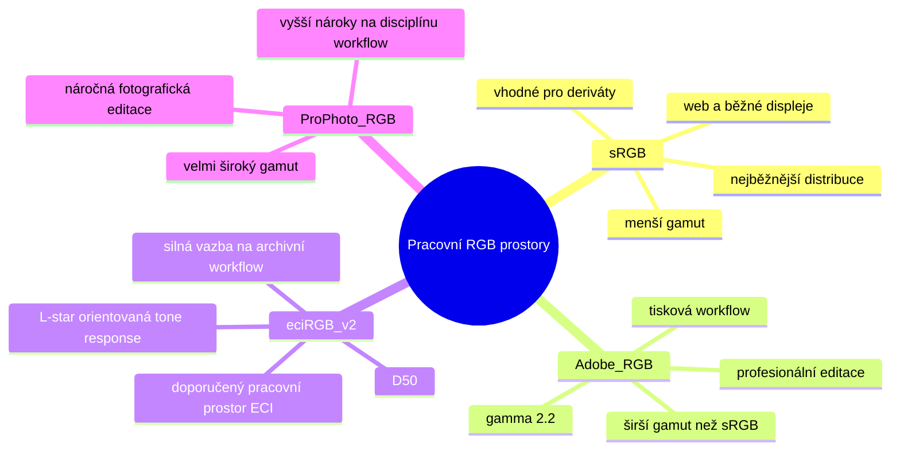
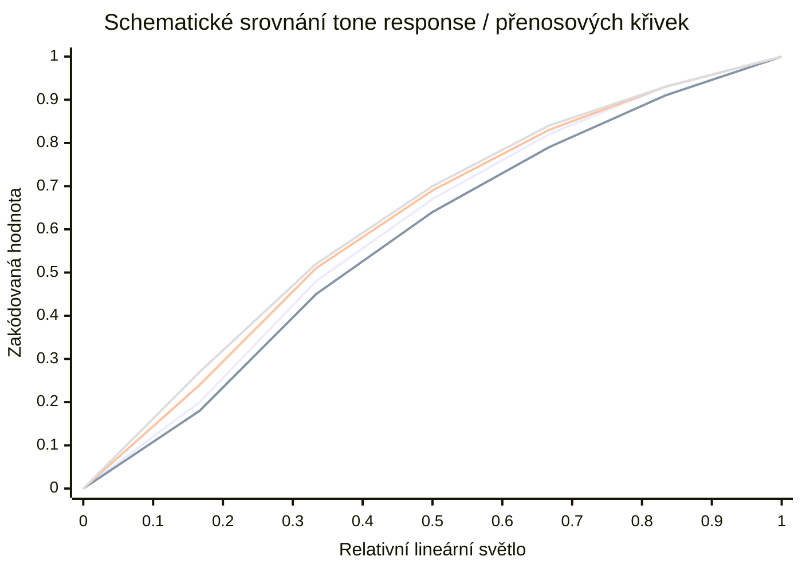
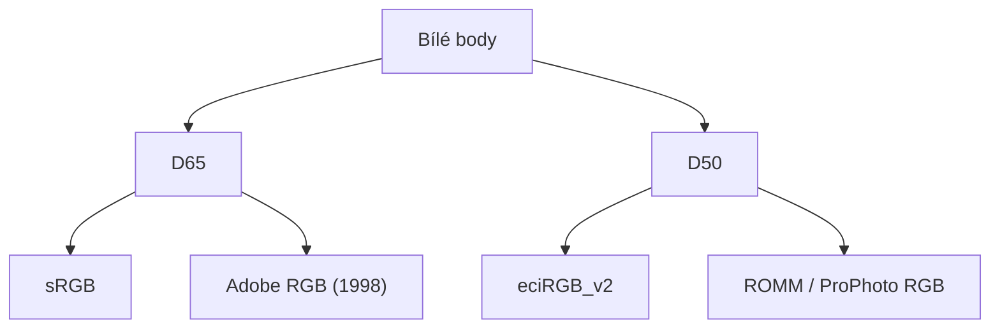
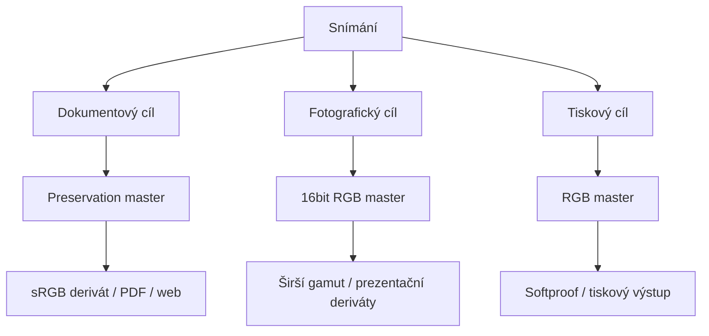

# Metodika tvorby preservation masterů obrazových dat kulturního dědictví

**Verze:** 0.3.0 
**Poslední aktualizace:** 2026-05-25 
**Formát:** markdown 
**Licence:** <a href="https://standardy.digitalizaty.cz">Metodika tvorby preservation masterů obrazových dat kulturního dědictví</a> © 2026 by <a href="https://github.com/bezverec">Jan Houserek</a> is licensed under <a href="https://creativecommons.org/licenses/by-sa/4.0/">CC BY-SA 4.0</a>

---

## Abstrakt

Tento dokument představuje pracovní návrh metodiky pro tvorbu preservation masterů při digitalizaci kulturního dědictví. Jeho cílem je formulovat odborně konzistentní a terminologicky přesný rámec pro vznik digitálních reprodukcí, které budou dlouhodobě použitelné jako archivní reprezentace fyzických předloh. Metodika vychází z mezinárodně uznávaných doporučení a standardů v oblasti obrazové kvality, správy barev, technické kontroly a dlouhodobé správy digitálních objektů, zejména z dokumentů FADGI, Metamorfoze, ISO 19264 a z principů ICC color managementu.^1^,^2^,^3^,^4^,^5

Dokument je koncipován jako podrobný odborný text. Neomezuje se na stručný soupis parametrů, ale usiluje také o výklad důvodů jednotlivých požadavků, jejich vzájemných vazeb a jejich významu pro institucionální praxi. Zvláštní pozornost je věnována rozdílu mezi device-dependent a device-independent přístupy, roli ICC profilů, vztahu mezi technickou měřitelností a vizuálním hodnocením, odlišení preservation masteru od pracovních a uživatelských derivátů a stručnému vysvětlení různých typů ICC charakterizace, zejména matrix/TRC a LUT profilů.^1^,^2^,^4^,^5

---

## 1. Úvod

Digitalizace kulturního dědictví již dávno nepředstavuje pouze technický proces převodu analogové předlohy do digitálního obrazového souboru. V současném institucionálním prostředí je chápána jako řízená odborná činnost, jejímž výsledkem má být standardizovaná, věrohodná, měřitelná a dlouhodobě spravovatelná digitální reprezentace originálu. Tato reprezentace musí vyhovět nejen bezprostředním potřebám zpřístupnění nebo badatelského využití, ale také budoucím požadavkům na re-use, migraci, reprocessing, validaci a důvěryhodnou archivaci.^1^,^2^,^3

Klíčovým pojmem v tomto kontextu je preservation master, tedy archivní master soubor první generace, z něhož mají být odvozovány další reprodukce, deriváty a uživatelské výstupy. Preservation master nelze chápat jako libovolný „nejlepší dostupný soubor“, nýbrž jako výsledek řízeného pracovního postupu, který zahrnuje kalibraci zařízení, standardizovanou správu barev, kontrolu obrazové kvality, důslednou dokumentaci a institucionálně obhajitelná rozhodnutí o formátu, barevném prostoru, bitové hloubce, samplingu a přípustných zásazích do obrazu.^1^,^2

---

## 2. Účel dokumentu a působnost

Účelem tohoto dokumentu je formulovat odborný metodický rámec pro tvorbu preservation masterů v procesu digitalizace kulturního dědictví. Dokument má sloužit jako základ pro vznik interních směrnic, projektových specifikací a provozních pracovních postupů na úrovni jednotlivých institucí nebo digitalizačních pracovišť.

Tato metodika je primárně určena pro digitalizaci plošných předloh, zejména rukopisů, starých tisků, novodobých knih, periodik, archiválií, grafických listů, fotografií, map a plánů, volných listů a obdobných dokumentových předloh. Dokument se zaměřuje na obrazová data vznikající skenováním nebo reprografickým fotografováním. Nevztahuje se plně na audiovizuální digitalizaci, 3D záznam, multispektrální zobrazování ani na specializované konzervační či forenzní zobrazovací metody, pokud nejsou výslovně začleněny do konkrétního projektového režimu.

---

## 3. Terminologické a koncepční vymezení

### 3.1 Preservation master

Preservation master je první generační archivní obrazový soubor určený pro dlouhodobé uchování. Musí představovat technicky kontrolovanou, standardizovanou a dokumentovanou digitální reprezentaci originálu.^2

### 3.2 Produkční nebo pracovní soubor

Pracovní soubor je mezivýstup vznikající v průběhu zpracování, validace nebo interní produkce. Může být technicky užitečný pro lokální pracovní postup, ale sám o sobě nemusí splňovat všechny požadavky preservation masteru.

### 3.3 Uživatelský derivát

Uživatelský derivát je odvozený soubor vytvořený z preservation masteru pro konkrétní účel užití, například webové zpřístupnění, OCR pracovní postup, studijní potřeby, tiskové náhledy nebo publikační výstupy.

### 3.4 Device-dependent a device-independent data

Device-dependent data jsou taková obrazová data, jejichž barevný význam je bezprostředně vázán na konkrétní zařízení nebo na úzce definovaný produkční řetězec. Device-independent data jsou naopak interpretovatelná prostřednictvím standardizovaného barevného popisu a nejsou závislá pouze na znalosti konkrétního zařízení.^4^,^5

### 3.5 ICC profil

ICC profil je standardizovaný popis barevné charakteristiky zařízení, barevného prostoru nebo transformačního vztahu, umožňující řízenou interpretaci a převod barevných dat. V praxi je vhodné rozlišovat zejména profily založené na matici a tónových přenosových křivkách (matrix/TRC) a profily využívající tabulkové transformace (LUT).^4

### 3.6 White balance, neutralita a color cast

White balance označuje míru neutrality neutrálních tónů v obrazu. Color cast představuje systematickou odchylku barevné neutrality, například teplý, studený, zelený nebo purpurový nádech. V kontextu preservation masterů je třeba chápat white balance jako samostatný parametr kvality, který nelze redukovat na obecnou color accuracy celého targetu.^2

### 3.7 Slovník pojmů

#### Adobe RGB (1998)
Standardní RGB barevný prostor s širším gamutem než sRGB.

#### Barevná přesnost / color accuracy
Míra shody mezi referenčními barevnými hodnotami targetu a jejich digitální reprodukcí.

#### Bitová hloubka
Počet bitů použitých pro zápis jedné barevné složky nebo tonální úrovně.

#### Claimed sampling rate
Nominálně deklarované rozlišení nebo sampling digitalizačního systému.

#### Color misregistration
Nesouosost barevných kanálů vedoucí k barevným lemům nebo nepřesnému překrytí obrazové informace.

#### DeltaE / ΔE
Souhrnné označení pro metriky vyjadřující barevnou odchylku mezi dvěma body v barevném prostoru.

#### DPIR
Digital Preservation Imaging Rating. Pracovní ratingový model této metodiky pro hodnocení důvěryhodnosti obrazového výstupu, workflow nebo produkční dávky.

#### eciRGB v2
Standardní RGB barevný prostor doporučovaný v evropském prostředí pro archivní a kvalitní produkční pracovní postup.

#### Embedded ICC profil
ICC profil vložený přímo do obrazového souboru.

#### Expozice
V kontextu digitalizace míra využití tonálního rozsahu pro zachycení předlohy bez ztráty informace ve světlech nebo stínech.

#### Gain modulation
Míra tonální rovnoměrnosti a reprodukční správnosti v průběhu jasové škály.

#### Geometrická přesnost
Míra, s jakou digitální reprodukce zachovává tvarové a rozměrové vlastnosti originálu bez zkreslení.

#### LUT profil
ICC profil využívající tabulkové transformace (look-up tables), který může detailněji modelovat nelineární barevné chování zařízení než jednoduchý matrix/TRC model.

#### MTF / SFR
Modulation Transfer Function, resp. Spatial Frequency Response. Soubor parametrů popisujících schopnost systému přenášet kontrast a detail při různých prostorových frekvencích.^2^,^3

#### PCS
Profile Connection Space. Referenční mezilehlý prostor používaný v ICC pracovním postupu při transformacích mezi zdrojovým a cílovým profilem.^4

#### Profil monitoru
ICC profil charakterizující konkrétní monitor pro účely správného zobrazení.

#### RAW data
Zdrojová obrazová data vzniklá při snímání před plnou interpretací nebo normalizací do standardního pracovního prostoru.

#### Rendering intent
Pravidlo nebo strategie převodu barev mezi prostory s různým gamutem.^1^,^4

#### Reproduction scale accuracy
Přesnost měřítka reprodukce, tedy shoda mezi skutečnými rozměry originálu a rozměry v digitálním záznamu.^1

#### Sampling efficiency
Míra, s jakou digitalizační systém skutečně využívá deklarované rozlišení k přenosu užitečného detailu.^1^,^2

#### Sharpening
Softwarové nebo hardwarové zvýraznění hran a lokálního kontrastu.

#### Target
Fyzický testovací obrazec nebo vzorník používaný ke kalibraci, měření a validaci kvality digitalizačního systému.^1^,^2

#### TIFF 6.0
Dlouhodobě zavedený rastrový obrazový formát široce používaný pro archivní a produkční obrazy.

---

## 4. Normativní a metodická východiska

Tento dokument vychází z kombinace standardů, doporučení a metodik, které představují současný mezinárodní referenční rámec pro digitalizaci kulturního dědictví.

### 4.1 FADGI

Doporučení FADGI představují komplexní technický rámec pro digitalizaci kulturního dědictví, zejména v oblasti obrazové kvality, samplingu, tonality, správy barev a dokumentace pracovního postupu.^1

### 4.2 Metamorfoze

Metamorfoze je evropská metodika preservation imagingu, která propojuje požadavky na objektivní i subjektivní hodnocení kvality, definuje kvalitativní režimy, stanovuje technické parametry a rozpracovává pořadí testování i interpretaci výsledků.^2

### 4.3 ISO 19264 a příbuzné normy

Normy ISO 19264 poskytují standardizovaný rámec pro měření obrazové kvality digitalizačních systémů. Důležité jsou zejména pro definování samplingu, MTF, noise, tonality, color accuracy a dalších parametrů technické výkonnosti zobrazovacího řetězce.^3

V redakční přípravě této verze byl zohledněn také dostupný pracovní návrh další edice ISO 19264-1.^7 Protože nejde o finálně vydanou mezinárodní normu, tato metodika jím nenahrazuje citaci ISO 19264-1:2021. Návrh je však důležitý jako signál vývoje směrem k větší nezávislosti na konkrétních obchodních názvech targetů: rozhodující mají být měřitelné vlastnosti testovacího targetu, dostupnost referenčních dat, vhodnost pro konkrétní metriky a kompatibilita s vyhodnocovacím softwarem, nikoli samotný fakt, že jde například o UTT nebo jiný známý target.

### 4.4 ICC Consortium

Dokumenty ICC Consortium poskytují teoretický i praktický rámec pro správu barev v RGB pracovním postupu.^4^,^5

---

## 5. Základní principy tvorby preservation masteru

1. Preservation master musí být chápán jako standardizovaný archivní objekt, nikoli jako nahodilý vedlejší produkt digitalizačního procesu.^2  
2. Cílem preservation masteru není vytvořit „vizuálně nejpůsobivější“ obraz, ale takový soubor, který co nejlépe a nejspolehlivěji reprezentuje originál v rámci definovaného technického režimu.^1^,^2  
3. Metodika musí preferovat postupy, které lze opakovat, validovat a obhájit.^1  
4. Je nutné důsledně rozlišovat mezi legitimní technickou kalibrací zobrazovacího řetězce a takovou manipulací obrazu, která mění informační obsah nebo povahu vizuálního svědectví.^1^,^2  
5. V rámci jednoho projektu musí být použity konzistentní postupy, technické cíle, targety, barevné prostory a pravidla kontroly kvality.^1^,^2

---

## 6. Barevné řízení a role ICC profilů

### 6.1 Správa barev jako součást preservation workflow

Správa barev není volitelným doplňkem, ale základní součástí workflow tvorby preservation masterů.^1^,^4^,^5

### 6.2 Role vstupního profilu zařízení

Vstupní profil zařízení má charakteristiku snímacího systému popsat a umožnit řízenou transformaci do cílového pracovního prostoru. Není automaticky optimálním dlouhodobým prostorem pro archivaci masteru.^1^,^4^,^5 Vstupní profil zařízení slouží k charakterizaci snímacího systému; preservation master se však zpravidla neukládá v device-dependent prostoru zařízení, ale po řízené transformaci do standardního pracovního RGB prostoru.

### 6.3 Standardní pracovní a archivní RGB prostor

FADGI doporučuje vytvářet master obrazové soubory ve standardním barevném prostoru a výslovně uvádí Adobe RGB (1998), ProPhoto a eciRGB v2 jako vhodné profily pro ukládání RGB image files.^1 Metamorfoze stanovuje, že preservation masters mají používat v rámci projektu konzistentní barevný prostor; pro Full je povinný eciRGB v2, pro Light je přípustný eciRGB v2 nebo Adobe RGB (1998), pro Extra Light též sRGB IEC61966-2.1.^2

### 6.3a Praktické postavení eciRGB v2 mimo paměťové instituce

Pro tuto metodiku je důležité rozlišovat mezi **metodickou preferencí** a **obecnou rozšířeností v komerční praxi**. eciRGB v2 má silnou legitimitu v evropském standardizačním, polygrafickém a paměťovém kontextu; samotná ECI jej na svém webu výslovně uvádí jako **pracovní barevný prostor doporučený ECI**. Současně však tato metodika nepracuje s tvrzením, že by eciRGB v2 byl dominantním pracovním RGB prostorem v celém širším komerčním prostředí.

V běžném komerčním ekosystému Adobe jsou mnohem viditelnější především **sRGB**, **Adobe RGB (1998)** a **ProPhoto RGB**. Photoshop uvádí, že je obecně nejlepší volit pro RGB working space spíše **Adobe RGB nebo sRGB** než profil konkrétního zařízení, a současně říká, že v nabídce pracovních prostorů standardně zobrazuje profily doporučené a otestované Adobe pro většinu workflow. Adobe Camera Raw mezi „standard color spaces“ z dřívějších verzí uvádí **Adobe RGB (1998), ColorMatch RGB, ProPhoto RGB a sRGB**. Lightroom Classic pak používá **Adobe RGB** v řadě modulů a **ProPhoto RGB** v modulu Develop.

Z toho plyne praktický závěr pro tuto metodiku: **eciRGB v2 je vhodné preferovat jako institucionálně a metodicky zdůvodněnou volbu pro preservation workflow, nikoli jako domněle univerzální komerční standard**. Současně je vhodné výslovně uznat, že **Adobe RGB (1998)** je v širší profesionální praxi velmi běžná a legitimní alternativa, zejména tam, kde organizace pracuje převážně v Adobe ekosystému.

### 6.3b Matrix/TRC profil a LUT profil

V praxi ICC správy barev je důležité rozlišovat mezi dvěma základními typy profilové charakterizace: **matrix/TRC profilem** a **LUT profilem**.

**Matrix/TRC profil** popisuje barevné chování zařízení nebo pracovního prostoru pomocí kombinace:
- barevných primárek nebo ekvivalentní maticové transformace,
- bílého bodu,
- a tónových přenosových křivek (**TRC**, tone response curves) pro jednotlivé kanály.

Tento typ profilu je výpočetně jednodušší, transparentnější a velmi rozšířený u standardních RGB pracovních prostorů, jako jsou **sRGB**, **Adobe RGB (1998)** nebo **eciRGB v2**. Je vhodný tam, kde lze barevné chování prostoru nebo zařízení dostatečně dobře popsat relativně jednoduchým modelem.

**LUT profil** (**Look-Up Table profile**) naproti tomu používá tabulkové transformace, které mohou detailněji modelovat nelineární a vzájemně provázané barevné chování reálného zařízení. V ICC architektuře bývají tyto převody reprezentovány zejména pomocí tabulek typu **A2B** a **B2A**, tedy transformací mezi zařízením definovaným prostorem a referenčním prostorem ICC workflow přes PCS.

Z metodického hlediska to znamená, že:
- **matrix/TRC profil** bývá vhodný pro standardní pracovní RGB prostory a pro jednodušší, dobře predikovatelné transformace,
- **LUT profil** bývá vhodný zejména pro přesnější charakterizaci vstupních a výstupních zařízení, pokud jednoduchý maticový model nestačí.

U digitalizačních zařízení může LUT profil lépe popsat:
- nelinearity snímacího řetězce,
- složitější vztahy mezi kanály,
- lokální odchylky v barevném chování,
- a problematická místa gamutu, která jednoduchá matice s TRC vystihuje jen přibližně.

Současně je však třeba upozornit, že LUT profil není automaticky „lepší“ ve všech ohledech. Oproti maticovým profilům může být:
- méně transparentní při odborné interpretaci,
- více závislý na kvalitě konkrétní profilace,
- a v některých softwarech nebo workflow méně předvídatelný z hlediska interoperability.

Pro tuto metodiku z toho plyne důležitý závěr:

**Volba mezi matrix/TRC a LUT profilem nemá být vedena představou, že jeden typ je absolutně správný, ale tím, zda zvolený profil dostatečně přesně, stabilně a opakovatelně charakterizuje konkrétní zařízení a zda je kompatibilní s institucionálním workflow.**

V institucionální praxi lze doporučit tento princip:
1. **pracovní RGB prostory preservation masterů** mají být standardní a široce interpretovatelné, typicky založené na dobře definovaném ICC prostoru,
2. **vstupní profil zařízení** může být maticový nebo LUT podle výsledku profilace a chování zařízení,
3. rozhodující je, aby převod ze vstupního profilu do standardního archivního RGB prostoru byl **řízený, dokumentovaný a reprodukovatelný**.

### 6.3c Standardizovaný ICC profil masteru a profil snímače

Tato metodika nadále vychází z praktické linie FADGI a Metamorfoze: preservation master má být zpravidla uložen ve standardizovaném pracovním RGB prostoru s vloženým ICC profilem, nikoli v nedokumentovaném device-dependent prostoru konkrétního snímače.^1^,^2^,^4^,^5

Je však nutné výslovně rozlišit dvě různé role ICC profilů. **Vstupní profil zařízení** popisuje konkrétní snímací řetězec a slouží jako nástroj charakterizace a řízeného převodu. **Standardizovaný profil preservation masteru** naproti tomu popisuje výsledný pracovní nebo archivní barevný prostor souboru. Správný postup tedy není prosté dodatečné přiřazení standardního profilu k libovolným výstupním datům, ale řízená transformace z validovaného vstupního stavu do zvoleného standardního prostoru.

Za metodicky rizikové se považuje zejména workflow, v němž zařízení provede skryté nebo nezdokumentované interní úpravy tonality, kontrastu, saturace, clippingu, odšumění nebo zostření a výslednému souboru je následně pouze přiřazen standardní ICC profil. V takovém případě profil nemusí věrně popisovat skutečný význam obrazových dat. Pokud se používá standardní profil typu eciRGB v2, Adobe RGB (1998), ProPhoto RGB nebo sRGB, má být zřejmé, jakou profilací, kalibrací nebo konverzí se do tohoto prostoru data skutečně dostala.

### 6.4 Profil monitoru

Profil monitoru slouží k řízenému zobrazení obrazu na konkrétním displeji. Nesmí být zaměňován s pracovním prostorem obrazového souboru.^4^,^5

### 6.5 Přiřadit profil a převést do profilu

Rozlišování mezi „Assign Profile“ a „Convert to Profile“ je zásadní. ICC white paper o roli profilů vychází z toho, že profil definuje význam numerických dat a že vlastní transformaci provádí CMM mezi zdrojovým a cílovým profilem přes PCS.^4

### 6.6 Rendering intent

FADGI uvádí, že perceptual intent obvykle funguje lépe pro fotografické obrazy, zatímco absolute colorimetric často pro textové dokumenty a grafiku; současně doporučuje intent ověřovat podle konkrétního souboru nebo skupiny souborů.^1

### 6.7 Praktická poznámka k širokým gamutům a bitové hloubce

Širší gamut sám o sobě automaticky neznamená vyšší věrnost nebo vyšší archivní kvalitu. Jeho přínos se projeví pouze tehdy, pokud je workflow dostatečně disciplinované, barevně řízené a pracuje s odpovídající bitovou hloubkou. U širokých pracovních prostorů proto obecně roste význam 16bitového zpracování a opatrného zacházení s převody, editací i exportem.

---

## 7. Formátové a technické parametry preservation masteru

### 7.1 Souborový formát

Metamorfoze předpokládá pro preservation masters primárně TIFF 6.0 uncompressed pro všechny tři úrovně kvality.^2

### 7.2 Bitová hloubka

Metamorfoze Full vyžaduje 16 bitů; Light a Extra Light 8 bitů na kanál. Zároveň uvádí, že fotografie a výtvarné předlohy by měly být vždy digitalizovány a ukládány při 16 bitech na kanál.^2 FADGI doporučuje pracovat co nejdéle ve 48-bit RGB nebo 16-bit grayscale a snížení bitové hloubky provádět až na konci workflow.^1

### 7.3 Rozlišení a sampling

Metamorfoze uvádí 300 ppi pro originály ≥ DIN A5 a maximálně 600 ppi pro menší originály; současně upozorňuje, že u předloh s vyšší informační hustotou může být vhodný vyšší sampling rate.^2 FADGI ve čtyřhvězdičkové úrovni pracuje u většiny dokumentových kategorií přibližně s 400 ppi, u fotografických předloh přibližně s 600 ppi a u některých výtvarných nebo jemně strukturovaných předloh připouští, že může být vhodná i vyšší hodnota.^1

Tato metodika se v otázce výchozího samplingu přiklání spíše k opatrnějšímu, vyššímu rámci FADGI než k minimální hranici 300 ppi. Neznamená to však mechanické navyšování PPI. Vyšší sampling má metodický smysl pouze tehdy, pokud digitalizační systém při daném nastavení reálně dosahuje odpovídající sampling efficiency, SFR/MTF výkon, přijatelnou míru sharpeningu, color misregistration, geometrickou přesnost a stabilní tonalitu.^1^,^2^,^3

Pro tuto metodiku lze jako výchozí institucionální rámec doporučit:

| Typ předlohy | Doporučený výchozí sampling | Poznámka |
|---|---|---|
| Běžné knihy, rukopisy, periodika a archiválie | 400 ppi | vychází z FADGI 4* dokumentového rámce; 300 ppi lze připustit u méně náročných projektů |
| Noviny a běžné textové dokumenty | 400 ppi | zejména tam, kde je cílem preservation master a OCR/re-use |
| Mapy, plány a technická dokumentace | 400 ppi, podle detailu 600 ppi+ | rozhoduje jemnost linií, popisů a metrické požadavky |
| Fotografické předlohy | 600 ppi | u malých nebo velmi jemných fotografií může být vhodné více |
| Grafiky, kresby, výtvarná díla a jemné tiskové techniky | 600 ppi nebo více | u rytin, kreseb, textur a malých detailů může být vhodné 800 ppi+ |
| Malé předlohy pod A5 nebo předlohy s vysokou informační hustotou | 600 ppi nebo více podle potřeby | vždy ověřit skutečný přenos detailu, nikoli jen hlavičkovou hodnotu PPI |

Pokud skener nebo reprografická sestava při vyšším PPI nedosahuje odpovídajícího MTF/SFR výkonu, je vhodnější použít nižší, prokazatelně kvalitní a validované nastavení než vytvářet větší soubory s nízkou skutečnou informační hodnotou. Softwarové převzorkování nebo pouhé zvýšení hodnoty PPI v metadatech nesmí být vydáváno za vyšší kvalitu digitalizace.

### 7.4 Embedded metadata a technická identifikace

Metamorfoze řadí kontrolu file format, technical metadata, embedded barevný prostor a bit depth do prvního kroku technického hodnocení.^2

---

## 8. Kalibrace, targety a měřicí infrastruktura

Metamorfoze uvádí přehled vhodných targetů pro jednotlivé testy: UTT, ColorChecker Digital SG / DCSG, Golden Thread FADGI 19264 target, QA-62 MTF test target a QA-2 Metric.^2 FADGI požaduje rutinní digital image conformance evaluation a doporučuje snímat appropriate target na začátku snímací session; target má být zkontrolován a musí projít ještě před zahájením produkčního snímání.^1

FADGI navíc doporučuje testovat na začátku každého pracovního dne nebo na začátku každé dávky, podle toho, co nastane dříve, a testování opakovat po aktualizaci software/device drivers i při indikaci problému.^1

V návaznosti na vývoj ISO 19264 je vhodné chápat seznamy targetů jako doporučené příklady, nikoli jako uzavřený katalog. UTT zůstává prakticky významný kombinovaný target, ale tato metodika jej nepovažuje za jediný referenční model konformity. Stejnou roli může plnit i jiný target nebo kombinace targetů, pokud prokazatelně pokrývá požadované metriky, má odpovídající referenční data, je kompatibilní s vyhodnocovacím softwarem a odpovídá zamýšlené sampling rate.

### 8.1 Typy targetů podle role ve workflow

Targety není vhodné chápat jako jeden zaměnitelný druh pomůcky. Metamorfoze rozlišuje dvě základní skupiny technických targetů: **kalibrační a validační targety** pro posouzení zařízení nebo snímací sestavy a **workflow targety / object-level targety** pro průběžné sledování stability konkrétních snímků nebo sérií.^2

Pro tuto metodiku je užitečné rozlišovat následující praktické role:

| Role targetu | Co kontroluje | Doporučené targety podle Metamorfoze | Referenční data |
|---|---|---|---|
| Tonální výkon | white balance, expozici, OECF, gain modulation, noise | UTT, ColorChecker Digital SG / DCSG, DT Next Generation Target V2, Golden Thread FADGI 19264 target, frame-filling white sheet, frame-filling black sheet | u tonálních a barevných targetů vždy target-specific L\*a\*b\* referenční soubor; u bílých/černých ploch změřené L\*a\*b\* hodnoty |
| Barevný výkon | color accuracy a stabilitu barevné reprodukce | ColorChecker Digital SG / DCSG jako standard; další barevné targety pouze při projektovém schválení | target-specific L\*a\*b\* referenční soubor je povinný |
| MTF / sampling | MTF10, sampling efficiency, MTF50, sharpening, color misregistration | UTT, QA-62 MTF test target, Golden Thread FADGI 19264 target | podle targetu a použitého software; u UTT a kombinovaných targetů odpovídající referenční data |
| Geometrie a měřítko | sampling rate, distortion, scale accuracy, vizuální ostrost | QA-2 Metric, UTT, metrické device-level targety | geometrická specifikace targetu a kompatibilita s vyhodnocovacím softwarem |
| Rovnoměrnost pole | illumination, color cast, lokální rozdíly v ploše | frame-filling white sheet, frame-filling black sheet, UTT, device-level targety | změřené L\*a\*b\* hodnoty ploch nebo referenční data targetu |
| Workflow / object-level kontrola | stabilitu snímání v průběhu série, zejména expozici, neutralitu, tonální chování a sampling | Munsell Linear Gray Scale (MLGS), Object Level Target (OLT) | pro nejvyšší kvalitu doporučen target-specific L\*a\*b\* referenční soubor; u režimu odpovídajícího Metamorfoze Full je vyžadován |

Jeden fyzický target může plnit více rolí, pokud obsahuje odpovídající prvky a pokud je podporován používaným analyzačním softwarem. Rozhodující není obchodní název targetu, ale jeho metrologická vhodnost, dostupnost referenčních dat, fyzický stav a kompatibilita s konkrétním vyhodnocovacím postupem.

U nově pořizovaných nebo projektově schvalovaných targetů má být vedle názvu a výrobce ověřeno také to, pro jakou maximální sampling rate je target určen, jaká referenční data jsou k dispozici, zda existuje možnost recertifikace, zda target obsahuje prvky pro požadované metriky a zda jeho fyzický rozměr odpovídá snímanému obrazovému poli. Pokud jedna deska nebo karta nepokrývá všechny metriky, je přípustné použít více vzájemně zdokumentovaných targetů.

### 8.2 Object-level targety a workflow targety

V Metamorfoze jsou **workflow targets** a **object-level targets** chápány jako tatáž provozní skupina: malé technické targety umísťované během digitalizace přímo do obrazového pole k originálu. Je třeba rozlišovat tuto skupinu od konkrétní rodiny targetů nazvané **Object Level Target (OLT)**. Standardními workflow/object-level targety podle Metamorfoze jsou:

- **Munsell Linear Gray Scale (MLGS)**, formát přibližně 25,5 × 3,2 cm,
- **Object Level Target (OLT)**, dostupný ve více velikostech, přibližně 11,75 × 1,6 cm, 23,5 × 2,54 cm a 47 × 4,45 cm.^2

Workflow/object-level targety slouží ke srovnání stability obrazového výkonu napříč sérií obrazů nebo skenů. Protože jsou malé, neposkytují informaci o výkonu celého obrazového pole a nesmějí nahrazovat periodické QA měření, device-level validaci ani kontrolu rovnoměrnosti osvětlení v celé ploše.^2

Metamorfoze pro režimy Full a Light vyžaduje workflow target v každém preservation master souboru a pro Full požaduje použití target-specific L\*a\*b\* reference file. Tato metodika tento požadavek nepřejímá jako obecně povinný. Pro české institucionální prostředí jej formuluje jako **doporučený vyšší režim** pro projekty s nejvyššími nároky na barevnou věrnost, auditovatelnost a dlouhodobou prokazatelnost kvality.^2

Pro tuto metodiku tedy platí:

- object-level/workflow target není povinnou součástí každého preservation masteru,
- u nejvyšších kvalitativních režimů je však MLGS, OLT nebo jiný schválený workflow target důrazně doporučen,
- u nejvyšší kvality má být použit target-specific L\*a\*b\* referenční soubor, pokud je pro konkrétní target dostupný,
- pokud je použit jiný workflow target než MLGS nebo OLT, musí být jeho použití schváleno v projektové specifikaci,
- pro uživatelské deriváty lze target podle projektových pravidel odstranit ořezem.^1^,^2

### 8.3 Umístění object-level targetu při snímání

Object-level/workflow target má být umístěn **ve stejném obrazovém poli jako originál**, typicky dole, nahoře nebo po straně. Pokud je to možné, má být v celé sérii kladen stále na stejné místo, preferenčně ke spodnímu okraji obrazu. Vzdálenost mezi targetem a originálem nemá podle Metamorfoze přesáhnout **5 cm**.^2

Pro provozní použití z toho plyne:

- target má ležet ve stejné rovině jako snímaná předloha,
- nemá překrývat originál, text, okraje, poškození ani jiné informačně významné části,
- má být celý viditelný, nepoškozený, ve stejné rovině ostrosti jako předloha a rovnoměrně osvětlený,
- má být natočen konzistentně vůči snímku a nemá být záměrně umisťován šikmo,
- nesmí být tak daleko od originálu, aby zbytečně zvětšoval obrazové pole, datový objem nebo rozsah následného ořezu,
- u vázaných předloh má být umístěn mimo hřbetní stín a mimo oblasti deformované vazbou,
- u snímání pod sklem má být target snímán ve srovnatelných podmínkách jako originál; pokud to není možné, musí být omezení zapsáno v projektové dokumentaci.

Velikost OLT nebo MLGS má odpovídat formátu originálu a sampling rate. U malých předloh je vhodné volit menší OLT, aby target nepřiměřeně nezvětšoval obrazové pole; u velkoformátových předloh může být vhodný větší target, aby byly jeho patchy dostatečně čitelné a vyhodnotitelné.

### 8.4 Quality assurance, device-level a kalibrační targety

Quality assurance targety mají ověřit, zda digitalizační sestava splňuje požadované parametry před zahájením produkce a zda se v čase významně nemění. Nejsou totéž co object-level targety. Jejich role je širší: mají doložit technickou konformitu snímacího systému, nikoli pouze stabilitu jednotlivého snímku nebo série.^1^,^2^,^3

Metamorfoze uvádí pro kalibraci a validaci tonálního a barevného výkonu zejména:

- **Universal Test Target (UTT)**,
- **ColorChecker Digital SG / Digital ColorChecker SG (CCSG/DCSG)**,
- **DT Next Generation Target V2 (NGT2)**,
- **Golden Thread FADGI 19264 target**,
- **frame-filling black sheet** s hodnotou přibližně L\* 25,
- **frame-filling white sheet** s hodnotou přibližně L\* 95.^2

Pro MTF, sampling a geometrický výkon uvádí zejména:

- **Universal Test Target (UTT)**,
- **QA-62 MTF test target**,
- **QA-2 Metric**.^2

Targety používané ke kalibraci nebo validaci tonálního a barevného výkonu mají být používány s odpovídajícím target-specific L\*a\*b\* referenčním souborem. Targety, které nejsou frame-filling, mají být při kalibraci nebo validaci umístěny na celoplošném černém pozadí; Metamorfoze doporučuje černou plochu okolo L\* 25, co nejnižší a\* a b\* hodnoty, rovnoměrnou texturu a bez struktury vláken či tkaniny.^2

Referenční soubor má být kompatibilní s použitým vyhodnocovacím softwarem a nemá být upravován. Metamorfoze požaduje, aby obsahoval zejména identifikaci měřicího přístroje, informaci o absenci filtrů, světelný zdroj D50, pozorovací úhel 2°, číslování a lokalizaci patchů, L\*a\*b\* hodnoty a datum měření. Název referenčního souboru má obsahovat zkratku a číslo targetu; běžné zkratky zahrnují například DCSG, CCSG, FADGI, NGT2, UTTA0 až UTTA3, MLGS a OLT. Target používaný s referenčním souborem má mít na přední straně viditelné číslo odpovídající tomuto souboru a referenční soubory mají být pravidelně obnovovány, podle Metamorfoze přibližně každé dva roky.^2

### 8.5 Doporučené targetové workflow

Tato metodika doporučuje rozlišit tři praktické vrstvy targetového workflow:

1. **Před zahájením projektu nebo po významné změně workflow** provést charakterizaci a ověření zařízení pomocí vhodných kalibračních a device-level targetů. Výsledky uložit jako součást projektové dokumentace.
2. **Na začátku pracovního dne, session nebo dávky** sejmout a vyhodnotit QA targety odpovídající požadovaným metrikám. Produkční snímání má začít až po ověření, že systém splňuje požadované parametry.
3. **V průběhu produkce** používat object-level/workflow targety podle náročnosti projektu. U běžných projektů mohou být nahrazeny pravidelným QA režimem; u nejvyšších kvalitativních režimů, fotografických předloh, výtvarných děl, map, unikátů a auditně citlivých zakázek se doporučuje jejich snímání přímo s objektem nebo v bezprostřední vazbě na něj.

Metamorfoze ukládá snímky QA targetů spolu s preservation mastery a zdůrazňuje, že musí být možné propojit produkční den, snímky technických targetů a konkrétní preservation mastery. Tuto vazbu lze v praxi zajistit produkčním přehledem, názvovou konvencí a uložením validačních reportů.^2

Při vstupní charakterizaci zařízení nebo při periodické plné validaci má targetové workflow pokrýt nejen tonalitu, barvu, SFR/MTF a geometrii, ale také metriky, které se v běžném denním provozu často přehlížejí: dynamický rozsah, banding, vadné pixely, reproduction scale, illumination non-uniformity a chrominance non-uniformity. Tyto metriky není nutné vyžadovat u každého snímku, ale mají být součástí důkazu, že digitalizační sestava je pro daný typ předloh technicky způsobilá.

### 8.6 Je nutné snímat target u každého dokumentu?

Tato otázka vyžaduje přesnou odpověď, protože v praxi se často směšují dva různé požadavky:
1. **průběžná technická kontrola digitalizačního systému**,  
2. **přítomnost targetu v každém jednotlivém obrazovém souboru nebo u každého digitalizovaného objektu**.

Pro tuto metodiku se doporučuje následující rozlišení:

- **Target není nutné chápat jako absolutně povinnou součást každého jednotlivého master souboru**, pokud instituce používá stabilní a dokumentovaný systém průběžné validace.
- **Targetově založená kontrola je však nutná jako součást řízení kvality**: minimálně na začátku snímací session, na začátku pracovního dne nebo dávky a vždy po změně nastavení, zařízení, software nebo podmínek snímání.
- **Silnější režim** představuje workflow, v němž je referenční target zachycen přímo s digitalizovaným objektem nebo v bezprostřední vazbě na něj; to je zvlášť vhodné u náročných předloh, fotografického materiálu, výtvarných děl, zakázek s vysokými požadavky na auditovatelnost nebo tam, kde to vyžaduje projektový standard.
- **Object-level target / workflow target** se v této metodice doporučuje pro nejvyšší kvalitativní režimy, ale nepovažuje se za univerzálně povinný požadavek pro každý preservation master.

FADGI doporučuje po zavedení systému provádět digital image conformance evaluation na začátku každého pracovního dne nebo na začátku každé dávky, podle toho, co nastane dříve; target má být před produkčním snímáním zkontrolován a musí projít. Současně FADGI ve svých doporučeních uvádí i silnější variantu: zahrnout referenční targety do každého snímku originálu, minimálně šedou škálu, barevnou referenci a měřítko, přičemž access deriváty lze následně o target oříznout.

Z toho pro institucionální praxi plyne tento závěr:

- **není nutné tvrdit, že bez targetu v každém jednotlivém dokumentu je digitalizace automaticky metodicky chybná**,  
- **je však nutné trvat na tom, že bez pravidelné targetové validace nelze prokázat stabilitu a konformitu systému**.

Pro běžnou metodickou formulaci lze doporučit tuto větu:

**Každý digitalizační workflow musí používat pravidelné targetové měření a validaci. Přítomnost targetu v každém jednotlivém souboru se řídí typem projektu, požadavky na auditovatelnost a institucionální politikou, nikoli jediným absolutním pravidlem.**

## 9. Hodnocení obrazové kvality

### 9.1 Obecné zásady

Hodnocení obrazové kvality preservation masteru musí kombinovat objektivní měření s kvalifikovaným vizuálním posouzením.^1^,^2

### 9.2 Pořadí vyhodnocení

Metamorfoze výslovně uvádí pořadí technického hodnocení: file format/metadata/barevný prostor/bit depth, vizuální kontrola targetů a referenčních dat, white balance, exposure, gain modulation, noise, illumination, color cast, color accuracy, sampling rate, MTF10/sampling efficiency/MTF50/maximum modulation/color misregistration a geometric distortion.^2

### 9.3 White balance a neutralita

Metamorfoze stanovuje pro Full a Light toleranci white balance ΔE(ab)* ≤ 3 a pro Extra Light ΔE(ab)* ≤ 5; současně uvádí, že color cast je white balance deviation, která se nemá vyskytovat nikde v obrazovém poli.^2 FADGI uvádí pro white balance for any given gray patch přibližně < 6 / < 4 / < 2 podle hvězdičkové úrovně.^1

### 9.4 Expozice a tonalita

Metamorfoze používá ΔL* a hodnotí expozici primárně v highlights; současně uvádí, že maximální L* v obrazovém poli nemá překročit L* 98.^2

### 9.5 Color accuracy

Metamorfoze používá ColorChecker Digital SG v centru obrazového pole a metriku CIE2000SL=1; pro Full stanovuje Mean ΔE* ≤ 3 a Max ΔE* ≤ 7, pro Light Mean ΔE* ≤ 4 a Max ΔE* ≤ 14.^2 FADGI používá Mean ΔE2000 a 90th percentile ΔE2000; orientačně < 5 / < 3.5 / < 2 pro průměr a < 10 / < 7 / < 4 pro 90. percentil.^1

### 9.5a Rovnoměrnost osvětlení, color cast a kvalita světelného zdroje

Rovnoměrnost osvětlení nelze redukovat na subjektivní dojem, že je stránka „dostatečně světlá“. V preservation workflow jde o měřitelný parametr, který ovlivňuje tonalitu, white balance, color accuracy, SFR/MTF i vizuální čitelnost jemných detailů. Nerovnoměrné osvětlení může způsobit lokální ztmavení, barevný posun, ztrátu kresby ve světlech nebo falešnou interpretaci tonality originálu.^1^,^2^,^3

Metamorfoze hodnotí illumination jako **illumination non-uniformity** a vyjadřuje ji pomocí **ΔL\***. Pro Metamorfoze Full a Light stanovuje limity podle velikosti obrazového pole: přibližně **ΔL\* ≤ 3** pro plochu do DIN A3, **≤ 4** pro > A3 až A2, **≤ 5** pro > A2 až A1 a **≤ 6** pro > A1 až A0. Pro Extra Light stanovuje pro plochu do A3 volnější limit **ΔL\* ≤ 5**; pro větší plochy nejsou limity specifikovány. White balance v celé ploše se hodnotí samostatně jako **ΔE(ab)\*** a color cast se nemá vyskytovat nikde v obrazovém poli.^2

FADGI používá metriku **Lightness Uniformity**, vyjádřenou jako standard deviation divided by mean. Konkrétní limity se liší podle kategorie a hvězdičkové úrovně, ale v typickém čtyřúrovňovém rámci se pohybují přibližně od **< 8 %** u nejnižší úrovně po **< 1 %** u čtyřhvězdičkové úrovně. FADGI současně upozorňuje, že flat-field korekce může nerovnoměrnost snížit, ale nemá nahrazovat dobré profesionální nastavení snímání; příliš agresivní korekce může zavést artefakty nebo šum.^1

ISO 19264-1 poskytuje analytický rámec pro měření kvality zobrazovacích systémů u reflexních předloh pomocí specifikovaného testovacího targetu. Z hlediska této metodiky je ISO důležité především tím, že podporuje měřitelný a opakovatelný přístup k parametrům obrazové kvality, nikoli pouhé vizuální posouzení osvětlení.^3 V návaznosti na připravovanou revizi ISO je vhodné rozlišovat **illuminance non-uniformity** jako rozdíl světlosti v ploše a **chrominance non-uniformity** jako barevnou nerovnoměrnost pole. Plná charakterizace systému má proto sledovat nejen ΔL\*, ale také barevné odchylky neutrální plochy napříč obrazovým polem.

Kromě rovnoměrnosti je nutné sledovat také **kvalitu světelného zdroje**. FADGI definuje **CRI (Color Rendering Index)** jako míru blízkosti spektrálního rozložení světelného zdroje k referenci a uvádí, že hodnota **CRI nad 90** je obecně považována za vhodnou pro většinu cultural heritage imaging. Světelné zdroje se závažnými spektrálními nedostatky jsou pro kulturně-dědické snímání nevhodné, protože mohou vést k metamerickým problémům a ke zkreslení barevné reprodukce.^1

Pro tuto metodiku z toho plyne následující doporučení:

1. rovnoměrnost osvětlení kontrolovat samostatně, nikoli jen nepřímo přes expozici nebo color accuracy,
2. pro kontrolu používat frame-filling white sheet, frame-filling UTT nebo jiný vhodný plošný target s měřenými L\*a\*b\* hodnotami,
3. sledovat jak ΔL\* / lightness uniformity, tak white balance a color cast v celé ploše,
4. používat světelné zdroje s vysokým CRI, orientačně **CRI > 90**, a dokumentovat typ světla, nastavení a případné změny,
5. při plné validaci systému hodnotit i chrominance non-uniformity, tedy barevnou nerovnoměrnost pole,
6. považovat flat-field korekci za kontrolovaný technický nástroj, nikoli za náhradu správné geometrie světel, odstínění odrazů, čisté optické dráhy a stabilního snímacího prostředí.

---

### 9.6 SFR, MTF, sharpening, misregistration a geometrická přesnost

#### 9.6.1 Proč nelze kvalitu redukovat na ppi

Samotné deklarované rozlišení nestačí pro posouzení kvality. FADGI uvádí sampling frequency jako parametr, který informuje o potenciální spatial resolution, ale současně jej váže k dalším metrikám, zejména reproduction scale accuracy a SFR parametrům.^1 Metamorfoze obdobně rozlišuje mezi required sampling rate, difference between claimed and obtained sampling rate, sampling efficiency, MTF50, maximum modulation, color misregistration a geometric distortion.^2

#### 9.6.2 SFR10 a sampling efficiency

FADGI používá SFR10 (Sampling Efficiency) jako ratio %, s orientačními prahy > 70 %, > 80 % a > 90 % podle úrovně.^1 Metamorfoze používá sampling efficiency definovanou jako resolution measured as frequency where 10% modulation is reached (MTF10) according to ISO 16067-1 a stanovuje hranici ≥ 85 % pro Full, Light i Extra Light.^2

#### 9.6.3 Claimed vs. obtained sampling rate a reproduction scale accuracy

Metamorfoze stanovuje rozdíl mezi claimed a obtained sampling rate ≤ 2 %.^2 FADGI používá reproduction scale accuracy jako % difference from header PPI a uvádí přibližně ±3 %, ±2 % a ±1 % podle úrovně.^1

#### 9.6.4 MTF50 a praktický význam ostrosti

Metamorfoze uvádí, že pokud se při tvorbě preservation masteru používá sharpening, má platit MTF50 ≥ 45 % of the minimum required MTF10 performance expressed in lp/mm; při 300 ppi to odpovídá požadovanému MTF50 ≥ 2.25 lp/mm v obou směrech.^2

#### 9.6.5 Maximum modulation a sharpening

Metamorfoze stanovuje maximum modulation ≤ 1.05 pro všechny tři kvalitativní úrovně.^2 FADGI uvádí sharpening (Units Max Modulation) < 1.1 / < 1.05 / < 1.02 podle úrovně.^1 Metamorfoze současně uvádí, že excessive sharpening can cause unwanted artefacts, such as halos, a doporučuje sharpening spíše pro uživatelské deriváty než pro preservation masters.^2

#### 9.6.6 Color misregistration

Metamorfoze stanovuje pro Full color misregistration ≤ 0.35 px a pro Light/Extra Light ≤ 0.50 px per color channel.^2 FADGI uvádí color channel misregistration < 0.8 px / < 0.5 px / < 0.33 px podle úrovně.^1

#### 9.6.7 Geometrická přesnost a zkreslení

Metamorfoze uvádí příklady barrel distortion, pincushion distortion i posunů horizontálních a vertikálních linií a stanovuje pro Full a Light geometric distortion ≤ 2 %, pro Extra Light ≤ 4 %.^2 FADGI používá reproduction scale accuracy jako klíčový měřítkový ukazatel a současně doporučuje průběžné ověřování konformity s technickými targety.^1

#### 9.6.8 Praktická interpretační zásada

Preservation master musí obstát jako celek: claimed sampling, obtained sampling, SFR10, MTF50, modulation, misregistration a geometrie musejí být interpretovány společně.^1^,^2^,^3

---

### 9.7 Srovnávací tabulky standardů, rolí a kvalitativních úrovní

#### 9.7.1 Standardy podle role ve workflow

| Standard nebo metodika | Primární role | Typ normativity | Typické použití v praxi |
|---|---|---|---|
| FADGI | praktický technický rámec a ověřování konformity | doporučení / guidelines | snímací workflow, QA, targetově založené validace |
| Metamorfoze | preservation imaging metodika s kvalitativními režimy | metodika / guidelines | definice preservation masteru, provozní rozhodování |
| ISO 19264-1 | analytický rámec image quality analysis | mezinárodní norma | měření SFR, tonality, noise, color accuracy, geometrie |
| ICC White Papers | teoretický a workflow rámec barevného řízení | odborné doporučení | role profilů, PCS, RGB workflow, konverze |

#### 9.7.2 Standardy podle hlavních rozhodnutí

| Oblast rozhodování | FADGI | Metamorfoze | ISO 19264-1 | ICC |
|---|---|---|---|---|
| Co je preservation master | nepřímo, přes master obrazové soubory | explicitně | neřeší provozně | neřeší |
| Color space masteru | ano | ano, velmi explicitně | ne | nepřímo |
| ICC workflow | ano | ano | ne | ano, zásadně |
| White balance | ano | ano, explicitně | analyticky nepřímo | ne |
| Color accuracy | ano | ano | ano | ne |
| SFR / MTF | ano | ano | ano | ne |
| Geometrie | ano | ano | ano | ne |
| QA frekvence a provoz | ano | částečně | ne | ne |
| Doporučené formáty | ano | ano | ne | ne |

#### 9.7.3 Metamorfoze vs. FADGI – vybrané metriky

| Parametr | Metamorfoze Full | Metamorfoze Light | Metamorfoze Extra Light | FADGI – orientační úrovně |
|---|---|---|---|---|
| White balance | ΔE(ab)* ≤ 3 | ΔE(ab)* ≤ 3 | ΔE(ab)* ≤ 5 | < 2 / < 4 / < 6 |
| Mean color accuracy | ≤ 3 | ≤ 4 | vizuální režim | < 2 / < 3.5 / < 5 |
| Upper metric | Max ≤ 7 | Max ≤ 14 | vizuální režim | 90th percentile < 4 / < 7 / < 10 |
| Sampling efficiency | ≥ 85 % | ≥ 85 % | ≥ 85 % | > 70 / > 80 / > 90 % |
| Sharpening / max modulation | ≤ 1.05 | ≤ 1.05 | ≤ 1.05 | < 1.1 / < 1.05 / < 1.02 |
| Color misregistration | ≤ 0.35 px | ≤ 0.50 px | ≤ 0.50 px | < 0.33 / < 0.5 / < 0.8 px |
| Geometric distortion | ≤ 2 % | ≤ 2 % | ≤ 4 % | zhruba ±1 až ±3 % měřítkové přesnosti |

---

### 9.8 ISO 19264 jako analytický rámec

ISO 19264-1:2021 popisuje metody pro image quality analysis u reflective originals a vztahuje se na skenery i digitální kamery v oblasti kulturního dědictví.^3 Pro tuto metodiku má význam především v tom, že sjednocuje měření více parametrů v rámci jednoho analytického rámce. Metamorfoze se na ISO 19264-1 výslovně odvolává a má samostatnou část věnovanou vztahu „Metamorfoze and ISO 19264-1(E) 2021.“^2 FADGI ISO 19264 výslovně uvádí mezi relevantními standardy pro digital image conformance evaluation.^1

Pracovní návrh další edice ISO 19264-1 potvrzuje, že ISO je vhodné chápat především jako analytickou a reportovací vrstvu.^7 Vedle běžně sledovaných parametrů, jako jsou white balance, tonalita, color accuracy, sampling rate, MTF/SFR, sharpening, misregistration a distortion, je vhodné u plné validace systému výslovně evidovat také:

- **dynamic range**, tedy schopnost snímacího systému zachytit kontrastní rozsah předloh bez ztráty kresby,
- **banding**, zejména u skenerů a liniových systémů,
- **defect pixels**, tedy vadné nebo odchylné pixely a jejich hustotu,
- **acutance**, jako doplňkový ukazatel vnímané ostrosti navázaný na SFR,
- **illuminance non-uniformity** a **chrominance non-uniformity**,
- **reproduction scale**, tedy vztah mezi fyzickou velikostí originálu a velikostí reprezentovanou v obrazových datech.

Tyto metriky nemají automaticky rozšířit každodenní provozní kontrolu do nepoužitelné šíře. Doporučuje se rozlišovat mezi denní kontrolou stability workflow a plnou charakterizací zařízení, která se provádí při zavedení workflow, po zásadní změně zařízení nebo nastavení a periodicky podle institucionální politiky.

### 9.9 RAW skeny a zdrojová snímací data

Pojem „RAW sken“ je třeba používat opatrně, protože v praxi může označovat dvě různé situace. U kamerových workflow obvykle znamená senzorová data před demosaicingem a před většinou interpretačních kroků. U skenerů bývá význam méně jednoznačný a často označuje spíše minimálně zpracovaný nebo device-dependent výstup zařízení než skutečně „syrová“ data v úzkém technickém smyslu.^1^,^2

FADGI upozorňuje, že i raw image files ze skenerů a kamer nebývají zcela nezpracované a samy o sobě obvykle nepředstavují obraz, který by odpovídal vzhledu originálu při běžném zobrazení.^1 Z toho plyne důležitý metodický závěr: RAW nebo device-dependent snímací data mohou být cenným zdrojovým materiálem pro budoucí reprocessing, kontrolu workflow nebo výzkumné účely, ale samy o sobě obvykle nepředstavují vhodnou hlavní archivní reprezentaci kulturní předlohy.

V rámci této metodiky se proto doporučuje rozlišovat dvě vrstvy uchování:
- **zdrojová snímací data** (RAW, device-dependent nebo jiná interní pracovní data), pokud jejich uchování dává technický nebo výzkumný smysl,
- **preservation master** jako standardizovaný, interpretovatelný a dlouhodobě použitelný archivní soubor se standardním formátem a embedded ICC profilem.^1^,^2^,^4^,^5

Metamorfoze formuluje preservation master explicitně jako soubor první generace určený k dlouhodobému uchování a další derivaci, přičemž požaduje standardizované parametry formátu, bitové hloubky a barevného prostoru.^2 FADGI současně doporučuje používat pro archivní mastery standardní RGB barevné prostory namísto device-dependent vstupních prostorů.^1 Z těchto důvodů tato metodika nepovažuje samotný RAW sken za náhradu preservation masteru.

Uchování RAW dat může být doporučeno zejména tehdy, když:
- instituce používá kamerový systém, jehož RAW workflow je stabilní a dobře zdokumentované,
- instituce chce zachovat možnost budoucího nového vyvolání nebo nové profilace,
- jde o mimořádně náročný materiál, u nějž může být budoucí reprocessing věcně přínosný,
- existuje dostatečná kapacita pro dlouhodobou správu nejen samotných dat, ale i souvisejících technických metadat a dokumentace workflow.

Naopak není vhodné:
- zaměňovat RAW za hotový preservation master,
- uchovávat RAW bez dokumentace, jak vznikl a jak má být interpretován,
- předpokládat, že device-dependent data budou dlouhodobě srozumitelnější než standardizovaný TIFF master,
- používat RAW jako omluvu pro nekonzistentní nebo nedostatečně standardizované preservation workflow.

Z hlediska institucionální praxe tedy tato metodika doporučuje model „**RAW případně navíc, standardizovaný preservation master vždy**“. To znamená, že pokud instituce uchovává RAW nebo jiná zdrojová snímací data, měla by je chápat jako doplňkovou vrstvu archivace a nikoli jako jedinou nebo hlavní archivní reprezentaci digitalizovaného objektu.^1^,^2

### 9.10 Vybrané technické parametry a jejich interpretace

#### 9.10.1 PPI a sampling rate

V digitalizační praxi je třeba důsledně rozlišovat mezi hodnotou PPI zapsanou v hlavičce souboru, deklarovaným sampling rate a skutečně dosaženým přenosem detailu. Samotná hodnota PPI neříká nic o optické kvalitě systému, o vlivu sharpeningu ani o tom, zda je reálně dosažený sampling v souladu s deklarovaným nastavením.^1^,^2^,^3

Metamorfoze používá pojem required sampling rate a současně sleduje rozdíl mezi claimed a obtained sampling rate, který má být pro Full i Light nejvýše 2 %.^2 FADGI obdobně pracuje s reproduction scale accuracy a se sampling-related SFR metrikami.^1 Z metodického hlediska tedy PPI nepředstavuje samostatný cíl, ale pouze jeden z parametrů širšího systému měření kvality.

#### 9.10.2 PPI vs. DPI

V odborné i provozní praxi bývají pojmy **PPI** a **DPI** často zaměňovány, což vede k nejasnostem při popisu digitalizační kvality. Pro účely této metodiky je vhodné tyto pojmy důsledně rozlišovat.

**PPI (pixels per inch)** označuje hustotu obrazových pixelů v digitálním souboru nebo sampling rate při digitalizaci. V kontextu snímání a hodnocení preservation masteru je to relevantní metrika, protože se vztahuje k digitálnímu obrazu, k jeho deklarovanému nebo dosaženému samplingu a k návazným parametrům typu sampling efficiency, obtained sampling rate nebo reproduction scale accuracy.^1^,^2^,^3

**DPI (dots per inch)** naproti tomu tradičně označuje hustotu tiskových bodů na výstupním zařízení, typicky tiskárně nebo osvitovém systému. Jeden obrazový pixel může být při tisku reprodukován více tiskovými body, takže DPI a PPI nejsou vzájemně zaměnitelné ani početně, ani významově.

Pro digitalizační metodiku je tedy správné používat:
- **PPI** pro snímání, sampling a parametry digitálního obrazu,
- **DPI** pouze tehdy, když se skutečně hovoří o tiskovém výstupu.

Tam, kde starší dokumentace nebo software používá z historických důvodů „dpi“ i pro digitální soubor, je vhodné tento zápis v metodice interpretovat jako nepřesný nebo legacy termín a v nových dokumentech dávat přednost pojmu **ppi**. Zároveň je třeba zdůraznit, že ani správně uvedené PPI samo o sobě neprokazuje kvalitu. O kvalitě rozhoduje až souběh PPI se skutečným přenosem detailu, tedy se SFR/MTF, sampling efficiency a dalšími metrikami.^1^,^2

#### 9.10.3 Color space

Volba barevného prostoru je klíčová pro dlouhodobou interpretovatelnost masteru. FADGI doporučuje pro archivní RGB mastery standardní prostory, například Adobe RGB (1998), ProPhoto nebo eciRGB v2, namísto device-dependent vstupních prostorů.^1 Metamorfoze stanovuje pro Full povinně eciRGB v2, pro Light eciRGB v2 nebo Adobe RGB (1998), pro Extra Light také sRGB IEC61966-2.1.^2

Z hlediska institucionální praxe je důležité, aby instituce neřešila volbu barevného prostoru ad hoc po jednotlivých projektech, ale aby zavedla konzistentní interní politiku. Color space není jen technické metadata pole; je to základní podmínka budoucí reprodukovatelnosti, zobrazení a převoditelnosti.

#### 9.10.4 Color depth / bitová hloubka

Bitová hloubka určuje, s jakou jemností mohou být zapsány tonální a barevné rozdíly. Metamorfoze Full vyžaduje 16 bitů na kanál, zatímco Light a Extra Light standardně 8 bitů; současně však doporučuje 16 bitů pro fotografie a výtvarné předlohy.^2 FADGI doporučuje pracovat co nejdéle ve 48-bit RGB nebo 16-bit grayscale a případné snížení provádět až na konci workflow.^1

V metodice kulturního dědictví je vhodné chápat vyšší bitovou hloubku jako prostředek zachování tonální rezervy a snížení rizika posterizace, zejména u materiálů s jemnými přechody, vyšší denzitou nebo nejistým budoucím užitím.

#### 9.10.5 SFR, MTF a praktické čtení výsledků

SFR a MTF nelze číst izolovaně. SFR10 nebo sampling efficiency vypovídá o tom, jak účinně systém převádí deklarovaný sampling do užitečného detailu. MTF50 vypovídá o chování systému v jiné části frekvenční odezvy a může být významně ovlivněna sharpeningem.^1^,^2

Metamorfoze proto správně nesleduje jen jednu ostrostní metriku, ale celý soubor: difference between claimed and obtained sampling rate, sampling efficiency, MTF50, maximum modulation, color misregistration a geometric distortion.^2 FADGI pracuje obdobně se SFR10, SFR50, sharpening a reproduction scale accuracy.^1 V praxi to znamená, že „dobrá ostrost“ musí být posuzována v kontextu celého snímacího a validačního řetězce, nikoli podle jediného čísla.

---

## 10. Specifika podle typu předloh a formátová politika

### 10.1 Specifika podle typu předloh

#### 10.1.1 Rukopisy a knihy

U rukopisů a knih je zásadní především čitelnost textu, věrnost papírového tónu, stabilní neutralita a kontrola geometrie v oblasti textového bloku a okrajů. Zvláštní pozornost vyžaduje vazba, zakřivení listu, stínování v hřbetu a riziko lokálního neostření v krajích stránky. U těchto předloh je třeba hodnotit nejen formální metriky, ale i konzistenci celého produkčního celku, zejména u rozsáhlých sekvencí stran.^1^,^2

#### 10.1.2 Fotografie

U fotografických předloh má zásadní význam tonální bohatost, přesnost barevného podání, práce ve vyšší bitové hloubce a pečlivé zacházení se světly a stíny. Metamorfoze výslovně doporučuje 16 bitů na kanál pro fotografický materiál a výtvarné předlohy.^2 U historických fotografií je navíc nutné rozlišovat mezi barevným nádechem způsobeným degradací originálu a technickým color castem vzniklým při snímání.

#### 10.1.3 Mapy, plány a technická dokumentace

U map, plánů a technických dokumentů je obvykle zvýšený důraz na geometrickou přesnost, reproduction scale accuracy a rovnoměrný přenos jemných lineárních struktur. Tyto materiály bývají citlivé na lokální zkreslení, neostrost v rozích a chyby měřítka. Samotná dobrá barevná reprodukce zde nestačí, pokud systém nevykazuje dostatečnou metrickou spolehlivost.^1^,^2

#### 10.1.4 Grafiky a výtvarná díla

U grafik a výtvarných předloh je důležitá nejen barevná přesnost, ale i schopnost zachytit povrchovou strukturu, jemné tonální vztahy a subtilní přechody v kresbě nebo malbě. Z metodického hlediska je vhodné preferovat 16bitové workflow, standardní archivní RGB prostor a přísnější vizuální posuzování, protože čistě souhrnné technické metriky nemusí plně vystihnout kvalitu výsledku.^1^,^2

### 10.2 Doporučené výchozí parametry podle typů předloh

Následující tabulky nepředstavují absolutní a univerzálně závazné limity pro všechny instituce a všechny projekty. Jejich účelem je nabídnout výchozí orientační rámec pro interní rozhodování tam, kde instituce potřebuje přenést obecné principy FADGI, Metamorfoze a ISO 19264 do typologicky diferencované praxe. Konkrétní projekt se může od těchto parametrů odchýlit, pokud je odchylka věcně odůvodněná, zdokumentovaná a kompatibilní s cílem preservation masteru.^1^,^2^,^3

#### 10.2.1 Knihy, rukopisy, periodika a běžné archiválie

| Parametr | Doporučené výchozí nastavení | Komentář |
|---|---|---|
| Formát masteru | TIFF 6.0 | bezeztrátový archivní formát |
| Barevný prostor | eciRGB v2 | Adobe RGB možné při zdůvodněném workflow |
| Bitová hloubka | 8 nebo 16 bitů/kanál podle režimu projektu | 16 bitů vhodné u náročnějších předloh |
| Sampling | výchozí 400 ppi | 300 ppi jen u méně náročných projektů; 600 ppi pro malé formáty nebo jemný detail |
| White balance | neutralita bez color castu | kontrolovat samostatně vůči color accuracy |
| Geometrie | vysoká důležitost | zejména textový blok, okraje, tabulky |
| Sharpening | minimální | vyhnout se halo efektům v textu |

#### 10.2.2 Fotografické předlohy

| Parametr | Doporučené výchozí nastavení | Komentář |
|---|---|---|
| Formát masteru | TIFF 6.0 | u interního workflow lze navíc uchovávat RAW |
| Barevný prostor | eciRGB v2 | Adobe RGB jako přijatelná alternativa |
| Bitová hloubka | 16 bitů/kanál | silně doporučeno |
| Sampling | výchozí 600 ppi | u malých nebo jemně strukturovaných fotografií více podle potřeby |
| White balance | velmi vysoká důležitost | nutno odlišovat degradaci originálu od technického castu |
| Color accuracy | vysoká důležitost | hodnotit spolu s tonalitou |
| Sharpening | velmi opatrný | raději až pro deriváty |

#### 10.2.3 Mapy, plány a technické dokumenty

| Parametr | Doporučené výchozí nastavení | Komentář |
|---|---|---|
| Formát masteru | TIFF 6.0 | priorita metrické stability |
| Barevný prostor | eciRGB v2 | podle projektu lze Adobe RGB |
| Bitová hloubka | 8 nebo 16 bitů/kanál | podle barevné a tonální náročnosti |
| Sampling | výchozí 400 ppi, často 600 ppi+ | jemné linie, malé popisy a metrické užití mohou vyžadovat vyšší sampling |
| Reproduction scale accuracy | velmi vysoká důležitost | klíčové pro měřítko a přesnost |
| Geometric distortion | velmi vysoká důležitost | zvlášť u velkoformátových předloh |
| Sharpening | omezený | nesmí deformovat lineární kresbu |

#### 10.2.4 Grafiky a výtvarná díla

| Parametr | Doporučené výchozí nastavení | Komentář |
|---|---|---|
| Formát masteru | TIFF 6.0 | standardní archivní varianta |
| Barevný prostor | eciRGB v2 | široký gamut je žádoucí |
| Bitová hloubka | 16 bitů/kanál | doporučeno |
| Sampling | výchozí 600 ppi nebo více | kresba, textura a jemné přechody mohou vyžadovat 800 ppi+ |
| Color accuracy | velmi vysoká důležitost | sledovat i vizuální věrnost |
| Tonalita | velmi vysoká důležitost | důležité zejména u akvarelů, kreseb a fotografických tisků |
| Sharpening | minimální | kvůli zachování přirozeného charakteru povrchu |

#### 10.2.5 Zjednodušené doporučení pro institucionální výchozí nastavení

| Typ předlohy | Color space | Bit depth | Sampling | Poznámka |
|---|---|---|---|---|
| Běžné knihy a archiválie | eciRGB v2 | 8/16 bit | 400 ppi | rozhoduje čitelnost, neutralita, geometrie |
| Fotografie | eciRGB v2 | 16 bit | 600 ppi | vysoká tonalita a barevná citlivost |
| Mapy a plány | eciRGB v2 | 8/16 bit | 400 až 600 ppi+ | priorita geometrie a měřítkové přesnosti |
| Grafiky a výtvarná díla | eciRGB v2 | 16 bit | 600 ppi+ | důležitá tonalita, gamut a vizuální věrnost |

### 10.3 Archivní formáty, JPEG 2000 v rámci NDK a volba preservation masteru

Otázku archivních formátů je třeba formulovat přesněji, než bývá zvykem v běžné provozní zkratce. V odborné praxi totiž nejde jen o to, „jaký formát je správný“, ale o tři odlišné roviny rozhodování:

1. **jaký formát je v dané metodice nebo instituci preferován jako výchozí preservation master při vzniku obrazu,**
2. **jaké formáty jsou touto metodikou nebo normativním rámcem vůbec přípustné,**
3. **jaká archivní reprezentace je v konkrétní instituci nebo infrastruktuře skutečně zvolena pro dlouhodobé uložení a správu.**

Nerozlišování těchto tří rovin vede v praxi k častým nedorozuměním při posuzování vztahu mezi TIFF, JPEG 2000 a dalšími formáty.

#### 10.3.1 TIFF jako preferovaná výchozí varianta preservation imagingu

Metamorfoze výslovně uvádí, že guidelines „assume that preservation masters are primarily created using the TIFF 6.0 uncompressed file format.“^2 Podobně i v širší preservation imaging praxi představuje TIFF nejčastěji preferovaný výchozí formát pro vznik preservation masteru, protože je široce interoperabilní, technicky transparentní a metodicky přímo spjatý se snímacím workflow.^1^,^2

V rámci této metodiky se proto **TIFF 6.0** nadále považuje za **preferovanou výchozí variantu preservation masteru**, zejména tam, kde instituce neváže své workflow na jiný výslovně definovaný národní nebo institucionální standard.

#### 10.3.2 Přípustné alternativy podle Metamorfoze

Zároveň je však nutné výslovně říci, že Metamorfoze nepřipouští pouze TIFF. Pro **Metamorfoze Full a Light** uvádí jako možné formáty při schválení klientem také:
- **TIFF 6.0 with LZW compression,**
- **JP2 (JPEG 2000 Part 1), lossless and lossy,**
- **JPEG.**

Pro **Metamorfoze Extra Light** jsou navíc uvedeny také:
- **PDF/A,**
- **PDF 1.7.**^2

Z toho plyne, že u Metamorfoze není správné tvrdit, že by JPEG 2000 byl pouze okrajovou nebo nelegitimní výjimkou. Přesnější je říci, že **TIFF je preferovaná výchozí forma**, ale **JP2 patří mezi výslovně povolené alternativy**, pokud to odpovídá projektovému rámci a je to klientem schváleno.^2

#### 10.3.3 FADGI a širší formátová politika

FADGI rovněž nepracuje s představou jediného povoleného archivního formátu. V tabulkách pro **Documents (Unbound): General Collections** uvádí jako master file formats **TIFF, JPEG 2000, PDF/A**; u **Oversize Items** uvádí jako master file formats **TIFF, JPEG 2000**.^1

FADGI tedy podporuje širší formátový rámec, v němž je rozhodující spíše to, zda zvolený formát odpovídá typu materiálu, institucionálnímu workflow a kvalitativnímu režimu, než rigidní vazba na jediný kontejner.

#### 10.3.4 NDK a role JPEG 2000 v českém prostředí

V českém prostředí je nutné zohlednit také standardy a metodické postupy spojené s **NDK**. Ty pracují s **JP2** jako s významným archivním formátem a řeší jeho technickou validaci, mapování technických metadat i jeho roli v institucionální infrastruktuře. V pracovních podkladech z prostředí NDK, které byly při přípravě této metodiky konzultovány, se objevuje model **archivních kopií ve formátu JP2 v bezeztrátové kompresi**, včetně validačních nástrojů **JHOVE** a **jpylyzer** a mapování technických metadat pro **TIFF** i **JP2**. Proto je vhodné s JPEG 2000 v českém prostředí počítat jako s reálně používanou archivní reprezentací; před finální verzí metodiky je však vhodné tuto pasáž opřít o přesně identifikované veřejné zdroje z portálu NDK.

Z hlediska této metodiky proto nelze JPEG 2000 v českém institucionálním prostředí redukovat pouze na distribuční formát. V řadě infrastruktur může být **plnohodnotnou archivní reprezentací**, pokud je jeho použití metodicky definováno a technicky kontrolováno.

#### 10.3.5 Bezeztrátový vs. ztrátový JPEG 2000

Metamorfoze připouští u JPEG 2000 jak **lossless**, tak **lossy** variantu.^2 To je důležitá informace, ale současně je třeba ji interpretovat metodicky obezřetně. Ztrátová komprese může být sice v některých projektech nebo režimech přípustná, avšak její dopad na obrazovou kvalitu musí být vždy hodnocen v souvislosti s technickými parametry výsledného obrazu.

V rámci této metodiky se proto doporučuje:
- **pro archivní a preservation účely preferovat lossless JPEG 2000,**
- **lossy JPEG 2000 připustit pouze tehdy, pokud je tento režim výslovně definován v institucionálním nebo projektovém rámci a je zdokumentováno, proč je takové řešení považováno za akceptovatelné.**

#### 10.3.6 Doporučené rozlišení tří úrovní archivního rozhodnutí

Pro redakční i institucionální čistotu je vhodné v metodice rozlišovat tyto formulace:

- **preferovaný formát preservation masteru:** formát, který je v metodice doporučen jako výchozí řešení;
- **povolené archivní alternativy:** formáty, které jsou přípustné podle metodiky, klientského zadání nebo národního rámce;
- **institucionální archivní reprezentace:** formát, který instituce skutečně používá v repozitáři nebo dlouhodobém úložišti.

Takové rozlišení pomáhá předejít falešnému sporu typu „TIFF versus JP2“. V mnoha případech totiž nejde o vzájemně se vylučující alternativy, ale o různé vrstvy téhož archivního ekosystému.

#### 10.3.7 Doporučení této metodiky

Na základě FADGI, Metamorfoze i českého prostředí NDK doporučuje tato metodika následující formulaci:

1. **Výchozí preferovaná varianta při vzniku preservation masteru:**  
   TIFF 6.0, zpravidla s embedded ICC profilem a standardním barevným prostorem.

2. **Přípustné alternativy:**  
   TIFF s bezeztrátovou kompresí, JPEG 2000 (přednostně lossless), případně další formáty tam, kde jsou výslovně předepsány metodikou projektu nebo institucionálním rámcem.

3. **Institucionální archivní reprezentace:**  
   může být TIFF, lossless JP2 nebo kombinace obou, pokud je toto rozhodnutí zdokumentováno, technicky validováno a dlouhodobě udržitelné.

4. **Distribuční a přístupové reprezentace:**  
   mají být metodicky odděleny od otázky preservation masteru, i když mohou v některých infrastrukturách používat tentýž technický formát.

#### 10.3.8 Srovnávací tabulka archivních formátů

| Formát / rámec | Metamorfoze | FADGI | NDK / české prostředí | Doporučení této metodiky |
|---|---|---|---|---|
| TIFF 6.0 uncompressed | preferovaný výchozí formát preservation masteru | běžný master formát | relevantní a podporovaný formát | výchozí preferovaná varianta |
| TIFF 6.0 LZW | povoleno při schválení klientem | obecně kompatibilní s archivní logikou | možné podle workflow | přípustná bezeztrátová alternativa |
| JP2 lossless | povoleno při schválení klientem | uváděno jako master file format | archivní kopie v JP2 je relevantní a validovaná | plně legitimní archivní alternativa |
| JP2 lossy | povoleno při schválení klientem | formálně možné v širším rámci | nutno posuzovat podle konkrétního standardu a rizika | jen při výslovném zdůvodnění |
| PDF/A | u Extra Light povoleno | v některých tabulkách master file format | významné spíše pro dokumentové balíčky a zpřístupnění | nikoli výchozí preservation imaging master |
| JPEG | povoleno v některých režimech Metamorfoze | spíše nearchivní nebo omezené použití | obvykle nevhodné jako hlavní preservation master | pouze výjimečně, pokud to rámec výslovně připouští |

#### 10.3.9 Praktický závěr

Praktickým závěrem této kapitoly je, že **TIFF má být v textu metodiky formulován jako preferovaný výchozí formát preservation masteru, nikoli jako jediný legitimní archivní formát.** JPEG 2000 je třeba vnímat jako metodicky obhajitelnou a v některých institucionálních kontextech plně legitimní archivní reprezentaci. Rozhodující není samotný název formátu, ale to, zda je jeho použití standardizované, zdokumentované, validovatelné a dlouhodobě udržitelné.^1^,^2

### 10.4 Institucionální formátová politika

Vedle samotné volby formátu preservation masteru je vhodné, aby každá instituce formulovala vlastní **institucionální formátovou politiku**. Ta má vyjasnit, jaké formáty instituce používá při vzniku digitálních obrazů, jaké formáty jsou určeny pro dlouhodobé uložení, jaké pro repozitářovou reprezentaci a jaké pro zpřístupnění. Bez takové politiky vzniká riziko, že stejný formát bude v různých projektech chápán různě a bez dostatečné dokumentace.

#### 10.4.1 Minimální otázky, které má formátová politika zodpovědět

Institucionální formátová politika by měla alespoň výslovně stanovit:

- jaký je **preferovaný výchozí formát preservation masteru při vzniku snímku**,
- které formáty jsou **přípustné jako archivní reprezentace**,
- zda instituce rozlišuje mezi **capture masterem**, **archivní kopií**, **repozitářovou reprezentací** a **uživatelským derivátem**,
- jaké formáty a kompresní režimy jsou dovoleny pro **JPEG 2000**,
- jaké validační nástroje a kontrolní mechanismy jsou povinné,
- jak jsou formátová rozhodnutí zapisována do metadat a projektové dokumentace.

#### 10.4.2 Doporučený minimální model

Pro většinu institucí lze jako výchozí model doporučit následující schéma:

| Vrstva objektu | Doporučený formát | Charakteristika |
|---|---|---|
| Původní snímek / capture master | TIFF nebo RAW/TIFF podle systému | primární výstup snímání |
| Preservation master | TIFF 6.0 jako preferovaná varianta | standardizovaný archivní master první generace |
| Archivní kopie / repozitářová reprezentace | lossless JP2 nebo TIFF podle institucionální politiky | dlouhodobé uložení a správa |
| Uživatelský derivát | JP2, JPEG, PDF/A, případně další | zpřístupnění a distribuce |

Tento model není závazný, ale pomáhá vyjasnit role jednotlivých vrstev. Zvlášť důležité je, aby instituce nepoužívala termín „master“ současně pro capture TIFF, archivní JP2 i uživatelskou kopii bez dalšího rozlišení.

#### 10.4.3 Validační a metadata politika ve vztahu k formátům

Formátová politika musí být provázána s politikou validace a metadat. Pokud instituce používá TIFF i JP2, měla by:
- určit, které validační nástroje jsou povinné pro každý formát,
- stanovit, které technické parametry se povinně evidují,
- rozhodnout, jak se zapisují události formátové identifikace, validace a případné migrace,
- definovat, které výstupy z validátorů se archivují a v jaké podobě.

V prostředí repozitářových standardů typu NDK je právě vazba mezi formátem, validací a PREMIS/MIX metadata vrstvou klíčová pro dlouhodobou důvěryhodnost objektu.

#### 10.4.4 Praktické doporučení této metodiky

Tato metodika doporučuje, aby každá instituce přijala krátkou, ale výslovnou formátovou politiku alespoň v následující podobě:

1. **Výchozí formát preservation masteru při vzniku obrazu:** TIFF 6.0, pokud projekt výslovně nestanoví jinak.  
2. **Archivní reprezentace v repozitáři:** TIFF, lossless JP2 nebo kombinace obou podle institucionální infrastruktury.  
3. **Kompresní politika:** lossless jako výchozí režim pro archivní reprezentace; odchylky musí být zdůvodněny.  
4. **Validační politika:** pro TIFF a JP2 používat definované validační nástroje a ukládat výsledky validace.  
5. **Metadata politika:** všechny formátové konverze, validace a identifikace zapisovat do odpovídajících technických a administrativních metadat.

Takto formulovaná politika zajišťuje, že formátové rozhodnutí není jen technickým detailem uvnitř digitalizačního software, ale součástí transparentního institucionálního rámce.

### 10.5 Oděv operátora a prevence odlesků

Vedle parametrů zařízení, osvětlení a targetů může výslednou kvalitu digitální reprodukce ovlivnit také samotné chování operátora v bezprostřední blízkosti snímané předlohy. To platí zejména u materiálů s vyšší odrazivostí, lesklým povrchem, ochrannými fóliemi, fotografickými vrstvami, laminovanými dokumenty nebo předlohami snímanými pod sklem. V těchto situacích může být zdrojem nežádoucích odlesků a barevných reflexů nejen okolní prostředí, ale i oděv operátora.

Z provozního hlediska se proto doporučuje, aby operátor při digitalizaci používal **tmavý, nejlépe matný a vizuálně nenápadný oděv**, který snižuje riziko sekundárních odrazů do obrazového pole. Nevhodné může být zejména:
- bílé nebo velmi světlé oblečení,
- výrazně barevné plochy,
- lesklé materiály,
- reflexní prvky,
- kovové doplňky v blízkosti snímané předlohy.

Toto doporučení je zvlášť důležité u:
- reprografických pracovišť s otevřeným snímáním,
- snímání pod ochranným sklem,
- fotografických předloh s lesklým povrchem,
- výtvarných děl a grafik,
- případů, kdy se operátor při manipulaci pohybuje těsně nad předlohou nebo v odrazové dráze světla.

Z metodického hlediska nejde o okrajový detail, ale o součást širší kontroly prostředí digitalizačního pracoviště. Stejně jako je třeba kontrolovat osvětlení, odrazy od okolních ploch a čistotu optické dráhy, je vhodné považovat také **oděv operátora** za jeden z praktických faktorů, které mohou ovlivnit vizuální čistotu preservation masteru.

Pro interní provozní pravidla lze doporučit jednoduchou formulaci:

**Operátor má při digitalizaci používat tmavý, matný a nereflexní oděv, zejména při snímání lesklých, fotografických nebo jinak odrazivých předloh, aby se minimalizovalo riziko odlesků a parazitních reflexů v digitální reprodukci.**

### 10.6 Zásady skenování a post-processingu

Vedle měřitelných parametrů obrazové kvality je nutné věnovat pozornost také zdánlivě provozním rozhodnutím při samotném snímání a následném základním zpracování. Právě zde mohou vzniknout ztráty informace, které pozdější validace formátu, profilu nebo barevné přesnosti již neodhalí nebo neodstraní. Tato část proto shrnuje minimální zásady pro pozadí, ořez, natočení, narovnání a práci s velkoformátovými předlohami.^1^,^2^,^3

#### 10.6.1 Pozadí a podložení předlohy

Plošné předlohy se mají snímat na rovnoměrném černém kartonu nebo černé textilní podložce. Černé pozadí nesmí být v obraze oříznuto tak, aby docházelo ke clippingu ve stínech; Metamorfoze uvádí jako orientační hodnotu světlosti pozadí přibližně **L\* 25**.^2 Cílem není vytvořit efektní kontrast, ale stabilní vizuální a měřitelný rámec, který umožní rozpoznat okraj originálu, deformace a případná poškození.

U velmi tenkých nebo prosvítajících papírů může černé pozadí prosvítat skrz originál a způsobit ztrátu informace nebo zkreslení tonality. Míra průsvitnosti má být posouzena už ve fázi přípravy. Pokud hrozí ztráta informačního obsahu, je vhodné použít světlejší nebo bílé podložení, a to po dohodě s objednatelem nebo odpovědným kurátorem projektu.^2

Černá podložka může být naopak metodicky užitečná tam, kde je třeba zřetelně odlišit malý list od většího listu, zvýraznit okraj předlohy nebo vizuálně zpřístupnit poškození, perforace a ztráty materiálu. Takové rozhodnutí má být součástí projektové specifikace, nikoli ad hoc úpravou jednotlivého operátora.

#### 10.6.2 Vázané předlohy, hřbet a čitelnost u vazby

Při digitalizaci vázaných předloh je nutné věnovat zvláštní pozornost oblasti hřbetu. Text, poznámky, ilustrace ani jiné informačně významné prvky nesmějí mizet v ohybu listu nebo se stávat nečitelnými kvůli stínu, neostrosti či geometrické deformaci. Pokud je taková ztráta při daném technickém nastavení nevyhnutelná, musí být problém eskalován v rámci projektu a řešen s objednatelem nebo odborným garantem, nikoli tiše akceptován jako běžná provozní odchylka.^2

#### 10.6.3 Ořez preservation masteru

Ořez je odstranění nadbytečných částí snímku. Přesné ořezové parametry, včetně toho, zda se ve výsledném souboru ponechávají nebo odstraňují workflow targety, mají být určeny projektově. Obecně však platí, že ořez preservation masteru nesmí odstranit žádnou část originálu ani informaci potřebnou k posouzení jeho fyzické podoby.^1^,^2

Pro kvalitativní režimy odpovídající Metamorfoze Full a Metamorfoze Light má celý originál zůstat viditelný a kolem něj má být ponechán okraj přibližně **0,3 až 0,5 cm**. Při 300 ppi to odpovídá přibližně **35 až 59 pixelům**, při 600 ppi přibližně **71 až 118 pixelům**. U silnějších knih nebo specifických vazeb může být viditelná část knižního bloku; pokud je součástí fyzické situace originálu při snímání, nemá být mechanicky odřezávána.^2

U režimů odpovídajících Metamorfoze Extra Light nejsou vyžadovány tak přesné ořezové okraje. Ani zde však nesmí dojít ke ztrátě textové nebo jiné informačně významné části předlohy.^2 FADGI zároveň řadí cropping, orientaci, skew, úplnost obrazu, přítomnost targetů a chybějící stránky mezi oblasti, které mají být kontrolovány při vizuální a technické inspekci dávky.^1

#### 10.6.4 Rotace, narovnání a geometrická zdrženlivost

Rotace obrazu o 90° nebo 180° je přípustná, pokud slouží ke správné orientaci výsledného souboru. Narovnávání, tedy deskew nebo straightening, má být u preservation masteru používáno zdrženlivě a pouze tehdy, pokud je povoleno projektovou specifikací nebo objednatelem. Důvodem je riziko negativního vlivu na ostrost, interpolaci a lokální geometrické vlastnosti obrazu.^2

Základní pravidlo proto zní: předloha má být co nejlépe ustavena již při snímání. U volných listů by šikmost neměla přesáhnout přibližně jeden stupeň. U vázaných knih a novin snímaných v kolébce může být levá a pravá strana mírně natočena odlišně; v takovém případě je cílem dosáhnout co nejlepší čitelnosti a přirozené geometrie obou stran, nikoli mechanicky vynutit jeden globální úhel za cenu dalších deformací.^2

#### 10.6.5 Velkoformátové předlohy a překryvné snímání

Velkoformátové předlohy, které nelze zachytit jedním snímkem, mají být digitalizovány soustavou překryvných snímků. Snímání má postupovat zleva doprava a shora dolů; překryv mezi sousedními snímky má být nejméně **15 %**.^2 Překryv musí být dostatečný pro orientaci, kontrolu úplnosti a případné vytvoření uživatelského derivátu.

Pro preservation master však platí, že jednotlivé překryvné snímky nemají být slučovány do jednoho skládaného obrazu, pokud metodika projektu výslovně nestanoví jinak. Stitching může být vhodný pro uživatelské nebo prezentační soubory, ale u preservation masteru by mohl zakrýt lokální chyby, interpolace, geometrické kompromisy nebo rozhodnutí učiněná při skládání.^2

Pokud projekt vedle samostatných překryvných preservation masterů vytváří také spojený pracovní, uživatelský nebo prezentační soubor, lze pro takový odvozený výstup použít **JPEG 2000** nebo **BigTIFF**, zejména tehdy, kdy velikost skládaného obrazu překračuje 4GB limit klasického TIFF. Použití BigTIFF v této souvislosti nemění základní pravidlo této metodiky: preservation master má zachovat jednotlivé zdrojové překryvné snímky a skládaný obraz má být chápán jako derivát nebo zvlášť zdokumentovaná pracovní reprezentace, nikoli jako běžný výchozí preservation master.

#### 10.6.6 Minimální doporučení této metodiky

Pro institucionální praxi lze doporučit následující minimální pravidla:

1. pozadí, podložení, ořez, narovnání a zacházení s targety definovat v projektové specifikaci před zahájením produkce,
2. u běžných plošných předloh používat rovnoměrné černé pozadí bez clippingu, orientačně okolo L\* 25,
3. u průsvitných materiálů volit podložení podle ochrany informačního obsahu, nikoli podle jednotného estetického pravidla,
4. ořez preservation masteru provádět tak, aby byl zachován celý originál a přiměřený okraj,
5. narovnávání používat pouze se schválením a preferovat správné ustavení předlohy při snímání,
6. u velkoformátových předloh uchovávat překryvné snímky jako preservation mastery a stitching ponechat primárně pro deriváty,
7. pro skládané odvozené soubory připustit JPEG 2000 nebo BigTIFF, pokud je to technicky zdůvodněné velikostí souboru a zdokumentované v projektové specifikaci.

---

## 11. Obrazové vady, artefakty a provozní stabilita

### 11.1 Účel kontroly artefaktů

Kontrola obrazových vad a artefaktů je nedílnou součástí tvorby preservation masteru. Preservation master nemá být pouze obrazem s odpovídajícím rozlišením, barevným prostorem a formátem, ale také obrazem, který neobsahuje technické vady vzniklé snímáním, zpracováním, kompresí, chybným nastavením zařízení nebo neodůvodněnými zásahy do obrazových dat.

Artefaktem se v této metodice rozumí takový obrazový jev, který není vlastností digitalizované předlohy, ale vznikl v důsledku snímacího zařízení, optiky, osvětlení, zpracování, komprese, manipulace se souborem nebo nekonzistentního provozního workflow. Artefakty je třeba odlišovat od vlastností originálu, například skvrn, poškození papíru, foxingu, stárnutí fotografického materiálu, tiskového rastru, deformace vazby, průsvitu textu z rubové strany nebo nerovnoměrností ruční výroby papíru.

Cílem kontroly artefaktů není vytvořit vizuálně „čistší“ obraz než originál, ale zabránit tomu, aby preservation master obsahoval technické vady, které zkreslují informační, vizuální, tonální, barevnou nebo metrickou hodnotu předlohy.

### 11.2 Vlastnosti originálu a vady digitalizace

Při hodnocení obrazové kvality je nutné důsledně rozlišovat mezi:

- vlastnostmi originálu, které mají být zachovány,
- poškozeními originálu, která mají být dokumentována,
- artefakty digitalizace, které mají být minimalizovány nebo odstraněny opakováním snímání,
- záměrnými zásahy, které mohou být přípustné u derivátů, ale zpravidla nejsou přípustné u preservation masteru.

Za vlastnosti nebo stopy originálu lze považovat například tón a strukturu papíru, skvrny, foxing, zatečení, zažloutnutí, mechanické poškození, tiskový rastr, fotografickou zrnitost, nerovnosti pergamenu nebo papíru, stopy vazby, razítka, vpisky, opravy a jiné historické nebo uživatelské zásahy.

Za artefakty digitalizace se naproti tomu považují zejména pruhy vzniklé snímačem, barevné lemy způsobené color misregistration nebo optikou, halo po doostření, posterizace, clipping světel nebo stínů, kompresní artefakty, ztráta textury vlivem odšumění, neodůvodněná změna barevnosti, příliš těsný nebo nekonzistentní ořez a chybějící části obrazu způsobené chybným snímáním.

Preservation master má dokumentovat originál, nikoli opravovat jeho fyzický stav. Retuše, digitální doplňování, odstraňování skvrn, vyhlazování povrchu, umělé bělení papíru nebo rekonstrukce chybějících částí se pro preservation master považují za nepřípustné, pokud nejsou výslovně součástí zvláštního konzervačního, restaurátorského nebo výzkumného režimu a nejsou uloženy jako samostatná odvozená reprezentace.

### 11.3 Snímací artefakty

Snímací artefakty vznikají přímo při převodu fyzické předlohy do digitálního obrazu. Mohou být způsobeny vlastnostmi snímače, mechaniky skeneru, světelného zdroje, elektroniky, pohybu, chybným zaostřením nebo nečistotami v optické cestě.

| Artefakt | Popis | Dopad |
|---|---|---|
| Banding | pravidelné pruhy nebo pásy v obraze | narušuje tonalitu a může zakrýt jemné informace |
| Streaking | podélné šmouhy nebo linky, často u liniových skenerů | znehodnocuje plochy i text |
| Missing scan lines | chybějící nebo vadné řádky snímání | může způsobit ztrátu obsahu |
| Defect pixels | vadné pixely nebo subpixely | rušivé body, případně clustery |
| Sensor dust | stopy prachu na snímači nebo optice | opakující se skvrny v sérii |
| Newton rings | interferenční obrazce při kontaktu s krycím sklem | závažné zejména u fotografií |
| Motion blur | rozmazání způsobené pohybem | ztráta detailu |
| Focus falloff | pokles ostrosti mimo rovinu zaostření | časté u knih, vazeb a nerovných předloh |

U nejvyšších kvalitativních režimů musí být snímací artefakty sledovány nejen vizuálně, ale také pomocí měřitelných parametrů, pokud jsou pro daný jev dostupné. ISO 19264 zahrnuje mimo jiné banding, defect pixels, noise, dynamic range a další charakteristiky jako součást širší analýzy zobrazovacího systému.^3

### 11.4 Optické a geometrické artefakty

Optické a geometrické artefakty vznikají zejména v důsledku objektivu, snímací geometrie, nekolmosti osy snímání, nerovinnosti předlohy, nevhodného osvětlení nebo nesprávného mechanického nastavení zařízení.

Mezi hlavní optické a geometrické artefakty patří chromatická aberace, color misregistration, geometrické zkreslení, nekolmost snímání, rotace a skew, nerovnoměrné měřítko v ploše, vinětace, flare, lokální neostrost, nerovnoměrné osvětlení a barevná nerovnoměrnost osvětlení.

U map, plánů, technické dokumentace, grafik a velkoformátových předloh mají optické a geometrické artefakty zásadní význam. U těchto typů předloh nestačí hodnotit pouze čitelnost nebo barevnost; digitální reprezentace musí být také metrická, stabilní a geometricky spolehlivá.

U knih a rukopisů je třeba věnovat zvláštní pozornost oblasti hřbetu, zakřivení listu, stínům, lokálnímu rozostření a deformaci textového bloku. Pokud je fyzická deformace originálu součástí jeho aktuálního stavu, nemá být mechanicky ani digitálně potlačována způsobem, který by zkresloval dokumentační hodnotu záznamu.

### 11.5 Procesní artefakty

Procesní artefakty vznikají v důsledku softwarového nebo hardwarového zpracování obrazu. Mohou být zavedeny skenerem, kamerou, ovladačem, RAW konvertorem, skenovacím softwarem, dávkovým postprocessingem nebo exportním modulem.

| Artefakt | Příčina | Riziko pro preservation master |
|---|---|---|
| Over-sharpening | agresivní doostření | halo, falešné hrany, deformace textury |
| Denoising artifacts | odšumění | ztráta papírové textury, kresby nebo zrna |
| Posterization | nízká bitová hloubka nebo špatné převody | ztráta jemných přechodů |
| Clipping | nevhodná expozice nebo tonalita | ztráta kresby ve světlech nebo stínech |
| Black crush | stlačení tmavých tónů | ztráta detailu v tmavých partiích |
| Artificial contrast enhancement | automatické úpravy kontrastu | zkreslení tonální věrnosti |
| Color cast | chybný white balance nebo profilace | systematická barevná odchylka |
| Channel clipping | ořez v jednom nebo více kanálech | barevné posuny a ztráta informace |

Pro preservation master se za rizikové považují zejména automatické nebo skryté úpravy obrazu, které nejsou dokumentované a které mění tonalitu, barevnost, ostrost, šum, texturu nebo informační obsah předlohy.

Pokud zařízení nebo software provádí interní korekce, musí být známo, jaké korekce jsou aktivní a zda jsou kompatibilní s cílem preservation masteru. Nastavení typu automatický kontrast, automatická saturace, automatické doostření, potlačení šumu, odstranění prachu, vybělení pozadí nebo vylepšení čitelnosti nejsou pro preservation master přípustná, pokud nejsou výslovně zdůvodněná, řízená a dokumentovaná.

### 11.6 Kompresní artefakty

Kompresní artefakty vznikají při ztrátové nebo nevhodně nastavené kompresi. U preservation masteru je třeba preferovat nekomprimovaná nebo bezeztrátově komprimovaná data, případně takovou kompresní politiku, která je výslovně schválená, validovaná a dlouhodobě obhajitelná.

Mezi kompresní artefakty patří zejména blokové artefakty u JPEG, ringing, ztráta jemné textury, změna hran a linií, rozpad drobného písma, vznik falešných struktur, ztráta tonální plynulosti a zhoršení dalšího zpracování, například OCR nebo metrické analýzy.

JPEG 2000 může být v některých institucionálních a národních rámcích použit jako archivní reprezentace, zejména v bezeztrátovém režimu. Pokud je použit ztrátový JPEG 2000, musí být jeho použití zdůvodněno, testováno a vizuálně i technicky ověřeno tak, aby kompresní artefakty nezasahovaly informační hodnotu předlohy.

Pro rating platí, že nejvyšší úrovně kvality nelze udělit výstupu, u něhož jsou patrné kompresní artefakty nebo u něhož není kompresní režim zdokumentován.

### 11.7 Noise a denoising

Šum je přirozenou nebo technickou součástí snímacího systému, ale jeho hodnocení musí být opatrné. Nízký šum nemusí vždy znamenat kvalitní snímání; může být také důsledkem agresivního odšumění, které odstranilo jemnou kresbu, texturu papíru, zrnitost fotografie nebo jiné vlastnosti originálu.

Preservation master nemá být vyhlazen tak, aby ztratil charakter fyzické předlohy. Zvláště u fotografií, grafik, kreseb, pergamenů, starých papírů a výtvarných děl může být přirozená textura nebo zrnitost významnou součástí dokumentační hodnoty.

Za rizikové se považuje zejména plošné vyhlazení papíru, ztráta vláken, potlačení fotografického zrna, plastický nebo voskový vzhled, zánik jemných čar a rozpad hran po kombinaci odšumění a doostření.

Pro preservation master má být odšumění buď vypnuto, nebo omezeno na technicky zdůvodněnou a dokumentovanou úroveň, která nezasahuje informační obsah ani charakter originálu.

### 11.8 Tonální artefakty a clipping

Tonální věrnost je základní podmínkou preservation masteru. Obraz nesmí ztrácet kresbu ve světlech, stínech ani v barevných kanálech. Hodnocení tonality proto nemá být omezeno na subjektivní dojem, ale má být spojeno s kontrolou expozice, OECF/TRC, dynamického rozsahu, šumu a bitové hloubky.

Za tonální artefakty se považují zejména clipping světel, clipping stínů, clipping jednotlivých barevných kanálů, black crush, posterizace, nežádoucí zvýšení kontrastu, příliš plochá nebo deformovaná tonální odezva a ztráta kresby v tmavých nebo světlých oblastech.

U předloh s vysokým dynamickým rozsahem, například u fotografických materiálů, tmavých tisků, lesklých povrchů nebo degradovaných dokumentů, je třeba ověřit, zda systém skutečně zachycuje potřebný rozsah bez nevratné ztráty informace.

### 11.9 Manipulační a retušovací zásahy

Preservation master nesmí být zaměňován s restaurátorskou nebo prezentační rekonstrukcí. Uživatelé i budoucí správci digitálních objektů musí být schopni důvěřovat tomu, že master reprezentuje aktuální fyzický stav originálu v definovaném technickém režimu.

Za nepřípustné zásahy do preservation masteru se zpravidla považují odstraňování skvrn originálu, digitální bělení papíru, vyhlazování struktury, doplňování chybějících částí, retuš trhlin, odstraňování razítek nebo vpisků, změna barevnosti s cílem „vylepšit“ vzhled, lokální zesvětlování nebo ztmavování obsahu, kreativní barevná korekce a neodůvodněný ořez zasahující do fyzických okrajů předlohy.

Takové zásahy mohou být přípustné u uživatelských derivátů, edičních výstupů, výstavních reprodukcí nebo badatelských rekonstrukcí, ale musí být odlišeny od preservation masteru.

### 11.10 Sekvenční konzistence produkční dávky

U vícestránkových, vícesnímkových a dávkově zpracovaných objektů nestačí hodnotit izolované obrazy. Kvalita preservation masteru se projevuje také konzistencí celé sekvence.

U knih, rukopisů, periodik, archivních složek a obdobných celků je třeba sledovat zejména stabilitu expozice, white balance, barevného profilu, ořezu, natočení, měřítka, pozadí, názvů souborů, úplnost sekvence, správné pořadí stran a absenci duplicit nebo chybějících snímků.

Sekvenční nekonzistence může snížit rating celé dávky, i pokud jednotlivé snímky splňují dílčí technické parametry. U nejvyšších ratingových úrovní musí být konzistence produkční dávky součástí kontroly kvality.

### 11.11 Artefakty jako diskvalifikační podmínka ratingu

Artefakty se v ratingovém modelu nehodnotí pouze jako dílčí bodové skóre. Některé vady mají charakter kritické brány. Pokud jsou přítomny, nelze udělit nejvyšší rating bez ohledu na dobré výsledky v jiných metrikách.

Za diskvalifikační pro rating DPIR-AAA se považují zejména viditelný banding, missing scan lines, systémové pruhy nebo šmouhy, clipping informačně významných oblastí, zjevné halo po doostření, agresivní denoising, viditelné kompresní artefakty, nezdokumentované retuše, zásah do obsahu originálu, nestabilní white balance v rámci série, chybějící QA report a chybějící nebo neověřený targetový režim.

Pro nižší ratingové úrovně mohou být některé artefakty tolerovány, pokud nezasahují zásadní informační obsah a jsou popsány jako omezení kvality.

## 12. DPIR – rating kvality preservation imaging workflow

### 12.1 Význam zkratky DPIR

DPIR znamená **Digital Preservation Imaging Rating**. Jde o pracovní ratingový model pro hodnocení důvěryhodnosti obrazového výstupu a workflow při digitalizaci kulturního dědictví. Rating DPIR vyjadřuje, do jaké míry lze konkrétní obrazový výstup, digitalizační workflow nebo produkční dávku považovat za vhodné pro dlouhodobé uchování, další zpracování, audit a budoucí interpretaci.

DPIR nehodnotí pouze jeden parametr, například PPI, formát souboru, barevný prostor nebo velikost obrazu. Hodnotí souběh měřitelných technických vlastností, provozní stability, použití targetů, kontroly artefaktů, bitové hloubky a dokumentace.

### 12.2 Smysl ratingu

Rating DPIR je hodnoticí model, který vyjadřuje celkovou důvěryhodnost digitální obrazové reprodukce a pracovního postupu, jímž vznikla. Jeho cílem není mechanicky přepsat jednu konkrétní metodiku, ale vytvořit praktický rámec, který propojí požadavky FADGI, Metamorfoze a ISO 19264 do srozumitelné a institucionálně použitelné škály.

Rating má sloužit zejména pro interní specifikaci digitalizačních projektů, porovnání úrovní workflow, dokumentaci kvality produkční dávky, komunikaci mezi zadavatelem a dodavatelem, audit a dlouhodobou správu digitálních objektů a rozhodování, zda výstup lze považovat za preservation master.

### 12.3 Co DPIR hodnotí

Rating DPIR hodnotí osm hlavních oblastí:

| Oblast | Obsah |
|---|---|
| Sampling a detail | obtained PPI, SFR/MTF, sampling efficiency, sharpening |
| Bitová hloubka | 8 nebo 16 bitů na kanál RGB, tonální rezerva, reprocessing |
| Tonalita a dynamic range | expozice, OECF/TRC, clipping, šum, posterizace |
| Barva | white balance, color accuracy, ICC workflow, barevný prostor |
| Geometrie | distortion, reproduction scale, skew, color misregistration |
| Artefakty | banding, streaks, defect pixels, denoising, kompresní artefakty |
| Targety a QA režim | device-level, object-level, workflow target, frekvence kontrol |
| Dokumentace a audit | QA report, metadata, zařízení, software, verze, pass/fail |

Barevná bitová hloubka je samostatnou součástí hodnocení DPIR, protože určuje jemnost tonálního a barevného zápisu. U RGB obrazů se v této metodice vyjadřuje jako počet bitů na jeden barevný kanál. Hodnota 8 bitů na kanál odpovídá 24bit RGB obrazu, zatímco 16 bitů na kanál odpovídá 48bit RGB obrazu.

Vyšší bitová hloubka sama o sobě nezaručuje vyšší obrazovou kvalitu, ale poskytuje větší tonální rezervu, snižuje riziko posterizace a je vhodnější pro barevně, tonálně nebo badatelsky náročné preservation workflow. Proto je pro vyšší úrovně DPIR vyžadována 16bitová RGB reprezentace.

### 12.4 Rating zařízení, workflow a produkční dávky

Je nutné rozlišovat tři různé typy ratingu:

- **DPIR rating zařízení** vyjadřuje technickou schopnost konkrétní snímací sestavy dosáhnout určité úrovně kvality za definovaných podmínek. Rating zařízení neznamená, že všechny výstupy z tohoto zařízení automaticky dosahují stejné úrovně.
- **DPIR rating workflow** hodnotí celý pracovní postup: přípravu předlohy, nastavení zařízení, targetový režim, snímání, zpracování, správu barev, validaci, formátovou politiku a ukládání výsledků.
- **DPIR rating produkční dávky** hodnotí konkrétní výstup, například jednu knihu, mapovou sadu, fotografickou kolekci nebo digitalizační zakázku. Tento rating je pro dlouhodobé uchování nejdůležitější, protože dokládá kvalitu skutečně vzniklých dat.

Produkční dávka může dostat rating pouze tehdy, pokud existuje dostatečná dokumentace jejího vzniku a kontroly.

### 12.5 Princip kritických bran

Rating DPIR se neurčuje prostým aritmetickým průměrem dílčích metrik. Některé požadavky mají charakter kritických bran. Pokud nejsou splněny, nelze udělit vyšší rating, i kdyby jiné parametry dosahovaly výborných hodnot.

Tento princip je důležitý zejména u nejvyšších úrovní. Vysoký sampling nemůže kompenzovat chybějící barevnou kontrolu, chybějící targety, clipping, viditelné artefakty, nízkou bitovou hloubku nebo neauditovatelné workflow.

Základní pravidlo zní:

**Rating DPIR nemůže být vyšší než nejslabší kritická brána.**

Vážené skóre může sloužit k jemnějšímu rozlišení uvnitř ratingové úrovně, ale nesmí obejít nesplněné minimální požadavky.

### 12.6 Ratingová stupnice DPIR

| Rating | Význam |
|---|---|
| DPIR-AAA | referenční preservation kvalita |
| DPIR-AA | velmi vysoká institucionální preservation kvalita |
| DPIR-A | standardní preservation master |
| DPIR-BBB | dobrá produkční digitalizace |
| DPIR-BB | použitelná digitalizace s omezeními |
| DPIR-B | základní dokumentační nebo pracovní kvalita |
| DPIR-C | nevyhovuje pro preservation master |

Ratingy DPIR-AAA, DPIR-AA a DPIR-A se vztahují k výstupům, které mohou být za splnění dalších institucionálních podmínek považovány za preservation master.

Rating DPIR-BBB označuje dobrou produkční kvalitu, která může být vhodná pro zpřístupnění, OCR nebo interní potřeby, ale nemusí splňovat všechny požadavky na plně auditovatelný preservation master. Ratingy DPIR-BB, DPIR-B a DPIR-C označují výstupy s rostoucími omezeními.

## 13. Výchozí numerické hodnoty DPIR

### 13.1 Princip výběru hodnot

Výchozí numerické hodnoty DPIR jsou odvozeny z nejpřísnějších prakticky použitelných hodnot obsažených ve FADGI, Metamorfoze a ISO 19264. Pokud se jednotlivé metodiky liší v definici nebo způsobu výpočtu metriky, tato metodika nepřevádí hodnoty mechanicky, ale stanovuje preferovanou metriku pro rating a v případě potřeby uvádí doplňkovou interpretační hodnotu.

Při přebírání nejpřísnějších hodnot je nutné rozlišovat mezi metrikami, které jsou přímo srovnatelné, a metrikami, které vycházejí z odlišného výpočtu. Například mean ΔE2000 ve FADGI, mean ΔE CIE2000 SL=1 v Metamorfoze a colour reproduction v ISO 19264 jsou významově blízké, ale nejsou vždy plně totožné z hlediska targetu, výběru patchů a reportovací praxe. Podobně MTF50 může být vyjadřováno jako procento Nyquistovy frekvence nebo jako poměr k požadovanému MTF10 výkonu.

ISO/DIS 19264-1:2026 je v této metodice chápán jako důležitý pracovní návrh a signál vývoje analytického rámce, nikoli jako finálně vydaná mezinárodní norma.^7

**DPIR používá nejpřísnější hodnoty jako výchozí referenční práh, nikoli jako nekritický mechanický průměr rozdílných metodik.**

### 13.2 Hlavní výchozí tabulka DPIR

| Metrika | DPIR-AAA | DPIR-AA | DPIR-A | DPIR-BBB |
|---|---|---|---|---|
| Obtained sampling rate | ≥ 400 ppi | ≥ 400 ppi / zdůvodněně ≥ 300 ppi | ≥ 300 ppi | ≥ 300 ppi |
| Barevná bitová hloubka RGB | 16 bit/kanál | 16 bit/kanál | 8 bit/kanál minimum; 16 bit/kanál doporučeno | 8 bit/kanál |
| Claimed vs. obtained sampling | ≤ 1 % | ≤ 2 % | ≤ 2–3 % | ≤ 4 % |
| Tone response ΔL\* | < 1,5 | ≤ 2 | ≤ 3 | ≤ 4 |
| Gain modulation – highlights | 0,8–1,1 | 0,8–1,1 | 0,7–1,2 | 0,6–1,3 |
| Gain modulation – ostatní neutrály | 0,7–1,3 | 0,7–1,3 | 0,6–1,4 | 0,3–1,6 |
| White balance | < 2 ΔE(a\*b\*) | ≤ 3 | ≤ 4 | ≤ 5 |
| Mean color accuracy | < 2 ΔE2000 | ≤ 3 | ≤ 3,5 / ≤ 4 | ≤ 5 |
| Color accuracy 90th percentile | < 4 ΔE2000 | < 7 | < 10 | < 13 |
| Max color error | ≤ 7 ΔE2000 | ≤ 7–10 | ≤ 14 | ≤ 14 |
| SFR10 / sampling efficiency | > 90 % | ≥ 85 % | ≥ 80–85 % | ≥ 70 % |
| SFR response at Nyquist | < 0,2 | < 0,3 | < 0,4 | < 0,5 |
| SFR50 / MTF50 | >45 % a <65 % Nyquist | >40 % a <75 % | >35 % a <85 % | >30 % a <95 % |
| MTF50 podle Metamorfoze interpretace | ≥ 45 % požadovaného MTF10 | ≥ 45 % | sledovat | sledovat |
| Sharpening / max modulation | cílově ≤ 1,0; průchodně < 1,02 | ≤ 1,05 | ≤ 1,05 | ≤ 1,1 |
| Noise upper limit | < 1 L\* std dev | ≤ 1,6 | ≤ 2 | ≤ 2,2–3 |
| Noise lower warning | > 0,25 | > 0,25 | > 0,25 | > 0,25 |
| Dynamic range | ≥ 2,3 D | ≥ 2,3 D | ≥ 2,1 D | ≥ 1,9 D |
| Illumination non-uniformity ≤ A3 | ΔL\* ≤ 3 | ΔL\* ≤ 3 | ΔL\* ≤ 3 | ΔL\* ≤ 5 |
| Illumination non-uniformity > A3 ≤ A2 | ΔL\* ≤ 4 | ΔL\* ≤ 4–5 | ΔL\* ≤ 5 | ΔL\* ≤ 5 |
| Illumination non-uniformity > A2 ≤ A0 | ΔL\* ≤ 5 | ΔL\* ≤ 5–6 | ΔL\* ≤ 6 | ΔL\* ≤ 6 |
| Color misregistration | < 0,33 px | ≤ 0,35–0,4 px | ≤ 0,5 px | ≤ 0,8 px |
| Geometric distortion | ≤ 1,5 % | ≤ 2 % | ≤ 2 % | ≤ 5 % |
| Reproduction scale accuracy | < ±1 % | ≤ ±2 % | ≤ ±2–3 % | ≤ ±5 % |
| Banding | žádný viditelný | žádný viditelný | žádný systémový | slabý tolerovaný |
| Defect pixels | žádné měřitelné | < 0,1 / mil. | < 1 / mil. | < 1 / mil. |
| Artefakty | žádné | žádné systémové | žádné významné | přípustné drobné |

### 13.3 DPIR-AAA – referenční preservation kvalita

Rating DPIR-AAA představuje nejvyšší úroveň této metodiky. Označuje výstup a workflow, které jsou vhodné pro dlouhodobé uchování jako referenční preservation master s vysokou mírou důvěryhodnosti, měřitelnosti a auditovatelnosti.

Rating DPIR-AAA vyžaduje minimálně:

- obtained sampling rate ≥ 400 ppi,
- barevnou bitovou hloubku RGB 16 bitů na kanál,
- rozdíl claimed vs. obtained sampling rate ≤ 1 %,
- tone response ΔL\* < 1,5,
- white balance < 2 ΔE(a\*b\*),
- mean color accuracy < 2 ΔE2000,
- 90th percentile color accuracy < 4 ΔE2000,
- max color error ≤ 7 ΔE2000,
- SFR10 / sampling efficiency > 90 %,
- SFR response at Nyquist < 0,2,
- SFR50 v pásmu >45 % a <65 % half-sampling frequency,
- max modulation cílově ≤ 1,0, průchodně < 1,02,
- color misregistration < 0,33 pixelu,
- reproduction scale accuracy < ±1 %,
- geometric distortion ≤ 1,5 %,
- žádný viditelný banding,
- žádné měřitelné defect pixels,
- žádné viditelné obrazové artefakty.

U fotografií, grafik, map, plánů, výtvarných děl, drobných předloh nebo předloh s vysokou informační hustotou může být pro DPIR-AAA požadováno více než 400 ppi, typicky 600 ppi nebo více podle typu materiálu a účelu digitalizace.

DPIR-AAA vyžaduje denní device-level kontrolu, workflow nebo object-level target podle typu předlohy, doložený target ID, doloženou platnost nebo recertifikaci targetu, pokud je relevantní, uložený QA report svázaný s dávkou nebo objektem, dokumentovaný ICC workflow a dokumentované nastavení zařízení a software.

Rating DPIR-AAA nelze udělit, pokud obtained sampling rate nedosahuje 400 ppi, výsledný master je uložen pouze v 8bit RGB nebo jiné nižší barevné bitové hloubce, není doložena měřená barevná kontrola, není doložen ICC workflow, nejsou použity odpovídající targety, není provedena denní device-level kontrola, není uložen QA report, jsou přítomny viditelné kompresní artefakty, je přítomen clipping významných oblastí, je patrný over-sharpening nebo agresivní denoising, jsou přítomny systémové pruhy, missing lines nebo výrazné defect pixels, nebo byly provedeny nezdokumentované retuše či obsahové zásahy.

### 13.4 DPIR-AA – velmi vysoká institucionální preservation kvalita

Rating DPIR-AA označuje velmi kvalitní preservation workflow, které splňuje většinu požadavků nejvyšší úrovně, ale může mít mírnější režim targetů, frekvence kontrol nebo některých metrických tolerancí.

Typické požadavky DPIR-AA jsou:

- obtained sampling rate ≥ 400 ppi, případně zdůvodněně ≥ 300 ppi u méně náročných textových předloh,
- barevná bitová hloubka RGB 16 bitů na kanál,
- rozdíl claimed vs. obtained sampling rate ≤ 2 %,
- white balance ≤ 3 ΔE(a\*b\*),
- mean color accuracy ≤ 3 ΔE,
- max color error ≤ 7–10 ΔE,
- sampling efficiency ≥ 85 %,
- color misregistration ≤ 0,35–0,4 px,
- geometric distortion ≤ 2 %,
- reproduction scale accuracy ≤ ±2 %,
- žádné systémové nebo obsahově významné artefakty,
- pravidelná device-level kontrola, ideálně denní,
- workflow target pro dávku,
- QA report pro dávku nebo projekt.

DPIR-AA se od DPIR-AAA liší zejména tím, že nemusí vyžadovat object-level target u každého jednotlivého objektu nebo snímku, pokud je kvalita dostatečně doložena workflow targetem, device-level kontrolou a stabilitou produkčního procesu.

### 13.5 DPIR-A – standardní preservation master

Rating DPIR-A označuje standardní preservation master vytvořený v řízeném workflow. Nemusí splňovat nejpřísnější požadavky na targety a metrické tolerance, ale musí být dostatečně kvalitní, konzistentní, dokumentovaný a dlouhodobě interpretovatelný.

Typické požadavky DPIR-A jsou:

- obtained sampling rate typicky ≥ 300 ppi,
- barevná bitová hloubka RGB nejméně 8 bitů na kanál,
- 16 bitů na kanál doporučeno u fotografií, grafik, map, výtvarných děl, tmavých předloh, předloh s jemnými tonálními přechody a materiálů s předpokládaným budoucím reprocessingem,
- rozdíl claimed vs. obtained sampling rate ≤ 2–3 %,
- white balance ≤ 4 ΔE(a\*b\*),
- mean color accuracy ≤ 3,5 až 4 ΔE,
- max color error ≤ 14 ΔE,
- SFR10 / sampling efficiency ≥ 80–85 %,
- color misregistration ≤ 0,5 px,
- reproduction scale accuracy ≤ ±2–3 %,
- bez zjevné ztráty kresby ve světlech a stínech,
- bez významných systémových vad,
- definovaný barevný prostor a embedded ICC profil,
- kontrola při zahájení projektu, po změně sestavy a periodicky,
- minimální technický QA protokol.

Rating DPIR-A je minimální úroveň, kterou tato metodika doporučuje pro běžný preservation master v institucionálním prostředí.

### 13.6 DPIR-BBB – dobrá produkční digitalizace

Rating DPIR-BBB označuje kvalitní digitalizaci vhodnou pro zpřístupnění, OCR, běžnou produkci nebo interní institucionální potřeby. Nemusí však splňovat všechny požadavky na plně auditovatelný preservation master.

Typické požadavky DPIR-BBB jsou obtained sampling rate obvykle ≥ 300 ppi, barevná bitová hloubka RGB nejméně 8 bitů na kanál, white balance ≤ 5 ΔE(a\*b\*), mean color accuracy ≤ 5 ΔE, SFR10 / sampling efficiency ≥ 70 %, color misregistration ≤ 0,8 px, reproduction scale accuracy ≤ ±5 %, absence artefaktů zásadně omezujících čitelnost nebo informační obsah, vizuálně přijatelná ostrost, základní evidence workflow a periodické nebo namátkové targety.

DPIR-BBB může být velmi dobrá uživatelská nebo produkční digitalizace, ale pro označení preservation masteru je nutné opatrné individuální posouzení.

### 13.7 DPIR-BB, DPIR-B a DPIR-C

**DPIR-BB** označuje výstup použitelný pro zpřístupnění, orientační badatelskou práci, OCR nebo pracovní účely, ale se zřetelnými omezeními. Typickými omezeními jsou nižší sampling, chybějící měřená barevná kontrola, pouze vizuální kontrola, neúplná dokumentace, drobné artefakty, nestabilní ořez nebo white balance, ztrátová komprese a omezená metrická spolehlivost.

**DPIR-B** označuje základní dokumentační výstup. Může být vhodný pro evidenci, rychlou kontrolu, pracovní komunikaci nebo orientační čtení, ale není vhodný jako archivní master. Typickými znaky jsou proměnlivý sampling, chybějící targety, chybějící QA report, nekonzistentní barevnost, zjevné provozní odchylky, možnost artefaktů, nejasný nebo nevhodný barevný prostor, ztrátová komprese a omezená dlouhodobá interpretovatelnost.

**DPIR-C** označuje výstup, který nevyhovuje požadavkům této metodiky pro dlouhodobé uchování ani pro spolehlivé zpřístupnění. Důvody mohou být zejména nečitelnost nebo ztráta obsahu, zásadní clipping, výrazná neostrost, výrazné kompresní artefakty, chybějící části obrazu, chybné pořadí nebo neúplnost sekvence, výrazná barevná chyba, chybějící nebo nesprávný ICC profil, neznámý původ souboru, neauditovatelné workflow, digitální zásahy měnící obsah originálu nebo bitová hloubka způsobující posterizaci a ztrátu tonálních přechodů.

Výstup s ratingem DPIR-C nemá být použit jako preservation master.

## 14. Interpretační poznámky k metrikám DPIR

### 14.1 Barevná bitová hloubka

Barevná bitová hloubka vyjadřuje počet bitů použitých pro zápis jedné barevné složky. U RGB obrazů se proto rozlišuje zejména 8 bitů na kanál, tedy 24bit RGB obraz, a 16 bitů na kanál, tedy 48bit RGB obraz.

Pro účely DPIR se bitová hloubka nehodnotí pouze jako technický údaj v hlavičce souboru, ale jako součást celého workflow. Pokud byl obraz po většinu zpracování veden v 8bitovém režimu a teprve na konci uložen jako 16bitový soubor, nelze jej považovat za skutečný 16bitový preservation master v plném smyslu této metodiky.

| Rating | Barevná bitová hloubka RGB |
|---|---|
| DPIR-AAA | 16 bitů/kanál |
| DPIR-AA | 16 bitů/kanál |
| DPIR-A | 8 bitů/kanál minimum, 16 bitů/kanál doporučeno |
| DPIR-BBB | 8 bitů/kanál |
| DPIR-BB | 8 bitů/kanál obvykle postačuje pro access/pracovní výstupy |
| DPIR-B | proměnlivé, pracovní kvalita |
| DPIR-C | nevyhovující nebo nejasná interpretace |

Pro rating DPIR-AAA a DPIR-AA je vyžadována 16bitová RGB reprezentace. Pro rating DPIR-A je minimem 8 bitů na kanál, avšak 16 bitů na kanál je doporučeno u fotografií, grafik, map, výtvarných děl, tmavých předloh, předloh s jemnými tonálními přechody a všech materiálů, u nichž lze očekávat budoucí náročnější zpracování.

### 14.2 Poznámka k MTF50

MTF50 je nutné interpretovat opatrně. Nelze jej používat jako samostatný důkaz vyšší kvality. Vyšší MTF50 může znamenat dobrou ostrost, ale také nadměrné doostření.

U ratingu DPIR se proto MTF50 vyhodnocuje vždy společně se SFR10, SFR response at Nyquist, max modulation, vizuální kontrolou halo artefaktů a kontrolou přenosu jemné struktury. Pro DPIR-AAA se požaduje, aby SFR50 leželo v doporučeném pásmu a současně aby max modulation nepřekračovala limit pro sharpening.

### 14.3 Poznámka k sharpening / max modulation

Pro rating DPIR-AAA je cílem SFR bez overshootu, tedy max modulation ideálně ≤ 1,0. Protože různé měřicí nástroje a targety mohou vykazovat drobné odchylky, jako průchodová hodnota DPIR-AAA se stanovuje < 1,02.

Hodnoty 1,02–1,05 mohou být přípustné pro DPIR-AA nebo DPIR-A, ale musí být posuzovány společně s vizuální kontrolou halo artefaktů. Hodnoty nad 1,1 jsou pro preservation master problematické a obvykle ukazují na nepřiměřené doostření.

### 14.4 Poznámka k noise lower warning

Příliš nízký naměřený šum není automaticky pozitivní výsledek. Může znamenat, že systém nebo software aplikoval agresivní denoising. Proto tato metodika zavádí nejen horní limit šumu, ale také varovnou spodní hranici.

Pokud je noise výrazně pod hodnotou 0,25 L\* standard deviation, je vhodné ověřit, zda nedošlo k nechtěnému potlačení textury, fotografického zrna, vláken papíru nebo jiných jemných vlastností originálu.

### 14.5 Poznámka k artefaktům

Artefakty se v DPIR nehodnotí pouze bodově. Některé vady mají charakter diskvalifikační brány. Pokud jsou přítomny, nelze udělit nejvyšší rating bez ohledu na dobré výsledky v jiných metrikách.

Za diskvalifikační pro DPIR-AAA se považují zejména viditelný banding, missing scan lines, systémové pruhy nebo šmouhy, clipping informačně významných oblastí, zjevné halo po doostření, agresivní denoising, viditelné kompresní artefakty, nezdokumentované retuše, zásah do obsahu originálu, nestabilní white balance v rámci série, chybějící QA report a chybějící nebo neověřený targetový režim.

## 15. QA, targety a dokumentace DPIR

### 15.1 Targetový režim

DPIR rozlišuje několik úrovní targetů:

| Typ targetu | Funkce | Vztah k ratingu |
|---|---|---|
| Device-level target | kontrola zařízení a snímací sestavy | povinný denně pro DPIR-AAA |
| Workflow/session target | kontrola konkrétní produkční dávky nebo série | povinný pro DPIR-AAA a DPIR-AA |
| Object-level target | target přítomný u konkrétního objektu nebo snímku | vyžadovaný pro DPIR-AAA u citlivých předloh |
| Profiling target | tvorba nebo ověření ICC profilu | povinný pro barevně věrné workflow |

Pro DPIR-AAA se vyžaduje denní device-level kontrola a současně workflow nebo object-level target podle typu materiálu. U fotografií, grafik, map, výtvarných děl a dalších barevně nebo metricky náročných předloh je object-level target silně preferovaný.

Pro DPIR-AA se vyžaduje pravidelná device-level kontrola, ideálně denní, a workflow target pro dávku. Pro DPIR-A se vyžaduje kontrola při zahájení projektu, po změně sestavy a periodicky podle interního plánu.

### 15.2 Minimální požadavky na QA report

Pro rating DPIR-A a vyšší musí být k dispozici alespoň základní QA report. Pro DPIR-AAA a DPIR-AA musí být QA report součástí auditovatelné dokumentace dávky.

| Položka | DPIR-A | DPIR-AA | DPIR-AAA |
|---|---|---|---|
| Identifikace zařízení | ano | ano | ano |
| Identifikace objektivu / snímací sestavy | doporučeno | ano | ano |
| Identifikace osvětlení | doporučeno | ano | ano |
| Datum a čas kontroly | ano | ano | ano |
| Operátor | doporučeno | ano | ano |
| Software a verze | ano | ano | ano |
| ICC profil / barevný prostor | ano | ano | ano |
| Barevná bitová hloubka | ano | ano | ano |
| Target ID | doporučeno | ano | ano |
| Datum recertifikace targetu | ne / podle potřeby | doporučeno | ano |
| White balance | doporučeno | ano | ano |
| Color accuracy | doporučeno | ano | ano |
| Sampling / SFR / MTF | doporučeno | ano | ano |
| Geometrie | podle typu předlohy | ano | ano |
| Artefakty | vizuálně | vizuálně + technicky | vizuálně + technicky |
| Pass/fail | ano | ano | ano |
| Vazba na dávku nebo objekt | ano | ano | ano |

## 16. Pomocné skóre a doporučené použití DPIR

### 16.1 Vážené skóre jako pomocný nástroj

Vedle ratingových bran lze použít pomocné vážené skóre. Toto skóre může být užitečné pro interní porovnání workflow, sledování vývoje kvality nebo automatizovanou kontrolu.

Pokud se bitová hloubka započítává jako samostatná oblast, doporučuje se používat upravené váhy:

| Oblast | Váha |
|---|---|
| Sampling, SFR/MTF a sharpening | 18 % |
| Tonalita, dynamic range a noise | 18 % |
| Barva a ICC workflow | 18 % |
| Geometrie a měřítko | 14 % |
| Bitová hloubka | 10 % |
| Artefakty | 10 % |
| Targety a QA režim | 8 % |
| Dokumentace a audit | 4 % |
| Celkem | 100 % |

Vážené skóre nesmí nahradit kritické brány. Pokud například chybí QA report, targetový režim nebo požadovaná bitová hloubka, nelze udělit DPIR-AAA ani DPIR-AA, i kdyby numerické skóre vycházelo velmi vysoko.

### 16.2 Minimální rating podle typu předlohy

| Typ předlohy | Doporučený minimální rating | Doporučený cílový rating |
|---|---|---|
| Běžné knihy a periodika | DPIR-A | DPIR-AA |
| Rukopisy a staré tisky | DPIR-A | DPIR-AA až DPIR-AAA |
| Fotografie | DPIR-AA | DPIR-AAA |
| Mapy a plány | DPIR-AA | DPIR-AAA |
| Grafiky a výtvarná díla | DPIR-AA | DPIR-AAA |
| Běžné archiválie | DPIR-A | DPIR-AA |
| Interní pracovní digitalizace | DPIR-BB | DPIR-BBB |
| Access kopie a webové deriváty | DPIR-BB | DPIR-BBB |

Tato tabulka není absolutní. Konkrétní projekt může požadovat vyšší nebo nižší rating podle hodnoty předlohy, účelu digitalizace, dostupných prostředků, fyzického stavu originálu a institucionální politiky.

### 16.3 Doporučený zápis ratingu

Rating by měl být zapisován tak, aby bylo zřejmé, zda se vztahuje k zařízení, workflow nebo produkční dávce.

Doporučené formy zápisu:

- DPIR-AA / workflow / knihy a periodika / 2026-05
- DPIR-AAA / produkční dávka / mapy / 600 ppi / 16bit RGB / device QA denně
- DPIR-A / preservation master / běžné archiválie / 400 ppi / 8bit RGB

U náročnějších projektů lze uvést také dílčí ratingy, například celkový rating, sampling/detail, bitovou hloubku, barvu, geometrii, artefakty a dokumentaci. Dílčí ratingy pomáhají přesněji popsat situace, kdy je například barevná kvalita velmi vysoká, ale geometrie, bitová hloubka nebo dokumentace nedosahuje stejné úrovně.

### 16.4 Vztah ratingu k označení preservation master

Za preservation master podle této metodiky lze standardně považovat výstupy s ratingem DPIR-AAA, DPIR-AA nebo DPIR-A.

Výstup s ratingem DPIR-BBB může být výjimečně použit jako institucionální master pouze tehdy, pokud je to výslovně zdůvodněno, schváleno a zapsáno v projektové dokumentaci. Neměl by však být označován jako referenční preservation master nejvyšší důvěryhodnosti.

Výstupy s ratingem DPIR-BB, DPIR-B a DPIR-C nejsou podle této metodiky vhodné jako preservation master. Mohou sloužit jako pracovní, náhledové, access nebo dokumentační kopie.

### 16.5 Praktický závěr

Rating DPIR má zabránit tomu, aby se kvalita digitalizace posuzovala podle jediného snadno dostupného údaje, například PPI, formátu, bitové hloubky nebo velikosti souboru. Skutečná preservation kvalita vzniká až kombinací měřitelného technického výkonu, stabilního workflow, správné správy barev, dostatečné bitové hloubky, kontroly artefaktů, targetového režimu a auditovatelné dokumentace.

Zjednodušeně: DPIR-AAA znamená vysoký sampling, 16bit RGB, vysokou barevnou a tonální věrnost, kontrolovanou geometrii, žádné významné artefakty, targety na úrovni objektu nebo workflow, denní device-level QA a plnou auditovatelnost. DPIR-AA znamená velmi vysokou preservation kvalitu, 16bit RGB a mírně praktičtější targetový a kontrolní režim. DPIR-A znamená standardní preservation master, minimálně 8bit RGB, s doporučením 16bit RGB pro náročné předlohy. DPIR-BBB a níže znamená produkční, access nebo pracovní kvalitu s omezeními.

## 17. Workflow tvorby preservation masteru

1. Příprava instituce, zařízení a předlohy.
2. Kontrola prostředí a ověření kalibračního stavu zařízení.
3. Snímání a vyhodnocení technického targetu.  
4. Nastavení white balance, expozice a základních parametrů snímání.  
5. Ověření neutrality, tonality a základní barevné správnosti.  
6. Capture originálu ve vysoké bitové hloubce.  
7. Řízená profilace a konverze do standardního archivního RGB prostoru.  
8. Uložení preservation masteru ve standardním formátu s embedded ICC profilem.  
9. Objektivní a vizuální kontrola kvality.
10. Tvorba derivátů až z validovaného preservation masteru.^1^,^2

Před zahájením produkčního snímání má být v projektové dokumentaci nebo denním QA záznamu ověřeno zejména:

- stabilita mechanické sestavy, čistota optické dráhy a omezení rušivého okolního světla,
- konzistentní nastavení capture software, včetně vypnutí nezdokumentovaných automatických korekcí,
- expozice bez clippingu ve světlech i ve stínech u relevantních typů předloh,
- white balance a její pravidelná obnova podle stability světelného zdroje,
- platnost vstupního profilu zařízení nebo jiného kalibračního modelu,
- ostření, rovinnost předlohy a kontrola hloubky ostrosti,
- ověření declared/obtained sampling rate a reproduction scale u dané sestavy,
- návaznost targetových snímků, validačních reportů a produkčních souborů.

---

## 18. Kontrola kvality, QA protokol a provozní doporučení

FADGI doporučuje vytvořit quality monitoring system založený na digital image conformance evaluation a vést záznamy kvality i kvantity.^1 Metamorfoze rozlišuje denní a týdenní targety a výslovně uvádí, že preservation master musí být hodnocen analyzováním více technických image criteria ve správném pořadí.^2

Z toho pro interní praxi plyne minimálně toto:

- na začátku snímací session nebo dávky snímat a vyhodnotit target,
- po aktualizaci software/driverů znovu charakterizovat zařízení,
- při podezření na problém opakovat conformance test,
- vést průběžný záznam o white balance, color accuracy, SFR/MTF, misregistration a geometrii,
- neměnit workflow po potvrzení konformity bez nového testování.^1^,^2

U plné charakterizace zařízení se doporučuje, aby report obsahoval také identifikaci skeneru nebo kamery včetně sériového čísla, identifikaci objektivu nebo snímací hlavy, verzi capture a QA software, target a jeho sériové číslo, verzi referenčního souboru, datum měření referenčních dat, bitovou hloubku, barevný prostor, embedded ICC profil, deklarovanou a dosaženou sampling rate, rozměry výsledného obrazu a jednoznačnou vazbu mezi reportem a testovacími soubory.

---

## 19. Přílohy

### Příloha A. Návrh protokolu měření: denní technická kontrola

**Účel:** ověřit, že systém je před zahájením digitalizace v konformním stavu.

**Minimální položky protokolu:**
- datum a čas měření,
- identifikace instituce,
- operátor,
- zařízení, objektiv / skenerová hlava,
- verze capture software,
- použitý ICC workflow,
- použitý target,
- pozice targetu,
- světelný zdroj a jeho nastavení,
- white balance výsledek,
- exposure / ΔL*,
- illumination / lightness uniformity,
- chrominance non-uniformity, pokud je součástí použitého QA režimu,
- color accuracy,
- sampling efficiency / SFR10,
- MTF50,
- max modulation,
- color misregistration,
- geometric distortion,
- vyhodnocení: prošel / neprošel,
- nápravné opatření.

### Příloha B. Návrh protokolu měření: týdenní / periodická rozšířená kontrola

**Rozšířené položky oproti denní kontrole**
- kontrola rovnoměrnosti osvětlení v obrazovém poli,
- kontrola chrominance non-uniformity v obrazovém poli,
- ověření neutrality v různých částech obrazu,
- kontrola typu světelného zdroje, stability nastavení a dostupné hodnoty CRI,
- dynamic range,
- banding,
- defect pixels,
- acutance, pokud jej podporuje použitý software,
- reproduction scale accuracy,
- kontrola targetů na fyzické poškození a znečištění,
- kontrola monitoru a data poslední kalibrace,
- revize změn ve workflow od poslední kontroly,
- podpis odpovědné osoby za QA.

### Příloha C. Doporučené targety

| Oblast / role | Doporučené targety | Referenční data | Poznámka |
|---|---|---|---|
| Tonální výkon | UTT, ColorChecker Digital SG / DCSG, DT Next Generation Target V2, Golden Thread FADGI 19264 target | target-specific L\*a\*b\* referenční soubor | white balance, expozice, OECF, gain modulation, noise |
| Barevný výkon | ColorChecker Digital SG / DCSG jako standard, případně Golden Thread FADGI 19264 target | target-specific L\*a\*b\* referenční soubor | jiné barevné targety jen při projektovém schválení |
| MTF / sampling | QA-62 MTF test target, UTT, Golden Thread FADGI 19264 target | podle targetu a vyhodnocovacího software | sampling efficiency, MTF50, modulation, misregistration |
| Geometrie / měřítko | QA-2 Metric, UTT, metrické device-level targety | geometrická specifikace targetu a kompatibilní software | pro scale accuracy i lokální zkreslení |
| Rovnoměrnost / color cast | frame-filling white sheet, frame-filling black sheet, UTT | změřené L\*a\*b\* hodnoty ploch nebo referenční data targetu | vhodné pro více míst v obrazovém poli |
| Device-level kontrola | UTT A3/A2/A1/A0, ColorChecker Digital SG / DCSG, DT Next Generation Target V2, Golden Thread FADGI 19264 target, QA-62, QA-2 Metric | podle měřené metriky; pro tonalitu a barvu target-specific L\*a\*b\* | benchmarking a periodická kontrola celé sestavy |
| Object-level / workflow kontrola | Munsell Linear Gray Scale (MLGS), Object Level Target (OLT) | pro nejvyšší kvalitu doporučen target-specific L\*a\*b\*; u Metamorfoze Full povinný | doporučeno pro nejvyšší kvalitativní režimy, nikoli obecně povinné |
| Měřítko u objektu | pravítko nebo metrický target vhodný pro daný formát | technická specifikace měřítka, pokud se používá k měření | nenahrazuje QA měření, ale pomáhá interpretovat rozměr |

### Příloha D. Povolené a doporučené targety

Za doporučené se považují targety, které:
- mají jasně dohledatelný původ a referenční data,
- jsou kompatibilní s používaným analyzačním softwarem,
- odpovídají měřené metrice,
- mají uvedenou nebo ověřitelnou maximální sampling rate, pro kterou jsou vhodné,
- umožňují recertifikaci nebo pravidelnou kontrolu referenčních hodnot, pokud je to pro daný typ targetu relevantní,
- jsou fyzicky v dobrém stavu a nejsou znečištěné nebo degradované,
- jsou používány konzistentně v rámci projektu,
- mají evidovanou identifikaci, verzi nebo sériové číslo, pokud je výrobce poskytuje,
- jsou umísťovány v odpovídající rovině a světelných podmínkách vůči snímané předloze.^1^,^2

Za nevhodné nebo nepřípustné se považují targety:
- bez spolehlivých referenčních hodnot,
- poškozené, vyšisované nebo neudržované,
- používané mimo svůj určený účel,
- zaměňované mezi workflow bez validace s používaným softwarem.

Pokud projekt používá object-level targety, má být v projektové dokumentaci výslovně určeno:

- zda zůstávají součástí preservation masteru,
- zda se odstraňují pouze z uživatelských derivátů,
- kde mají být v obrazovém poli umístěny; preferenčně stále na stejném místě a u spodního okraje obrazu,
- že vzdálenost mezi targetem a originálem nemá přesáhnout 5 cm,
- jaká referenční data a jaký software se používají pro jejich vyhodnocení,
- zda je použit MLGS, OLT nebo jiný projektově schválený workflow target.

### Příloha E. Doporučený software

| Oblast | Doporučený typ software | Poznámka |
|---|---|---|
| Capture | software výrobce zařízení nebo validovaný snímací software instituce | musí podporovat stabilní a dokumentovaný workflow |
| QA analýza | software kompatibilní s ISO 19264 / FADGI / Metamorfoze targety | klíčová je konzistence a validace měření |
| Správa barev / profilace | ICC-kompatibilní software pro profilaci vstupu a konverzi | musí umožňovat kontrolu embedded profilů a řízenou konverzi |
| Obrazová kontrola a editace | Adobe Photoshop nebo ekvivalent s plnou ICC správou | pouze pro kontrolované a zdokumentované operace |
| Metadata / archivace | software podporující technická a administrativní metadata | musí být napojen na institucionální workflow |

### Příloha F. Minimální doporučené nastavení software

**Capture software**
- vypnout nezdokumentované automatické korekce,
- evidovat sharpening, noise reduction a tonal corrections,
- udržovat konzistentní nastavení mezi dávkami.

**QA software**
- používat stejné referenční soubory pro stejné targety,
- neměnit výpočetní režimy bez validace,
- archivovat exporty výsledků měření.

**Obrazový editor**
- preserve embedded profiles,
- warnings on profile mismatch / missing profile,
- nepoužívat profil monitoru jako pracovní prostor,
- odlišovat assign profile a convert to profile.

---

### Příloha G. Jednoduchý textový protokol z validačního software

Tato příloha předpokládá, že validační software standardně exportuje tabulku nebo report s měřenými hodnotami, které lze převést do textového dokumentu bez zásahu do samotných dat.

**Doporučená minimální textová podoba protokolu**

**Identifikace měření**
- datum a čas
- instituce
- operátor
- zařízení
- verze software
- identifikace targetu
- soubor / dávka

**Naměřené hodnoty**
- white balance
- exposure / ΔL*
- mean color accuracy
- upper metric (max nebo 90th percentile podle metodiky)
- dynamic range, pokud je součástí plné validace
- banding a defect pixels, pokud je podporuje použitý QA software
- claimed sampling rate
- obtained sampling rate
- sampling efficiency / SFR10
- MTF50
- maximum modulation
- color misregistration
- geometric distortion

**Vyhodnocení**
- splněno / nesplněno
- stručný komentář
- navržené nápravné opatření

Tento formát je vhodný tam, kde instituce nechce nebo nemůže archivovat proprietární QA report ve finální podobě, ale chce zachovat čitelný a dlouhodobě srozumitelný textový záznam.

### Příloha H. Jednoduchý souhrnný protokol pro textový dokument

**Název projektu:**  
**Signatura / identifikátor objektu:**  
**Datum měření:**  
**Operátor:**  
**Zařízení a workflow:**  

**Použitý target a validace referenčních dat:**  
...  

**Souhrn výsledků:**  
- White balance:...  
- Exposure:...  
- Color accuracy:...  
- Sampling efficiency / SFR10:...  
- MTF50 / acutance, pokud je sledována:...
- Max modulation:...
- Dynamic range / banding / defect pixels, pokud jsou součástí validace:...
- Color misregistration:...
- Geometric distortion:...

**Celkové posouzení:**  
...  

**Rozhodnutí:**  
- preservation master přijat / vrácen k nápravě

### Příloha I. Doporučení k transformaci SW výstupů do textového protokolu

Při převodu výstupů validačního software do textového dokumentu se doporučuje:
- zachovat původní názvy metrik nebo uvést jejich jasný ekvivalent,
- nepřepisovat numerické hodnoty bez kontroly jednotek,
- uvést, zda jde o mean, maximum, percentile nebo jiný typ horní metriky,
- zaznamenat verzi software a verzi referenčního target datasetu,
- přiložit nebo archivovat i původní export, pokud je to technicky možné.

Smyslem textového protokolu není nahradit originální report, ale vytvořit dlouhodobě srozumitelnou, citovatelnou a institucionálně přenositelnou podobu validačního výsledku.^1^,^2

---

## 20. Závěr

Tvorba preservation masterů kulturního dědictví vyžaduje propojení technické disciplíny, odborného úsudku a institucionální odpovědnosti. Nestačí dosáhnout pouze nominálně vysokého rozlišení nebo obrazu, který na první pohled působí přesvědčivě. Rozhodující je, zda je digitální reprezentace standardizovaná, měřitelná, barevně interpretovatelná, dokumentovaná a dlouhodobě důvěryhodná.^1^,^2^,^3

---

## 21. Odkazy na přílohy v této verzi

Pro lepší orientaci se v této verzi doporučuje používat v hlavním textu tyto ustálené odkazy:

- **Příloha A** – ICC profily, barevné prostory a související výkladové schéma
- **Příloha B** – TIFF 6.0 a související technické minimum

## 22. Redakční a terminologické zásady této verze

Tato redakce vychází ze sloučení obsahu předchozích verzí 0.1.2 a 0.1.3 do jedné pracovní verze.

V této verzi dokumentu jsou některé mezinárodně ustálené odborné termíny ponechány v angličtině, pokud pro ně v českém prostředí neexistuje jednoznačně přijatý a současně dostatečně přesný ekvivalent. Týká se to zejména termínů *preservation master*, *workflow*, *RAW*, *white balance*, *color cast*, *sampling efficiency*, *sharpening* nebo *rendering intent*. Tam, kde je to možné, jsou tyto termíny v textu průběžně doprovázeny českým výkladem nebo zasazeny do české větné stavby.

Dokument se současně snaží důsledně rozlišovat mezi:
- normativním rámcem mezinárodních norem,
- metodickými doporučeními typu FADGI a Metamorfoze,
- a interním institucionálním rozhodnutím, které z těchto zdrojů vychází, ale musí být vždy výslovně formulováno.

Tabulky v této verzi mají orientační a rozhodovací funkci. Nenahrazují plný výklad v hlavním textu, ale slouží jako rychlá referenční vrstva pro provozní praxi a připomínkové řízení.

Ve verzi 0.2.5 byly oproti verzi 0.2.4 doplněny zejména tyto oblasti:

- zásady skenování a post-processingu podle Metamorfoze, včetně pozadí, ořezu, rotace, narovnání, práce s vazbou a velkoformátových překryvných snímků,
- přesnější rozlišení kalibračních, validačních, QA, device-level a object-level/workflow targetů včetně doporučených druhů targetů a role referenčních L\*a\*b\* dat,
- formulace institucionální politiky, podle níž object-level/workflow targety nejsou obecně povinné, ale jsou doporučené pro nejvyšší kvalitativní režimy,
- doplnění pravidel pro umístění object-level targetů při snímání,
- doplnění doporučeného nastavení PPI podle typu předlohy s orientací na vyšší rámec FADGI, za podmínky ověřené sampling efficiency, SFR/MTF, sharpeningu a geometrické přesnosti,
- doplnění samostatné části k rovnoměrnosti osvětlení, color castu, flat-field korekci a kvalitě světelného zdroje včetně orientačního požadavku CRI > 90,
- upřesnění, že skládané odvozené soubory z překryvného snímání mohou při překročení limitů klasického TIFF používat JPEG 2000 nebo BigTIFF, zatímco preservation master má zpravidla zůstat tvořen samostatnými zdrojovými překryvnými snímky.

V této verzi 0.2.6 byly oproti verzi 0.2.5 doplněny zejména tyto oblasti:

- pracovní poznámky k vývoji ISO 19264-1 a k posunu od konkrétních obchodních názvů targetů k měřitelným požadavkům na target, referenční data a vyhodnocovací workflow,
- zpřesnění vztahu mezi vstupním profilem snímacího zařízení a standardizovaným ICC profilem preservation masteru,
- doplnění požadavků na výběr targetů, zejména maximální vhodnou sampling rate, recertifikaci, referenční data a možnost kombinovat více targetů pro různé metriky,
- doplnění metrik vhodných pro plnou charakterizaci zařízení: dynamic range, banding, defect pixels, acutance, reproduction scale a chrominance non-uniformity,
- rozšíření doporučeného workflow a QA protokolů o kontrolu nastavení systému před snímáním a o úplnější reportování měřicích podmínek.

V této verzi 0.3.0 byly oproti verzi 0.2.6 doplněny zejména tyto oblasti:

- samostatná kapitola k obrazovým vadám, artefaktům a provozní stabilitě, včetně rozlišení vlastností originálu a vad digitalizace,
- taxonomie snímacích, optických, geometrických, procesních, kompresních, tonálních a manipulačních artefaktů,
- doplnění sekvenční konzistence produkčních dávek jako samostatné oblasti hodnocení,
- zavedení ratingového modelu DPIR (Digital Preservation Imaging Rating),
- rozlišení ratingu zařízení, workflow a produkční dávky,
- zavedení kritických bran, které nelze obejít váženým skóre,
- doplnění výchozích numerických hodnot pro DPIR-AAA, DPIR-AA, DPIR-A a DPIR-BBB,
- doplnění interpretačních poznámek k bitové hloubce, MTF50, sharpeningu, šumu a artefaktům,
- doplnění minimálního targetového režimu a QA reportu pro DPIR-A až DPIR-AAA.

---

## 23. Poznámka k bibliografii

Bibliografie v této verzi plní dvojí funkci: jednak identifikuje hlavní normativní a metodické opory dokumentu, jednak slouží jako pracovní základ pro budoucí zpřesnění citačního aparátu. U mezinárodních dokumentů je zápis stabilnější; u některých českých metodických materiálů, zejména v prostředí NDK, je vhodné v další fázi doplnit definitivní bibliografické údaje podle zvoleného citačního standardu a podle způsobu, jakým budou tyto dokumenty v instituci evidovány.

---

## Příloha A. ICC profily a barevné prostory

### A.1 Účel této přílohy

Tato příloha rozšiřuje hlavní metodický text o souvislejší vysvětlení role ICC profilů, pracovních barevných prostorů a jejich praktických důsledků pro digitalizaci kulturního dědictví. Jejím cílem není nahradit specializované dokumenty ICC, ECI ani Adobe, ale nabídnout institucionálně použitelný výklad, který propojuje teorii barevného řízení s praxí preservation masterů.

Diagramy v této příloze jsou záměrně **schematické**. Nejde o plnou kolorimetrickou analýzu ani o přesné geometrické rekonstrukce gamutů. Mermaid zde slouží jako čitelná textová vrstva pro metodický dokument.

### A.2 ICC profil a barevný prostor nejsou totéž

ICC profil je standardizovaný datový popis, který umožňuje interpretovat barevná data a převádět je mezi zdrojovým a cílovým prostředím. Profil nefunguje jako „vylepšovač obrazu“, ale jako popis významu číselných hodnot a transformačních pravidel mezi barevnými reprezentacemi.

Barevný prostor je naopak definovaný systém, v němž mají obrazová data význam. V praxi je nutné odlišovat:
- profil zařízení,
- profil monitoru,
- pracovní RGB prostor,
- výstupní nebo tiskový prostor.

### A.3 PCS, CIE XYZ a CIE Lab

ICC workflow používá **PCS (Profile Connection Space)** jako mezilehlý referenční prostor, přes který se provádějí převody mezi zdrojem a cílem. V klasickém ICC modelu jde o prostor založený na **CIE XYZ** nebo **CIE Lab**.

Pro účely metodiky je důležité rozumět rozdílu mezi těmito vrstvami:
- **CIE XYZ** je kolorimetrický referenční model,
- **CIE Lab** je device-independent prostor navržený tak, aby byl přibližně perceptuálně uniformní,
- **RGB pracovní prostory** jsou praktické kódovací prostory pro editaci, ukládání a výměnu obrazů.

### A.4 Schéma vztahu mezi zdrojem, pracovním RGB prostorem, PCS a cílem

**Legenda:** PCS = Profile Connection Space; CMM = Color Management Module. PCS je referenční mezivrstva ICC workflow, typicky CIE XYZ nebo CIE Lab. CMM je modul, který provádí barevnou transformaci mezi profily.

**Smysl schématu je jednoduchý:** pracovní RGB prostor není totéž co profil monitoru ani totéž co profil zařízení. ICC workflow používá PCS jako referenční mezivrstvu pro řízené převody mezi zdrojem a cílem.

### A.5 Gamut a vztah k lidskému vidění

Gamut barevného prostoru vyjadřuje množinu barev, které lze v daném prostoru reprezentovat. Různé RGB prostory mají různě velký gamut a různý tvar v kolorimetrických diagramech. To má praktické důsledky při převodech, při editaci i při volbě pracovního prostoru.

Je užitečné rozlišovat tři tvrzení, která se v praxi často směšují:
1. větší gamut není automaticky „věrnější“,
2. menší gamut může být pro některé workflow stabilnější,
3. žádný běžný RGB pracovní prostor není totožný s plným rozsahem lidského vidění.

### A.6 Schematické srovnání vybraných RGB prostorů

### A.7 Matrix/TRC a LUT v praktické správě barev

Vedle rozdílů mezi samotnými pracovními prostory je vhodné rozlišovat také rozdíl mezi **typem profilu** a **typem pracovního prostoru**. Standardní RGB prostory, jako **sRGB**, **Adobe RGB (1998)** nebo **eciRGB v2**, jsou typicky reprezentovány jako relativně jednoduché **matrix/TRC profily**. To znamená, že jejich chování lze popsat pomocí primárek, bílého bodu a tónových přenosových křivek.

Naproti tomu profily konkrétních zařízení — zejména vstupních a výstupních — mohou být vytvářeny jako **LUT profily**, pokud je třeba zachytit složitější a méně lineární barevné chování. LUT profil může být přesnější, ale současně bývá méně názorný a více závislý na kvalitě konkrétní profilace.

Pro tuto metodiku je proto důležité nezaměňovat:
- **standardní pracovní RGB prostor**, který slouží k ukládání a dlouhodobé interpretaci preservation masteru,
- a **vstupní profil zařízení**, který má co nejlépe charakterizovat konkrétní snímací řetězec.

Jinými slovy: preservation master může být uložen v dobře definovaném standardním RGB prostoru, i když samotná vstupní profilace zařízení využívá LUT charakterizaci.

### A.8 Tone response, gamma a L\*

Pracovní RGB prostory se neliší jen gamutem, ale také **tone response curve**, tedy přenosovou charakteristikou. V běžném provozu se to často zjednodušeně označuje jako „gamma“, i když přesnější popis může být složitější než jediná mocninná hodnota.

- **sRGB** používá standardizovanou přenosovou charakteristiku určenou pro běžné zobrazovací workflow.
- **Adobe RGB (1998)** používá přenosovou charakteristiku odpovídající jednoduchému gamma modelu 2.2.
- **eciRGB v2** je podle ECI doporučený pracovní prostor s tone response založenou na přístupu odvozeném od **L\***, nikoli na běžné jednoduché gamma křivce.
- **ROMM / ProPhoto RGB** pracuje s velmi širokým gamutem a historicky se váže k gamma 1.8.

### A.9 Schematické srovnání tonálního chování

Tento diagram je pouze orientační. Má ukázat rozdíl mezi jednoduchými gamma křivkami a L\*-odvozeným chováním, ne přesnou matematickou definici jednotlivých TRC.

### A.10 D50 a D65

Volba bílého bodu souvisí s tím, k jakému referenčnímu prostředí je pracovní prostor orientován.

- **D65** je běžný pro zobrazovací a monitorová workflow, například u sRGB a Adobe RGB.
- **D50** je běžný v tiskových a některých archivních workflow a používá se například u eciRGB v2 a ROMM/ProPhoto RGB.

### A.11 Dokumentový, fotografický a tiskový workflow

Stejné snímání může vést k různým následným rozhodnutím podle toho, zda je cílem čitelný dokumentový derivát, fotograficky věrný master nebo příprava na konkrétní tiskový výstup.

### A.12 Praktické srovnání pracovních prostorů

| Prostor | Typické použití | Silná stránka | Riziko / omezení |
|---|---|---|---|
| sRGB | web, běžné zobrazení, deriváty | široká kompatibilita | menší gamut a menší rezerva |
| Adobe RGB (1998) | profesionální editace, tisk, některé mastery | dobrý kompromis mezi rozsahem a stabilitou | na necitlivých systémech hrozí chybná interpretace |
| eciRGB v2 | archivní a kvalitní workflow | silná metodická volba pro paměťové instituce | vyšší nároky na důsledné ICC workflow |
| ROMM / ProPhoto RGB | náročná fotografická editace | velmi široký gamut | větší riziko chyb v méně kontrolovaném prostředí |

### A.13 Stručný slovník pojmů

**CIE**  
Commission Internationale de l'Éclairage. Mezinárodní komise pro osvětlování, která vytvořila základní kolorimetrické modely a standardy používané v ICC workflow i v popisu barevných prostorů.

**CIE 1931**  
Základní kolorimetrický systém zavedený v roce 1931, z něhož vychází zejména CIE XYZ a dvourozměrný diagram chromatičnosti x,y.

**CIE 1976**  
Soubor pozdějších CIE úprav, který zahrnuje mimo jiné prostor CIE L\*a\*b\* a další perceptuálně užitečnější reprezentace.

**CIE 2000**  
Obvykle zkratka pro novější způsob vyjadřování barevné odchylky Delta E 2000 (CIEDE2000).

**CIE 2000 SL1**  
Způsob použití metriky CIEDE2000, při němž jsou parametry váhování nastaveny na standardní hodnoty 1. V Metamorfoze se tento zápis používá při hodnocení color accuracy.

**CIE Lab**  
Zařízení-nezávislý kolorimetrický prostor navržený tak, aby vzdálenosti mezi body přibližně odpovídaly vizuálním rozdílům.

**L\***  
Složka v prostoru CIE Lab reprezentující světlost.

**a\***  
Složka v prostoru CIE Lab vyjadřující osu mezi zelenou a červenou.

**b\***  
Složka v prostoru CIE Lab vyjadřující osu mezi modrou a žlutou.

**D50**  
Standardní referenční bílý bod odpovídající přibližně 5000 K.

**D65**  
Standardní referenční bílý bod odpovídající přibližně 6500 K.

**PCS**  
Profile Connection Space. Referenční mezivrstva ICC workflow, přes kterou se provádějí převody mezi zdrojovým a cílovým profilem.

**Gamma**  
Zjednodušený popis přenosové křivky mezi lineárním světlem a zakódovanou hodnotou.

**TRC**  
Tone Response Curve. Přenosová charakteristika barevného prostoru nebo zařízení.

**Gamut**  
Soubor barev, které lze v daném barevném prostoru nebo zařízení reprezentovat.

**LUT**  
Look-Up Table. Tabulkový způsob popisu nebo transformace barev, používaný zejména u složitějších ICC profilů zařízení.

### A.14 Doporučení této metodiky

Na základě FADGI, Metamorfoze, ICC a ECI lze pro institucionální digitalizační praxi formulovat toto doporučení:

1. pro preservation master preferovat standardní, zařízení-nezávislý pracovní prostor,
2. za výchozí volbu považovat eciRGB v2,
3. Adobe RGB (1998) připustit jako legitimní alternativu v dobře zdokumentovaném workflow,
4. sRGB používat primárně pro deriváty, zpřístupnění a běžné zobrazovací scénáře,
5. pracovat s ICC profily jako s nástrojem interpretace a konverze, nikoli jako s náhradou za správně nastavené snímání a kalibraci.

### A.15 eciRGB v2 v praxi mimo paměťové instituce

Tato metodika preferuje eciRGB v2 z důvodů metodických a standardizačních, nikoli proto, že by šlo o dominantní praktický standard ve veškerém komerčním prostředí. ECI jej výslovně uvádí jako pracovní barevný prostor doporučený ECI, což je silná opora pro evropský standardizační a archivní kontext. Současně však nelze bez dalšího tvrdit, že je eciRGB v2 běžnější než Adobe RGB v širším profesionálním kreativním workflow.

Adobe dokumentace ukazuje, že v běžném Adobe prostředí jsou nejviditelnější především **sRGB**, **Adobe RGB (1998)** a **ProPhoto RGB**. Photoshop obecně doporučuje volit jako RGB working space spíše Adobe RGB nebo sRGB než profil konkrétního zařízení. Camera Raw mezi standardními prostory uvádí Adobe RGB (1998), ColorMatch RGB, ProPhoto RGB a sRGB. Lightroom Classic používá Adobe RGB v některých modulech a ProPhoto RGB v modulu Develop. To podporuje opatrný závěr, že mimo specializované standardizační a paměťové prostředí je eciRGB v2 pravděpodobně méně rozšířený než Adobe RGB (1998).

Pro tuto metodiku je proto vhodné formulovat doporučení takto: **eciRGB v2 je preferovaná volba pro preservation workflow této metodiky, zatímco Adobe RGB (1998) je uznána jako legitimní a v širší profesionální praxi často běžnější alternativa.**

### A.16 Praktický závěr

Pro potřeby této metodiky je zásadní, že ICC profil a pracovní barevný prostor nejsou totéž co profil monitoru ani totéž co profil konkrétního snímacího zařízení. Správná archivní praxe nespočívá v „uložení všeho v profilu skeneru“, ale ve standardizovaném, zařízení-nezávislém RGB workflow, které umožňuje dlouhodobou interpretovatelnost, kontrolovanou konverzi a důvěryhodnou archivaci.

## Příloha B. TIFF 6.0 – základní technické minimum pro tuto metodiku

### B.1 Účel této přílohy

Tato příloha neslouží jako úplný opis nebo náhrada TIFF 6.0 specification. Jejím cílem je shrnout základní technické body, které jsou pro digitalizační metodiku prakticky důležité, a současně odkázat na dva referenční zdroje:

1. **TIFF Revision 6.0. Final — June 3, 1992**  
2. **LibTIFF Coverage of the TIFF 6.0 Specification**

První dokument představuje základní technickou specifikaci formátu. Druhý je užitečný jako praktický implementační přehled, který ukazuje, jaké části specifikace jsou pokryty v běžně používané open-source knihovně libtiff.

### B.2 Co TIFF 6.0 pro tuto metodiku znamená

Z hlediska této metodiky je TIFF především:

- **rastrový obrazový formát** vhodný pro ukládání master obrazových souborů,
- **tagově orientovaný formát**, v němž je význam obrazu a jeho technických parametrů popsán pomocí definovaných tagů,
- formát podporující **různé barevné režimy, komprese a metadata vrstvy**,
- formát, který je dlouhodobě dobře čitelný v archivním a paměťovém prostředí.

Pro preservation workflow je důležité, že TIFF není jen „obraz v kontejneru“, ale strukturovaný formát, jehož technická interpretace závisí na správné kombinaci dat a tagů.

### B.3 Prakticky důležité oblasti TIFF 6.0

Pro digitalizační metodiku kulturního dědictví jsou v TIFF 6.0 nejdůležitější zejména tyto oblasti:

#### a) Struktura souboru a IFD

TIFF používá strukturu založenou na **Image File Directories (IFD)**. To je důležité, protože technické vlastnosti obrazu nejsou „někde implicitně“, ale jsou popsány pomocí záznamů a tagů navázaných na konkrétní obrazovou reprezentaci.

#### b) Tagy

TIFF 6.0 definuje řadu tagů, které popisují například:
- rozměry obrazu,
- bitovou hloubku,
- kompresi,
- fotometrickou interpretaci,
- rozlišení,
- organizaci dat,
- stripy nebo tiles,
- textové a další doprovodné informace.

Z metodického hlediska je důležité, že správná interpretace TIFF souboru závisí právě na těchto tagách, nikoli pouze na příponě souboru.

#### c) Komprese

TIFF 6.0 umožňuje více kompresních režimů. Pro tuto metodiku je důležité především rozlišovat:
- **nekomprimovaný TIFF**,
- **bezeztrátově komprimovaný TIFF**,
- a takové režimy, které by nebyly vhodné pro preservation master bez výslovného zdůvodnění.

V hlavním textu metodiky je TIFF 6.0 chápán jako preferovaný výchozí formát preservation masteru; konkrétní kompresní politika se však má řídit institucionálními pravidly a validací workflow.

#### d) Stripy a tiles

TIFF podporuje ukládání dat po **stripech** i po **tiles**. To je technicky důležité zejména pro:
- práci s velkými obrazy,
- interoperabilitu mezi softwarem,
- výkon při čtení a zpracování,
- některé validační a repozitářové postupy.

#### e) Barevná interpretace a bitová hloubka

TIFF může nést data v různých barevných režimech a s různou bitovou hloubkou. Pro preservation master je však rozhodující nikoli samotný TIFF jako kontejner, ale:
- jaká barevná data nese,
- jaká je jejich bitová hloubka,
- jaká je fotometrická interpretace,
- a zda je workflow doplněno o správný ICC profil nebo jinou odpovídající barevnou charakterizaci.

### B.4 Co z toho plyne pro preservation master

Pro tuto metodiku je vhodné chápat TIFF 6.0 takto:

- TIFF je **doporučený výchozí kontejner** pro preservation master,
- samotné označení „TIFF“ ale **automaticky nezaručuje správnost nebo archivní vhodnost**,
- archivně důležitá je vždy konkrétní kombinace:
  - struktury souboru,
  - tagů,
  - komprese,
  - bitové hloubky,
  - barevného prostoru,
  - embedded profilu nebo jiné barevné charakterizace,
  - a výsledku validace.

Jinými slovy: **správný preservation master není dán jen tím, že jde o TIFF, ale tím, že jde o metodicky správně vytvořený a interpretovatelný TIFF.**

### B.5 Praktické využití libtiff coverage

Stránka **LibTIFF Coverage of the TIFF 6.0 Specification** je pro tuto metodiku užitečná zejména jako praktický doplněk. Nepředstavuje náhradu původní specifikace, ale pomáhá rychle zjistit:

- které části TIFF 6.0 jsou v libtiff pokryty,
- jaké tagy a funkce jsou podporovány,
- které oblasti mohou být omezené nebo implementačně specifické.

To je cenné zejména pro:
- správce workflow,
- vývoj a testování validačních nástrojů,
- kontrolu interoperability,
- a technické pracovníky zodpovědné za dlouhodobou správu obrazových souborů.

### B.6 Praktický závěr

Pro běžnou institucionální praxi není nutné, aby každý operátor studoval plnou TIFF 6.0 specification. Je však vhodné, aby:

- metodika vycházela z jejích základních principů,
- správci workflow a validace znali specifikaci podrobněji,
- a instituce měla jasně definováno, jaké varianty TIFF jsou v jejím preservation workflow přípustné.

## 24. Bibliografie

Aldus Corporation. *TIFF Revision 6.0. Final — June 3, 1992*. Autor/editor/arbitrátor: Steve Carlsen. Volně dostupné PDF přes veřejný dokumentový server ITU.

LibTIFF Project. *LibTIFF Coverage of the TIFF 6.0 Specification*. Dokumentace LibTIFF 4.7.1.

Federal Agencies Digital Guidelines Initiative. *Technical Guidelines for Digitizing Cultural Heritage Materials: Creation of Raster Image Files*. 3rd ed. Washington, DC: FADGI, 2023.

International Color Consortium. *RGB Workflow*. ICC White Paper 23. International Color Consortium.

International Color Consortium. *The Role of ICC Profiles*. ICC White Paper 7. International Color Consortium.

International Organization for Standardization. *ISO 19264-1:2021 Photography—Archiving Systems—Image Quality Analysis—Part 1: Reflective Originals*. Geneva: ISO, 2021.

International Organization for Standardization. *ISO/DIS 19264-1:2026 Photography—Archiving Systems—Image Quality Analysis—Part 1: Reflective Originals*. Draft International Standard. Geneva: ISO, 2026.

Kočišová, Pavlína, Zdeněk Vašek, Václav Jiroušek, Vojtěch Kopský, Jan Bilwachs, Filip Pavčík a Petr Cajthaml. *Zachováno navěky? Teorie a praxe dlouhodobého uchování digitálních dokumentů*. Praha: Národní knihovna České republiky, 2023.

Van Dormolen, Hans. *Metamorfoze Preservation Imaging Guidelines: Image Quality*. Version 2.0. The Hague: Metamorfoze, April 2025.

---

## 25. Poznámky

1. Federal Agencies Digital Guidelines Initiative, *Technical Guidelines for Digitizing Cultural Heritage Materials: Creation of Raster Image Files*, 3rd ed. (Washington, DC: FADGI, 2023).
2. Hans van Dormolen, *Metamorfoze Preservation Imaging Guidelines: Image Quality*, version 2.0 (The Hague: Metamorfoze, April 2025).
3. International Organization for Standardization, *ISO 19264-1:2021 Photography—Archiving Systems—Image Quality Analysis—Part 1: Reflective Originals* (Geneva: ISO, 2021).
4. International Color Consortium, *The Role of ICC Profiles*, ICC White Paper 7.
5. International Color Consortium, *RGB Workflow*, ICC White Paper 23.
6. Pavlína Kočišová et al., *Zachováno navěky? Teorie a praxe dlouhodobého uchování digitálních dokumentů* (Praha: Národní knihovna České republiky, 2023).
7. International Organization for Standardization, *ISO/DIS 19264-1:2026 Photography—Archiving Systems—Image Quality Analysis—Part 1: Reflective Originals*, Draft International Standard (Geneva: ISO, 2026). Tento dokument je pracovní návrh a nemá být interpretován jako finálně vydaná mezinárodní norma.
