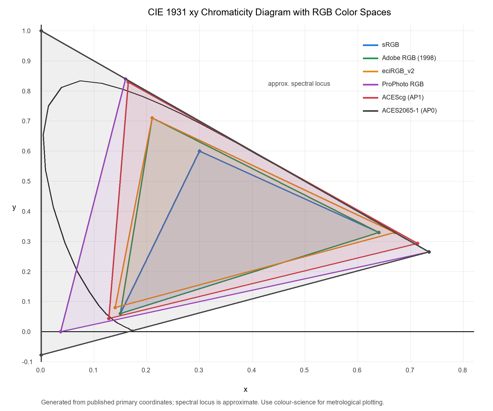
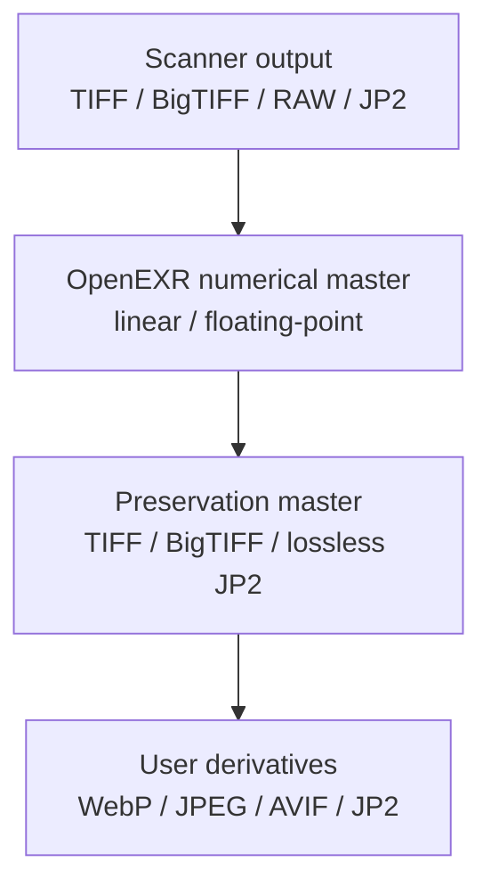
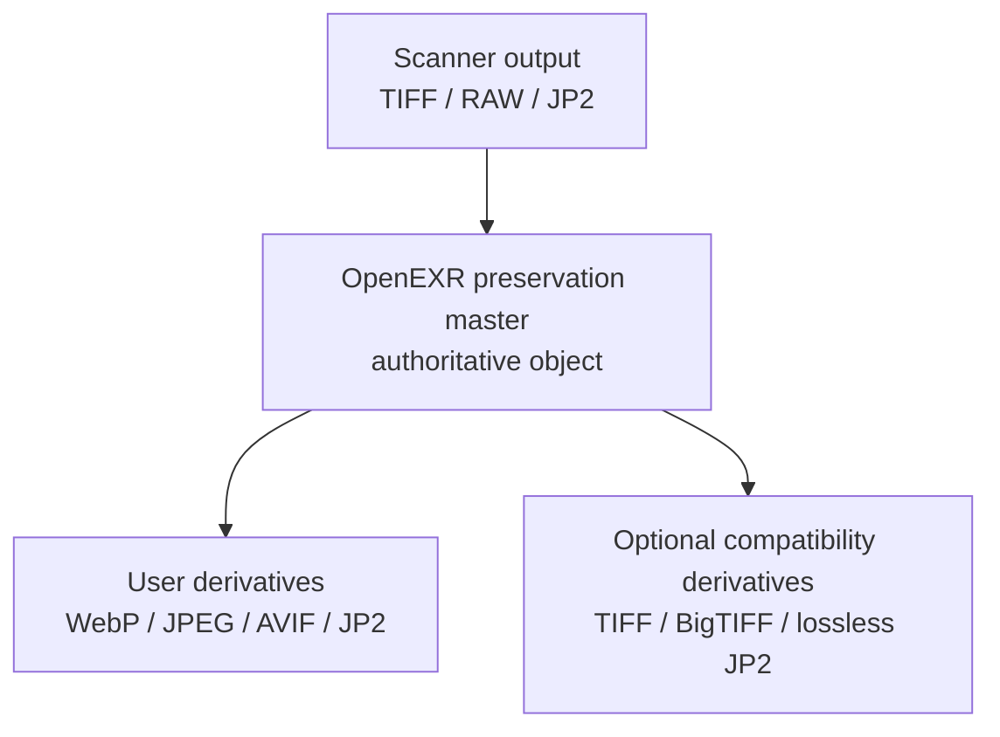
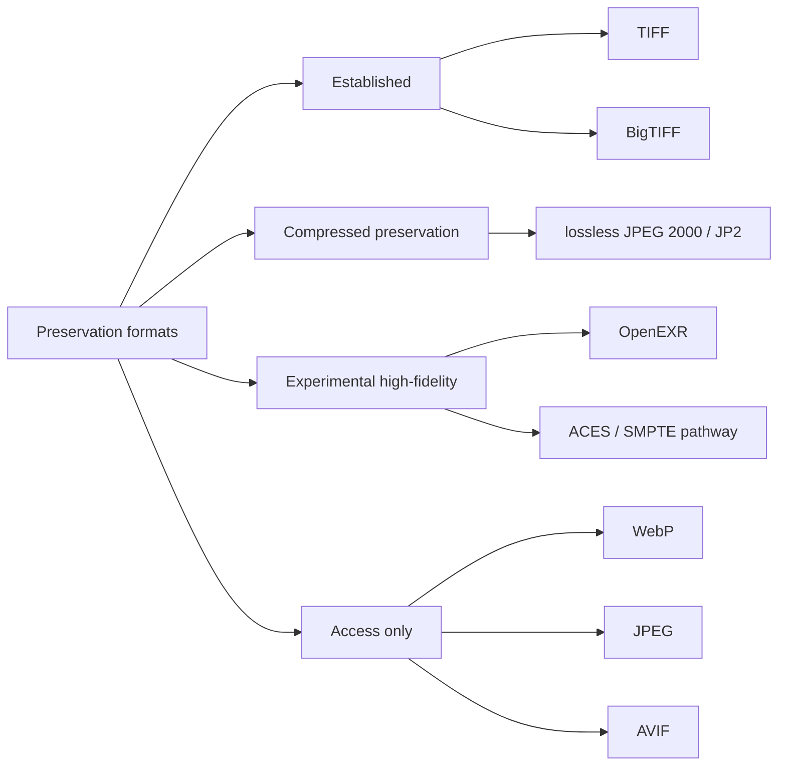

# OpenEXR, Color Management and Preservation Masters: A Candidate Architecture for Cultural Heritage Imaging

**Author:** Jan Houserek
**Version:** 0.3 draft
**Date:** 2026-04-26
**Status:** Working paper / discussion draft

---

## Abstract

Preservation imaging workflows in libraries, archives and museums are currently dominated by TIFF or BigTIFF as preservation master formats and by JPEG 2000, JPEG, WebP or AVIF as access formats. These formats are practical and well understood, but they usually store output-referred or working-space RGB images as integer samples. This paper evaluates OpenEXR as a candidate preservation or preservation-processing master format for cultural heritage imaging, with particular attention to color management, ICC workflows, ACES color encodings and the practical fact that current book scanners do not normally capture directly to OpenEXR.

The paper argues that OpenEXR should not be introduced as a direct scanner-output replacement for TIFF. Instead, its realistic role is as a controlled, validated, scene-linear or reference-linear master generated after capture from RAW, TIFF or scanner-native data. OpenEXR offers high numerical precision, floating-point storage, high dynamic range support and a standardised ACES container pathway. At the same time, it lacks broad GLAM adoption, robust preservation profiles and mature ICC-oriented tooling. A hybrid architecture is therefore proposed: TIFF/BigTIFF remains the institutional preservation master, OpenEXR serves as a numerical preservation-processing master, and WebP or JPEG 2000 are selected according to access infrastructure.

---

## 1. Introduction

Digital preservation of cultural heritage images is not only a question of compression or file extension. A preservation master must preserve evidence, support future reinterpretation, and remain verifiable across decades. In practice, institutional workflows have converged around TIFF because it is simple, widely supported, compatible with ICC profiles and well integrated with existing digitisation systems. BigTIFF extends this model to very large files. JPEG 2000 remains important in institutional delivery stacks, especially where tiling, resolution progression and IIIF servers are already deployed.

OpenEXR introduces a different model. It was designed to represent high-dynamic-range, scene-linear image data and associated metadata efficiently. The official OpenEXR documentation describes the format as intended for accurate and efficient representation of high-dynamic-range scene-linear image data, with strong support for multi-channel and multi-part use cases. OpenEXR also supports 16-bit half-float and 32-bit floating-point samples and multiple compression modes. [^openexr-tech]

This makes OpenEXR technically attractive for preservation imaging, but also problematic: most book scanners and cultural heritage capture systems do not output OpenEXR directly. Therefore, this paper treats OpenEXR not as a scanner-native format, but as a possible **post-capture preservation-processing master**.

---

## 2. Current Capture Reality: Scanners Do Not Normally Produce OpenEXR

A key practical limitation is that current book scanners, reprographic systems and cultural heritage capture workflows normally produce:

- TIFF or BigTIFF,
- JPEG,
- RAW / camera RAW,
- sometimes JPEG 2000 or PDF derivatives.

They do not generally produce OpenEXR as a first-class archival output.

However, some digitization workflows and systems can produce **JPEG 2000 (JP2)** directly, either as a scanner output format or as an immediate preservation master. In such cases, JPEG 2000 should be treated alongside TIFF/BigTIFF as a legitimate preservation pathway, provided that a lossless profile and proper validation are used. This matters because preservation methodology prefers minimal, well-documented transformation between capture and master. Introducing OpenEXR therefore implies an additional transformation stage.

The proposed realistic pipelines are therefore:

### Pipeline A (TIFF/BigTIFF-based)

```text
capture device / scanner
        ↓
scanner-native TIFF / BigTIFF / RAW
        ↓
profiled color transform and linearisation
        ↓
OpenEXR preservation-processing master
        ↓
TIFF / BigTIFF preservation master
        ↓
WebP / JPEG 2000 / JPEG / AVIF access derivatives
```

### Pipeline B (JPEG 2000-based)

```text
capture device / scanner
        ↓
scanner-native JPEG 2000 (JP2)
        ↓
(optional) transformation to OpenEXR numerical master
        ↓
lossless JPEG 2000 preservation master
        ↓
WebP / JPEG / AVIF access derivatives
```

In both cases, the key methodological question is not whether OpenEXR can replace scanner output. It cannot in most current systems. The question is whether a controlled conversion into OpenEXR can preserve additional information, reduce processing loss and improve future reinterpretability.

---

## 3. OpenEXR Technical Properties Relevant to Preservation

### 3.1 Floating-point storage

Traditional TIFF workflows usually use 8-bit or 16-bit unsigned integer samples. OpenEXR commonly stores image channels as:

- 16-bit half float,
- 32-bit float,
- or, less relevant for preservation imaging, unsigned integer channels.

Floating-point storage is significant because processing operations such as color conversion, white balancing, deconvolution, sharpening and denoising can generate intermediate values outside a fixed integer range. In an integer pipeline these values must be clipped, rounded or remapped. In a floating-point pipeline they can be preserved until a final rendering decision is made.

### 3.2 Scene-linear or reference-linear representation

OpenEXR is strongly associated with scene-linear image data. Linear representation is important because many image-processing operations are mathematically more correct when applied to values proportional to light intensity rather than gamma-encoded display values.

For cultural heritage imaging this is attractive for:

- controlled sharpening,
- tone mapping,
- illumination correction,
- color target analysis,
- repeatable conversion to different output color spaces.

### 3.3 Compression

OpenEXR supports multiple compression modes. For preservation use, a restricted profile should allow only lossless or preservation-acceptable compression, for example:

- `NO_COMPRESSION`,
- `ZIP`,
- `ZIPS`,
- `PIZ`,
- possibly `RLE`.

Lossy or precision-reducing modes such as `DWAA`, `DWAB`, `B44`, `B44A` and `PXR24` should be excluded from a strict preservation profile. The OpenEXR technical documentation notes that compression modes differ substantially, including modes with loss or reduced floating-point accuracy. [^openexr-tech]

---

## 4. Color Management: ICC and OpenEXR Are Not the Same Model

### 4.1 ICC model

The ICC model is based on profiles that connect color encodings through a Profile Connection Space. The International Color Consortium describes the ICC specification as defining the file format for profiles that connect between color encodings; ICC v4 is also standardised as ISO 15076-1. [^icc-home] [^icc-specs]

A typical cultural heritage TIFF workflow uses:

```text
scanner/camera RGB + input ICC profile
        ↓
PCS conversion
        ↓
working/archive RGB color space
        ↓
embedded ICC profile in TIFF
```

This is practical, auditable and widely supported. It is one reason TIFF remains strong as a preservation master.

### 4.2 OpenEXR color metadata model

OpenEXR can store color-related metadata, especially standard attributes such as `chromaticities`, `whiteLuminance` and `adoptedNeutral`. The OpenEXR documentation states that if chromaticities and luminance of an RGB image are known, conversion from RGB to CIE XYZ is possible. [^openexr-attrs]

However, OpenEXR is not equivalent to a TIFF with an embedded ICC profile. The OpenEXR library does not perform color transforms; this is left to display or processing software. The documentation also notes that the `chromaticities` attribute is optional and that many programs omit it. If absent, display software is expected to assume BT.709 primaries and white point. [^openexr-color]

### 4.3 Storing CIE XYZ and CIE Lab in OpenEXR

OpenEXR does not prescribe a single color model; channels are arbitrary and can be named and typed flexibly. This allows several preservation-relevant strategies:

1. **CIE XYZ as native channels**
   - Store three channels named `X`, `Y`, `Z` in linear light (FLOAT or HALF).
   - Advantages: device-independent representation, direct link to ICC PCS (XYZ), straightforward transforms to/from RGB via documented primaries and white point.
   - Requirements: explicit white point and chromaticities metadata; document adaptation method (e.g., Bradford) if conversions were applied.

2. **CIE Lab as derived channels**
   - Store channels `L`, `a`, `b` (typically FLOAT).
   - Advantages: perceptual uniformity for QA and comparison (ΔE).
   - Caveats: Lab is relative to a reference white; must store reference white (e.g., D50) and encoding details. Lab is not linear-light; not ideal as a primary processing space, but useful as an **analysis layer**.

3. **Dual representation (recommended for research-grade workflows)**
   - Primary image in linear RGB (e.g., ACEScg or documented linear RGB with chromaticities).
   - Additional channels or auxiliary layers for XYZ and/or Lab.
   - Enables round-trip validation (RGB ↔ XYZ) and perceptual metrics (Lab/ΔE) without recomputation.

4. **Metadata binding to ICC**
   - Record source ICC profile name/hash and transform parameters.
   - If XYZ is stored, document whether it is PCS-referenced (D50) and any chromatic adaptation used.

In all cases, a preservation profile must require explicit declaration of the color encoding and reference white. Implicit defaults are not acceptable.

### 4.4 Recommended color metadata for archival EXR

A cultural heritage OpenEXR profile should require at least one of the following color declarations:

1. **ACES-compliant declaration**, preferably ACES2065-1 for interchange or archiving.
2. **Explicit chromaticities and white point**, using OpenEXR standard attributes.
3. **External or embedded profile reference**, for example a documented ICC profile name, hash and source URI.
4. **Processing metadata**, including source profile, transform intent, rendering intent and software version.

A minimal metadata set could include:

```yaml
required_color_metadata:
  - colorEncoding
  - primaries
  - whitePoint
  - transferFunction
  - sourceICCProfileName
  - sourceICCProfileHash
  - transformSoftware
  - transformIntent
```

## 5. ACES Compared with Common RGB Color Spaces

### 5.1 What ACES is

ACES, the Academy Color Encoding System, is a color encoding and workflow system developed under the Academy of Motion Picture Arts and Sciences. Current ACES documentation describes ACES2065-1 as a linear wide-gamut RGB encoding using AP0 primaries and as the core interchange encoding. ACEScg is described as a linear encoding using AP1 primaries, optimised for rendering and compositing. [^aces-overview]

SMPTE also defines ACES standards, including ST 2065-4, the ACES Image Container File Layout. SMPTE describes ST 2065-4 as a file format for image data encoded according to ST 2065-1 and compatible with OpenEXR image viewers. [^smpte-aces]

### 5.2 ACES2065-1

ACES2065-1 uses AP0 primaries. It is intended as the ACES interchange and archival encoding rather than as the most convenient working space. Its gamut is extremely large and uses imaginary primaries. This helps prevent clipping of real-world colors, but it can be awkward for image operations that act independently on RGB channels.

Potential role in cultural heritage imaging:

- best candidate for an EXR archival interchange encoding,
- useful when long-term reinterpretation is more important than editing convenience,
- requires strict metadata and transform documentation.

### 5.3 ACEScg

ACEScg uses AP1 primaries and is scene-linear. ACES documentation describes ACEScg as a working space for CGI rendering and compositing, based on 16-bit or 32-bit floating-point values. Its AP1 primaries are less extreme than AP0 and more practical for processing. [^acescg]

Potential role in cultural heritage imaging:

- suitable as a processing space,
- more stable for image operations than ACES2065-1,
- less directly archival than ACES2065-1.

### 5.4 sRGB

sRGB is small-gamut and display-oriented. It is useful for access derivatives but too restrictive for high-end preservation masters, especially where wide-gamut targets or saturated pigments are relevant.

Potential role:

- web access,
- thumbnails,
- general public delivery.

### 5.5 Adobe RGB (1998)

Adobe RGB has a larger gamut than sRGB, especially in greens and cyans. It is common in photographic and cultural heritage workflows, and it is easier to integrate with ICC-based software than ACES.

Potential role:

- conventional TIFF preservation workflows,
- practical institutional RGB working/archive space.

### 5.6 eciRGB_v2

eciRGB_v2 is important in European cultural heritage and print-oriented workflows. It is ICC-friendly and better aligned with controlled reproduction workflows than sRGB.

Potential role:

- strong candidate for ICC-based TIFF/BigTIFF preservation masters,
- more directly compatible with existing GLAM workflows than ACES.

### 5.7 ProPhoto RGB

ProPhoto RGB is very wide-gamut and often used in photographic RAW workflows. It can preserve very saturated colors but may require 16-bit precision to avoid banding in integer workflows.

Potential role:

- high-end photographic processing,
- less ideal as a general institutional archival standard unless tightly controlled.

---

## 6. Comparative Table: ACES and Common RGB Color Spaces

| Color space | Encoding | Gamut | Typical container | Strength | Risk |
|---|---|---:|---|---|---|
| sRGB | gamma / display-referred | small | JPEG, PNG, WebP, TIFF | universal access | clips wide-gamut data |
| Adobe RGB (1998) | gamma / output/workspace RGB | medium-wide | TIFF | common photographic workflow | not scene-linear |
| eciRGB_v2 | ICC working/archive RGB | medium-wide | TIFF | European preservation/print compatibility | less common in general software |
| ProPhoto RGB | gamma or linear variants | very wide | TIFF, RAW workflows | preserves saturated colors | imaginary primaries, needs high precision |
| ACES2065-1 | scene-linear AP0 | extremely wide | OpenEXR / ACES container | interchange/archive in ACES | awkward as working space |
| ACEScg | scene-linear AP1 | very wide | OpenEXR | processing/compositing | not the formal archival interchange encoding |

---

## 7. Visual Comparison of Color Spaces in the CIE 1931 xy Diagram

Color spaces are often compared by plotting their RGB primaries as triangles in the **CIE 1931 xy chromaticity diagram**. The curved boundary represents the approximate locus of monochromatic visible colors; the straight lower boundary is the line of purples. An RGB color space can represent chromaticities inside the triangle formed by its red, green and blue primaries.

This diagram is useful, but it has important limitations:

- it shows chromaticity, not luminance;
- it is not perceptually uniform;
- it does not describe spectral reflectance;
- it does not show metameric differences;
- it says nothing about bit depth or transfer curve.

For cultural heritage preservation, this means that gamut coverage is only one part of the problem. A wide gamut does not automatically mean accurate color reproduction. Accuracy still depends on capture profiling, target measurement, illumination, camera/scanner characterisation and transform documentation.

### 7.1 CIE xy gamut diagram

The following figure is a visual aid generated from published RGB primary coordinates. It shows the relative position of common RGB spaces against an approximate visible chromaticity boundary.



*Figure: Comparison of common RGB color spaces in the CIE 1931 xy diagram. For metrological publication, regenerate the figure with a color-science plotting library and documented CIE observer data.*

### 7.2 Interpretation

The visual comparison suggests several preservation-relevant conclusions:

1. **sRGB is too small for a preservation master** when the goal is to preserve measured color beyond ordinary display reproduction.
2. **Adobe RGB and eciRGB_v2 are practical ICC-based archival spaces** because they are larger than sRGB and well suited to TIFF/BigTIFF workflows.
3. **ProPhoto RGB is extremely wide**, but its very large gamut requires careful 16-bit or floating-point handling to avoid sparse encoding and processing artefacts.
4. **ACES2065-1/AP0 is primarily an interchange/archive encoding** in the ACES ecosystem. It is extremely wide and intended to encompass the visible locus, but it is not a comfortable editing or correction space.
5. **ACEScg/AP1 is more practical for processing** because it is scene-linear and wide-gamut, but less extreme than AP0.

### 7.3 Approximate chromaticity coordinates

| Space | Red x,y | Green x,y | Blue x,y | White point | Typical role |
|---|---:|---:|---:|---|---|
| sRGB / Rec.709 | 0.640, 0.330 | 0.300, 0.600 | 0.150, 0.060 | D65 | web / display access |
| Adobe RGB (1998) | 0.640, 0.330 | 0.210, 0.710 | 0.150, 0.060 | D65 | photographic / TIFF workflow |
| eciRGB_v2 | 0.670, 0.330 | 0.210, 0.710 | 0.140, 0.080 | D50 | European archival / print-oriented workflow |
| ProPhoto RGB | 0.735, 0.265 | 0.160, 0.840 | 0.037, 0.000 | D50 | RAW/high-end photographic processing |
| ACES2065-1 / AP0 | 0.735, 0.265 | 0.000, 1.000 | 0.0001, -0.077 | ACES white / D60-like | interchange / archive in ACES |
| ACEScg / AP1 | 0.713, 0.293 | 0.165, 0.830 | 0.128, 0.044 | ACES white / D60-like | scene-linear processing |

For OpenEXR preservation work, the practical lesson is not simply “choose the largest triangle”. Instead, the chosen color encoding must be aligned with the purpose of the file:

- **TIFF/BigTIFF master:** ICC-based Adobe RGB, eciRGB_v2 or another documented archival RGB space.
- **OpenEXR preservation-processing master:** ACES2065-1 for interchange/archive, ACEScg for processing, or explicitly documented linear RGB with chromaticities.
- **Web access derivative:** sRGB/WebP unless there is a controlled wide-gamut web delivery requirement.

---

## 8. Proposed OpenEXR Preservation-Processing Profile

A preservation-grade OpenEXR profile for cultural heritage imaging should be intentionally narrow.

### 8.1 File structure

Allowed:

- single-part EXR,
- scanline or tiled storage,
- RGB or grayscale channel sets.

Disallowed in strict profile:

- deep images,
- arbitrary multipart EXR,
- unspecified color encoding,
- lossy compression,
- non-1:1 channel sampling.

### 8.2 Pixel types

Allowed:

- `HALF` for practical preservation-processing masters,
- `FLOAT` for scientific or high-dynamic-range datasets.

Disallowed:

- `UINT` in strict float-preservation profile, unless a specific integer compatibility profile is defined.

### 8.3 Compression

Allowed:

- `NO_COMPRESSION`,
- `ZIP`,
- `ZIPS`,
- `PIZ`,
- optionally `RLE`.

Disallowed:

- `DWAA`,
- `DWAB`,
- `B44`,
- `B44A`,
- `PXR24`.

### 8.4 Color declaration

Required:

- ACES2065-1 or ACEScg identifier, or
- explicit chromaticities and white point, plus source ICC metadata.

Recommended:

```yaml
color:
  encoding: ACES2065-1
  transfer: linear
  source_icc_profile: eciRGB_v2.icc
  source_icc_sha256: "..."
  conversion_engine: LittleCMS
  rendering_intent: relative_colorimetric
  observer: CIE 1931 2-degree
```

---

## 9. Why OpenEXR Is Still Interesting for Cultural Heritage

OpenEXR should not be adopted because it is fashionable in VFX. It is interesting because it addresses technical weaknesses in integer preservation masters:

1. **Numerical precision**: floating-point values reduce cumulative rounding loss.
2. **Linear-light processing**: many corrections are more defensible in linear light.
3. **HDR capacity**: future capture systems may exceed the practical assumptions of 16-bit integer workflows.
4. **Multi-channel extensibility**: masks, segmentation and analysis layers can be stored with the image data.
5. **ACES compatibility**: a standardised OpenEXR-based image container already exists for ACES workflows.

But these benefits only matter if the workflow is validated and documented.

---

## 10. Revised Preservation Architecture

### 10.1 Conservative institutional model

| Role | Format |
|---|---|
| Capture output | scanner TIFF / RAW |
| Preservation master | TIFF / BigTIFF / lossless JPEG 2000 (JP2) |
| Web access | WebP / JPEG |
| Institutional delivery | JPEG 2000 where IIIF infrastructure requires it |



### 10.2 JPEG 2000 as a preservation master

JPEG 2000 (JP2) is a viable **preservation master** when encoded losslessly. It provides:

- reversible (lossless) compression,
- tiling and resolution scalability,
- efficient storage compared with uncompressed TIFF,
- compatibility with IIIF and image-server ecosystems.

A preservation-grade JP2 profile should require:

- JP2 file format (not raw codestream),
- reversible 5/3 wavelet (lossless),
- no lossy quantisation,
- explicit color information (ICC or defined color space),
- documented tiling/progression parameters,
- validation (e.g., jpylyzer) and codec inspection.

### 10.3 TIFF, BigTIFF and JPEG 2000 compared as preservation masters

| Criterion | TIFF | BigTIFF | lossless JPEG 2000 / JP2 |
|---|---|---|---|
| Institutional familiarity | very high | high | medium to high |
| File size | large | large | smaller |
| >4 GB support | limited | yes | yes |
| Lossless preservation | yes | yes | yes |
| Streaming / scalability | limited | limited | strong |
| Validation ecosystem | JHOVE, libtiff | libtiff, partial JHOVE | jpylyzer, codec inspection |
| Complexity | low | low to medium | high |
| Best use | standard masters | very large masters | compressed masters / IIIF-oriented preservation |

### 10.4 Experimental high-fidelity model

| Role | Format |
|---|---|
| Capture output | scanner TIFF / RAW |
| Numerical preservation-processing master | OpenEXR |
| Institutional preservation master | TIFF / BigTIFF / lossless JPEG 2000 |
| Web access | WebP |
| Institutional access | JPEG 2000 or WebP depending on server stack |



---

## 11. Access Formats

JPEG 2000 is not automatically the best access format for all uses. It remains valuable where existing IIIF infrastructure, tiling, resolution progression and archival delivery stacks are built around JP2. However, for ordinary web delivery, WebP is often more practical because browser support is broad and deployment is simpler.

A pragmatic recommendation is:

- **WebP** for public web access,
- **JPEG 2000** where institutional IIIF or existing repositories require it,
- **JPEG** as fallback,
- **AVIF** as optional high-compression derivative where browser and encoding support are acceptable.

---

## 12. Validation Requirements

OpenEXR adoption requires validation tooling comparable in spirit to TIFF/JHOVE or JPEG 2000/jpylyzer workflows.

A validator should check:

- syntactic OpenEXR validity,
- allowed storage type,
- channel names and pixel types,
- compression mode,
- dataWindow/displayWindow consistency,
- color metadata completeness,
- ACES compliance where declared,
- full chunk decode.

At present, cultural heritage workflows should not assume that an appropriate OpenEXR preservation validator already exists. A practical preservation profile would therefore need a dedicated validator, or at least a documented validation procedure, capable of checking these requirements reproducibly before OpenEXR could be treated as an institutional preservation master format.

---

## 13. International Standards, ISO Status and Preservation Guidance

The suitability of a preservation master format should be assessed at three different levels:

1. **Formal standardization** — whether the format is defined by ISO, IEC, ITU, SMPTE or another recognized standards body.
2. **Preservation guidance** — whether memory institutions and digitization guidelines recommend or accept the format.
3. **Operational ecosystem** — whether tools, validators, repositories and workflows can handle the format reliably.

These levels do not always align. A format may be formally standardized but difficult to operate, or widely used but not fully standardized by ISO.

### 13.1 TIFF and BigTIFF

TIFF is the most established preservation master format in cultural heritage imaging. Its strength is not primarily ISO status, but institutional adoption, simplicity, broad software support and compatibility with ICC profiles.

The original TIFF 6.0 specification is an Adobe specification rather than an ISO still-image preservation standard. However, TIFF-based standards do exist. TIFF/EP is standardized as ISO 12234-2 and is described by the Library of Congress as a TIFF 6.0-compatible format based on a subset of TIFF plus EXIF-related concepts. [^iso-tiffep] [^loc-tiffep]

BigTIFF extends TIFF by using 64-bit offsets to overcome the classic 4 GB limit. Its preservation case is pragmatic rather than formal: it is the natural extension of TIFF for very large preservation images, but it should be validated through libtiff-based tools and institutional policy rather than assumed to be covered by all TIFF validation frameworks.

**Assessment:** TIFF/BigTIFF have the strongest GLAM adoption, but BigTIFF has weaker formal preservation-standard visibility than baseline TIFF workflows.

### 13.2 JPEG 2000 / JP2

JPEG 2000 has the strongest formal international standardization position among the formats considered here. The JPEG 2000 family is standardized as ISO/IEC 15444 and jointly developed with ITU-T recommendations. The JPEG organization describes JPEG 2000 as an ISO/IEC and ITU-T standard first published in 2001 and maintained since then. [^jpeg2000-org]

The JP2 file format and codestream architecture are therefore not merely de facto standards. They are part of a formal international standards family. This gives JPEG 2000 a strong preservation argument when encoded losslessly and wrapped as JP2.

From a preservation perspective, the most relevant strengths are:

- formal ISO/IEC standardization;
- reversible/lossless coding mode;
- tiling and resolution scalability;
- support for large images;
- established use in some cultural heritage repositories;
- availability of validation tools such as jpylyzer.

The main weaknesses are operational rather than formal:

- complex parameterization;
- fewer general-purpose tools than TIFF;
- higher dependency on specialized codecs;
- risk of non-conformant or poorly profiled encodings.

**Assessment:** lossless JP2 is a strong preservation master candidate when an institution can enforce a strict profile and validation regime.

### 13.3 OpenEXR and ACES

OpenEXR itself is an open format with a public specification and reference implementation, but its strongest formal standardization link is through ACES. SMPTE ST 2065-4 specifies the ACES Image Container File Layout, which is compatible with OpenEXR image viewers and stores image data encoded according to ST 2065-1. [^smpte-aces]

The OpenEXR project also documents that the ACES Image Container File Format specified in SMPTE ST 2065-4 is a constrained subset of OpenEXR. [^openexr-aces]

This distinction is important:

- **general OpenEXR** is flexible, powerful and open, but too broad for preservation without a profile;
- **ACES container / ST 2065-4** is a standardized constrained OpenEXR-based pathway for ACES image data;
- **cultural heritage OpenEXR preservation** would still require a GLAM-specific profile, because ACES was designed primarily for motion-picture and VFX workflows.

OpenEXR should therefore be evaluated through two possible standardization routes:

1. **ACES-compatible route**
   Use ACES2065-1 / ST 2065-4 constraints where possible. This provides stronger standardization but may be too restrictive for some cultural heritage use cases.

2. **GLAM-specific OpenEXR profile**
   Define a cultural heritage profile using OpenEXR standard attributes, strict channel rules, lossless compression and explicit color metadata. This is more flexible but would initially be a community or institutional profile rather than an ISO/SMPTE preservation standard.

**Assessment:** OpenEXR has a credible standards pathway through ACES/SMPTE, but general OpenEXR is not yet an established preservation master standard in the GLAM sector.

### 13.4 ICC and color standards

ICC color management has a strong standards foundation. ICC v4 is standardized as ISO 15076-1, and ICC profiles remain central to TIFF/BigTIFF preservation workflows. [^icc-specs]

This gives ICC-based TIFF/BigTIFF and lossless JP2 workflows a practical advantage: color interpretation can be embedded or associated through well-known profiles and existing tools.

OpenEXR can store chromaticities and other color-related attributes, and ACES provides a standardized color encoding system, but OpenEXR workflows are not ICC-centric by default. Therefore, an archival OpenEXR profile must explicitly document:

- source ICC profile;
- transform engine;
- rendering or conversion intent;
- target color encoding;
- chromaticities and white point;
- any CIE XYZ or CIE Lab auxiliary channels.

### 13.5 Summary comparison

| Format | Formal standardization | Preservation guidance | Tooling maturity | Color-management model | Preservation status |
|---|---|---|---|---|---|
| TIFF | Adobe TIFF 6.0; TIFF/EP as ISO 12234-2 | very strong | very strong | ICC-centric | established master |
| BigTIFF | TIFF extension, not as universally standardized | moderate to strong for large files | strong in modern libtiff tools | ICC-centric | practical large-file master |
| lossless JPEG 2000 / JP2 | ISO/IEC 15444 / ITU-T JPEG 2000 family | strong in some repositories/guidelines | medium to strong | ICC or enumerated color spaces | compressed preservation master |
| OpenEXR | public OpenEXR spec; ACES container via SMPTE ST 2065-4 subset | weak in GLAM | strong in VFX, weak in GLAM | chromaticities / ACES / OCIO, not ICC-centric | experimental preservation master |
| WebP | web format, not preservation-oriented | weak for preservation | strong for web | usually sRGB/display delivery | access derivative |
| AVIF | ISO BMFF/AV1 ecosystem, web-oriented | weak for preservation | growing | HDR/wide-gamut capable but workflow-dependent | access derivative / experimental |

### 13.6 Standards-based recommendation



From a standards perspective, the most defensible hierarchy is:

1. **Conventional preservation:** TIFF / BigTIFF with ICC metadata.
2. **Compressed preservation:** lossless JPEG 2000 / JP2 under a strict profile.
3. **Experimental high-fidelity preservation:** OpenEXR, preferably aligned with ACES/SMPTE constraints or a documented GLAM-specific EXR profile.
4. **Access only:** WebP, JPEG, AVIF, and lossy JPEG 2000 derivatives.

OpenEXR should therefore not be presented as already equivalent to TIFF or lossless JP2 in preservation-policy terms. Its strongest claim is different: it may provide a better **technical representation of image data**, but it still needs preservation-specific standardization, validation and institutional adoption.

---

## 14. Cost, Storage and Master Strategy: Supplementary EXR or Primary EXR?

A dual-master strategy, in which TIFF/BigTIFF or lossless JPEG 2000 is retained as the institutional preservation master and OpenEXR is added as a numerical preservation-processing master, is methodologically conservative. However, it may be economically difficult to justify at scale. Storing both an integer preservation master and a floating-point OpenEXR master can significantly increase storage, fixity checking, backup, replication and migration costs.

This raises an important strategic question:

> Should OpenEXR be treated as a supplementary preservation master, or should it become the primary preservation master with only access/user derivatives generated from it?

### 14.1 Conservative layered model: scanner output + numerical master + preservation master + user derivatives

The conservative model separates four distinct layers. It does not treat OpenEXR as the sole preservation object. Instead, OpenEXR acts as a **numerical master** that preserves a high-fidelity processing state, while TIFF/BigTIFF or lossless JPEG 2000 remains the institutional preservation master.

```text
scanner output
    ↓
OpenEXR numerical master
    ↓
TIFF / BigTIFF / lossless JPEG 2000 preservation master
    ↓
user/access derivatives
```

| Layer | Format | Function |
|---|---|---|
| Scanner output | scanner TIFF / RAW / native export | original device output |
| Numerical master | OpenEXR | linear/floating-point processing reference |
| Preservation master | TIFF / BigTIFF / lossless JPEG 2000 | institutional preservation object |
| User derivatives | WebP / JPEG / JP2 / AVIF | access and delivery |

Advantages:

- compatible with current GLAM expectations;
- preserves original scanner output separately from processed preservation objects;
- allows OpenEXR to be evaluated without making it the legal/institutional master;
- supports existing TIFF/JP2 validation and repository workflows.

Disadvantages:

- highest storage and management cost;
- multiple high-value files per object;
- more complex provenance chain;
- risk of ambiguity about which object is authoritative.

This model is suitable for pilot projects, high-value objects, scientific imaging, color-critical collections and institutional environments where TIFF/BigTIFF or JP2 must remain the official preservation object.

### 14.2 Experimental primary OpenEXR model: scanner output + OpenEXR preservation master + user derivatives

The experimental model removes the separate TIFF/BigTIFF/JP2 preservation master layer. The scanner output is retained as capture evidence, but the controlled OpenEXR conversion becomes the **authoritative preservation master**. All other formats are derivatives.

```text
scanner output
    ↓
OpenEXR preservation master
    ↓
user/access derivatives
```

| Layer | Format | Function |
|---|---|---|
| Scanner output | scanner TIFF / RAW / native export | original device output / capture evidence |
| Preservation master | OpenEXR | authoritative linear/floating-point preservation object |
| User derivatives | WebP / JPEG / JP2 / AVIF / optional TIFF | access, delivery and compatibility |

Advantages:

- avoids maintaining two full preservation master layers;
- creates a clear authority model: OpenEXR is the master;
- reduces storage compared with the conservative layered model;
- aligns with future re-rendering and computational preservation workflows;
- TIFF/BigTIFF and lossless JP2 can still be generated when required, but as derivatives.

Disadvantages:

- weak current institutional acceptance;
- limited GLAM tooling;
- less familiar validation ecosystem;
- requires a strict OpenEXR preservation profile;
- requires documented color encoding, preferably ACES or explicit chromaticities/ICC provenance;
- current scanners generally do not output OpenEXR directly, so the master is created through a controlled conversion step.

This model is attractive for future-oriented repositories, but it should not be adopted without strong validation, documented conversion logs, reproducible derivative generation and explicit institutional policy support.

### 14.3 Cost-aware recommendation

A reasonable staged recommendation is:

1. **Mass digitization today**
   Use TIFF/BigTIFF or lossless JPEG 2000 as the preservation master. Generate WebP/JPEG/JPEG 2000 derivatives as needed. Do not store OpenEXR unless there is a specific need.

2. **Color-critical or research collections**
   Store OpenEXR as an additional preservation-processing master where the added storage cost is justified by future analytical value.

3. **Experimental next-generation workflow**
   Treat OpenEXR as the primary preservation master and generate TIFF/BigTIFF, lossless JP2 and WebP only as derivatives. This requires a validated OpenEXR profile and strong institutional policy support.

### 14.4 Revised strategic position

The most economical long-term OpenEXR argument is not necessarily the dual-master model. The stronger future-facing claim may be:

> OpenEXR should be evaluated as a possible **primary preservation master** for workflows where numerical fidelity, linear-light processing and future reinterpretation are more important than immediate compatibility with existing GLAM software.

In this model, TIFF/BigTIFF and JPEG 2000 become preservation-compatible derivatives rather than the authoritative source object. This reverses the traditional hierarchy, but it may be more coherent if OpenEXR is treated as the richest available representation of the captured image data.

---

## 15. Conclusion

OpenEXR is not currently a drop-in replacement for TIFF or BigTIFF in book-scanning workflows. The most important reason is operational: scanners do not normally produce OpenEXR, and GLAM systems do not generally ingest it as a preservation master.

Nevertheless, OpenEXR is a credible candidate for a **preservation-processing master** or future preservation master because it combines:

- floating-point representation,
- linear-light image data,
- high dynamic range,
- ACES compatibility,
- rich metadata potential.

The strongest near-term strategy is therefore not replacement but layering:

```text
TIFF / BigTIFF = institutional preservation object
OpenEXR       = numerical preservation-processing object
WebP / JP2    = access object
```

OpenEXR becomes compelling when preservation is understood not only as storing a final image, but as preserving the ability to reinterpret captured light accurately in the future.

---

## References

[^openexr-tech]: OpenEXR Project. *Technical Introduction to OpenEXR*. https://openexr.com/en/latest/TechnicalIntroduction.html

[^loc-jp2]: Library of Congress. *JPEG 2000 Part 1 (Core) jp2 File Format*. https://www.loc.gov/preservation/digital/formats/fdd/fdd000143

[^iso-tiffep]: ISO. *ISO 12234-2:2001 — Electronic still-picture imaging — Removable memory — Part 2: TIFF/EP image data format*. https://www.iso.org/standard/29377.html

[^loc-tiffep]: Library of Congress. *TIFF/EP, ISO 12234-2:2001*. https://www.loc.gov/preservation/digital/formats/fdd/fdd000073.shtml

[^jpeg2000-org]: JPEG. *JPEG 2000*. https://jpeg.org/jpeg2000/

[^openexr-aces]: OpenEXR Project. *exr2aces*. https://openexr.com/en/latest/bin/exr2aces.html.shtml

[^openexr-attrs]: OpenEXR Project. *Standard Attributes*. https://openexr.com/en/latest/StandardAttributes.html

[^openexr-color]: OpenEXR Project. *Technical Introduction to OpenEXR*, color/chromaticities discussion. https://openexr.com/en/latest/TechnicalIntroduction.html

[^icc-home]: International Color Consortium. *ICC color management and ICC profile information*. https://www.color.org/

[^icc-specs]: International Color Consortium. *ICC Specifications*. https://www.color.org/icc_specs2.xalter

[^aces-overview]: ACES Central. *ACES System Overview*. https://docs.acescentral.com/background/overview/

[^acescg]: ACES Central. *ACEScg – A Working Space for CGI Render and Compositing*. https://docs.acescentral.com/encodings/acescg/

[^smpte-aces]: SMPTE. *ACES Standards*. https://www.smpte.org/standards/aces-standards
